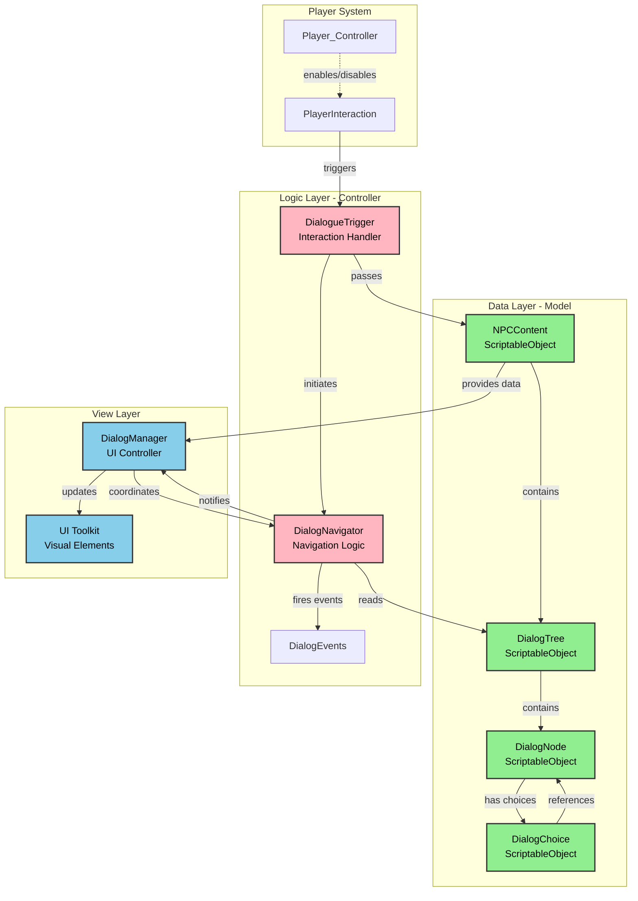
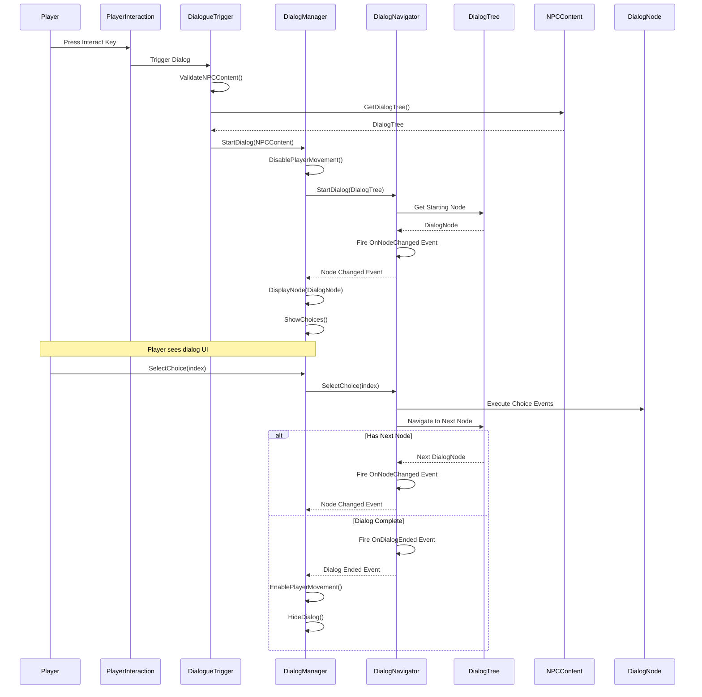
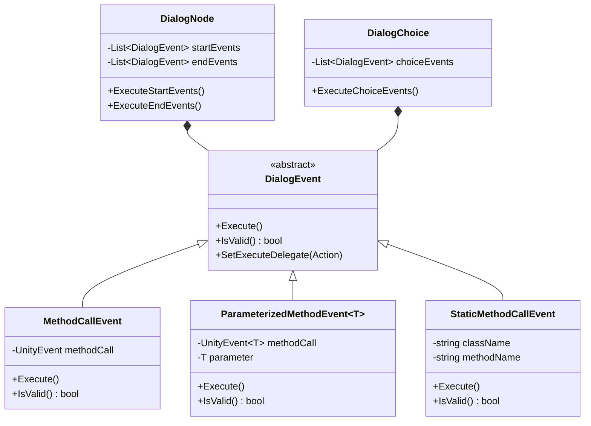
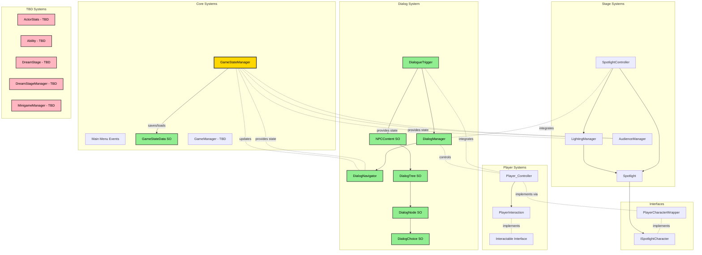
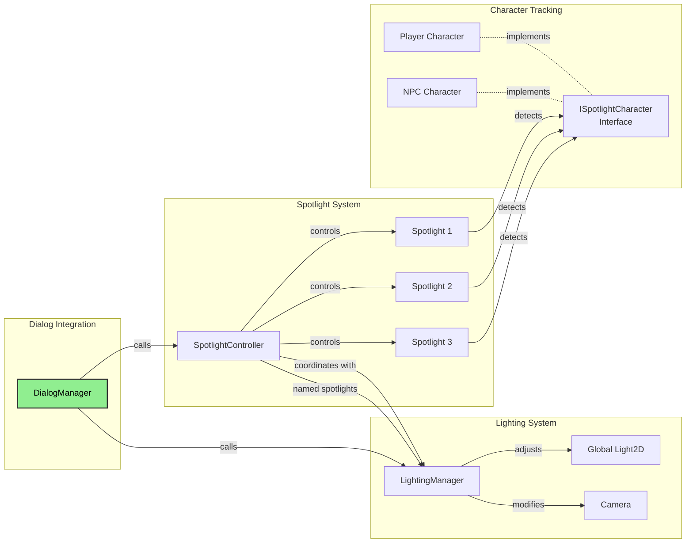
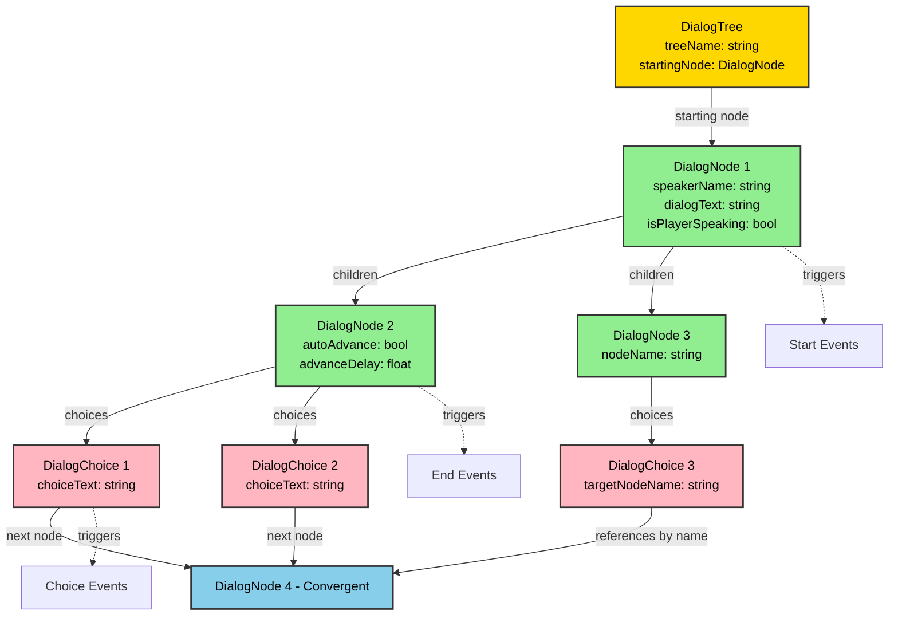

# Stage of Dreams - Class Hierarchy

## Architecture Diagrams

### Dialog System Architecture (MVC Pattern)



### Dialog Flow Sequence



### Dialog Event System



### Complete Class Hierarchy Overview



### Spotlight & Lighting Integration



### Data Structure: Dialog Tree



---

## Dialog System - Detailed Architecture

### Pattern: Model-View-Controller (MVC) with Event-Driven Communication

**Clean Architecture (Current Implementation):**
```
DialogNode (Data - Model)
    ↓
DialogNavigator (Game Logic - Controller)
    ├─ Fires: OnNodeChanged
    ├─ Fires: OnRememberScriptStarted
    ├─ Fires: OnRememberScriptProgress
    ├─ Fires: OnRememberScriptSuccess/Failure
    └─ Fires: OnDialogEnded
         ↓
    DialogManager (View - UI Controller)
         └─ Subscribes to events and renders UI
```

**Key Principle**: 
- DialogNavigator focuses purely on game logic (validation, scoring, state)
- DialogNavigator fires events when state changes
- DialogManager (or future UI controllers) subscribe to events and handle presentation
- **No UI code in DialogNavigator** - complete separation of concerns

**Current Status**:
- ✅ DialogNavigator has full minigame logic with events
- ✅ RememberTheScript events defined and functional
- ⏳ DialogManager needs to subscribe to minigame events (when UI is added)
- ⏳ Minigame UI components need to be created in DialogManager

### Documentation References

**📚 Complete Documentation:**
- **User Guide**: [`Docs/Dialog-System-Complete-Guide.md`](./Dialog-System-Complete-Guide.md) - For designers and content creators
- **Technical Reference**: [`Docs/Dialog-System-Technical-Reference.md`](./Dialog-System-Technical-Reference.md) - For developers and system integrators
- **DialogEvents Guide**: [`Docs/DialogEvents-Scaffolding-Guide.md`](./DialogEvents-Scaffolding-Guide.md) - Event system documentation
- **Workflow Guide**: [`Docs/DialogTree-Editing-Workflow-Guide.md`](./DialogTree-Editing-Workflow-Guide.md) - Detailed editor workflow
- **Node ID Guide**: [`Docs/DialogNodeID-NamingConvention.md`](./DialogNodeID-NamingConvention.md) - Naming conventions

**📦 Archived Documentation:**
- Historical development documents: [`Docs/Archive/Dialog-Development/`](./Archive/Dialog-Development/)

### Components

#### A. Data Layer (Model)
- **`DialogTree`** (ScriptableObject): Container for entire conversation tree
  - Location: `Assets/_Stage of Dreams_/World/Dialog Tree.cs`
  - Stores starting node and manages node collection
  - Provides tree traversal and validation methods
  - Supports named nodes for convergent dialog paths
  - Properties:
    - `string treeName` - Display name
    - `string description` - Tree description
    - `DialogNode startingNode` - Entry point
    - `List<DialogNode> allNodes` - All nodes in tree
    - `bool autoUpdateNodeList` - Auto-refresh setting
    - `bool validateOnSave` - Validation on save
  - Key Methods:
    - `GetStartingNode()` - Get entry point
    - `GetAllNodes()` - Get all nodes
    - `FindNodeByName(string)` - Find by ID
    - `GetConvergentNodes()` - Get nodes with multiple parents
    - `GetEndNodes()` - Get terminal nodes
    - `ValidateTree()` - Comprehensive validation
    - `RefreshNodeList()` - Update node collection
    - `ResolveNamedReferences()` - Resolve named node references
    - `CreateStartingNode()` - Create entry point
    - `AddChoiceNode()` - Add branching node
    - `AddSequentialNode()` - Add auto-advance node
  
- **`DialogNode`** (Serializable Class): Individual conversation node
  - Location: `Assets/_Stage of Dreams_/World/Dialog Node.cs`
  - Properties:
    - Node Identification:
      - `string NodeName` - Unique identifier (e.g., `act1_director_intro_01`)
    - Dialog Content:
      - `string CharacterName` - Speaker name
      - `string DialogText` - Dialog content (TextArea 3-6 lines)
      - `bool IsPlayerSpeaking` - Player dialog flag
    - Flow Control:
      - `float AutoAdvanceDelay` - Auto-advance timing (0 = manual advance)
    - Tree Structure:
      - `List<DialogNode> ParentNodes` - Incoming connections (supports convergent paths)
      - `DialogNode ChildNode` - Auto-advance target (null if has choices)
      - `List<DialogChoice> Choices` - Player choice options
    - Events:
      - `List<DialogEvent> StartEvents` - Events triggered on node start
      - `List<DialogEvent> EndEvents` - Events triggered on node end
      - `UnityEvent OnDialogStart` - Legacy start event (backwards compatibility)
      - `UnityEvent OnDialogEnd` - Legacy end event (backwards compatibility)
    - Computed Properties:
      - `bool IsRootNode` - True if no parent nodes
      - `bool HasChoices` - True if has choice options
      - `bool HasAutoAdvance` - True if has child node
  - Key Methods:
    - Hierarchy Management:
      - `SetChildNode(DialogNode)` - Set auto-advance target
      - `CreateChildNode(string speaker, string text, ...)` - Create and link child node
      - `AddParentNode(DialogNode)` - Add parent reference
      - `RemoveParentNode(DialogNode)` - Remove parent reference
    - Choice Management:
      - `AddChoice(string text, DialogNode target, string choiceId)` - Add player choice
      - `RemoveChoice(int index)` - Remove choice by index
    - Event Management:
      - `AddStartEvent(DialogEvent)` - Add start event
      - `AddEndEvent(DialogEvent)` - Add end event
      - `RemoveStartEvent(int)` - Remove start event
      - `RemoveEndEvent(int)` - Remove end event
      - `ExecuteStartEvents()` - Trigger all start events
      - `ExecuteEndEvents()` - Trigger all end events
    - Validation:
      - `IsValid()` - Validate node configuration
      - `GetDisplayName()` - Get display name for UI
  
- **`DialogChoice`** (Serializable Class): Choice option in dialog
  - Location: `Assets/_Stage of Dreams_/World/Dialog Choice.cs`
  - Properties:
    - Choice Data:
      - `string ChoiceText` - Display text for choice
      - `string ChoiceId` - Unique identifier for custom actions
      - `List<bool> Conditions` - Conditions to show choice (not implemented yet)
    - References:
      - `DialogNode ParentNode` - Node this choice belongs to
      - `DialogNode TargetNode` - Direct target node reference
      - `string TargetNodeName` - Named target for convergent paths
    - Events:
      - `List<DialogEvent> ChoiceEvents` - Events triggered on selection
      - `UnityEvent OnChoiceSelected` - Legacy choice event (backwards compatibility)
    - Computed Properties:
      - `bool HasNamedTarget` - True if using named reference
      - `bool HasValidTarget` - True if has target (direct or named)
      - `bool HasEvents` - True if has events to execute
  - Key Methods:
    - Event Management:
      - `AddChoiceEvent(DialogEvent)` - Add choice event
      - `RemoveChoiceEvent(int)` - Remove choice event
      - `ExecuteChoiceEvents()` - Trigger all choice events
    - Target Management:
      - `CreateTargetNode(string speaker, string text, ...)` - Create and set target node
      - `SetTarget(DialogNode)` - Set direct target reference
      - `SetTargetByName(string)` - Set named target for convergent paths
      - `ResolveNamedTarget(DialogTree)` - Resolve named target to actual node
    - Validation:
      - `IsValid()` - Validate choice configuration
      - `IsTargetResolved()` - Check if named target is resolved
      - `GetDisplayName()` - Get display name for UI
      - `GetTargetInfo()` - Get target information for debugging
- **`DialogEvent`** (Abstract Base Class): Polymorphic event system
  - Location: `Assets/_Stage of Dreams_/Scripts/Dialog/DialogEvents.cs`
  - Base Properties:
    - `string eventName` - Event identifier
    - `bool isEnabled` - Enable/disable flag
    - `string description` - Event description
    - `Action onExecuteDelegate` - Method delegate support
    - `Func<bool> validationDelegate` - Custom validation
  - Base Methods:
    - `Execute()` - Trigger event
    - `IsValid()` - Validate event
    - `SetExecuteDelegate(Action)` - Set method delegate
    - `SetValidationDelegate(Func<bool>)` - Set validation method
  - Implemented Event Types:
    - `MethodCallEvent` - Execute Action delegates
    - `ParameterizedMethodEvent<T>` - Execute Action<T> with parameters
    - `StaticMethodCallEvent` - Call static methods via reflection
  - Usage: See [`DialogEvents-Scaffolding-Guide.md`](./DialogEvents-Scaffolding-Guide.md)

#### B. Logic Layer (Controller)
- **`DialogNavigator`**: Navigation logic engine
  - Location: `Assets/_Stage of Dreams_/Scripts/Dialog/DialogNavigator.cs`
  - Properties:
    - `DialogNode currentNode` - Current position in tree
    - `NPCContent currentNPC` - Current NPC context
    - `DialogTree currentTree` - Current tree
    - `bool IsActive` - Navigation active flag
  - Events:
    - `Action<DialogNode> OnNodeChanged` - Node navigation event
    - `Action<DialogChoice, NPCContent> OnCustomActionTriggered` - Custom action event
    - `Action OnDialogEnded` - Dialog completion event
  - Key Methods:
    - `StartDialog(NPCContent, string)` - Begin navigation
    - `NavigateToNode(DialogNode)` - Move to specific node
    - `SelectChoice(int)` - Handle choice selection
    - `AdvanceDialog()` - Advance to next node
    - `EndDialog()` - Complete navigation
    - `SwitchToTree(string)` - Change dialog tree
    - `GetCurrentState()` - Get navigation state
  
- **`DialogueTrigger`**: Interaction trigger component
  - Location: `Assets/_Stage of Dreams_/Scripts/Dialog/DialogueTrigger.cs`
  - Properties:
    - `bool triggerOnSpotlight` - Spotlight trigger flag
    - `bool triggerOnInteraction` - Interaction trigger flag
    - `bool triggerOnProximity` - Proximity trigger flag
    - `float interactionRadius` - Interaction range
    - `float proximityRadius` - Proximity range
    - `bool requireInteractionInput` - Require key press
    - `NPCContent targetNPC` - Target NPC reference
    - `string specificDialogTree` - Specific tree name
    - `bool canRetrigger` - Allow retriggering
    - `float retriggerDelay` - Retrigger cooldown
  - Events:
    - `Action OnDialogTriggered` - Dialog started event
    - `Action OnDialogEnded` - Dialog ended event
  - Key Methods:
    - `ManualTrigger()` - Force trigger
    - `SetTriggerType(bool, bool, bool)` - Configure trigger types
    - `ValidateSetup()` - Validate configuration
    - `IsReadyToTrigger()` - Check trigger readiness
    - `GetSetupStatus()` - Get setup status string
    - `GetTargetDialogTree()` - Get target tree

#### C. View Layer
- **`DialogManager`**: UI controller (Singleton)
  - Location: `Assets\_Stage of Dreams_\Scripts\Dialog\DialogManager.cs`
  - Properties:
    - `static DialogManager Instance` - Singleton instance
    - `UIDocument uiDocument`
    - `VisualTreeAsset dialogVisualTree`
    - `string interactActionName = "Interact"`
    - `bool enableInputLogging`, `enableDebugLogs`, `validateOnStart`
    - `GroupBox dialogBox`, `Label dialogLabel`
    - `Button choiceButton1-5`
    - `PlayerInput playerInput`, `InputAction interactAction`
    - `DialogNavigator navigator`
    - `bool isUIActive`, `isInitialized`
    - `NPCContent currentNPC`, `DialogTree currentTree`
    - `int dialogSessionCount`
  - Methods:
    - `Awake()`, `Start()`, `Update()`, `OnDestroy()`
    - `InitializeDialogManager()`, `InitializeNavigator()`, `InitializeUI()`, `InitializeInput()`
    - `ValidateSetup()`, `ValidateNPCContent()`
    - `StartDialog(NPCContent)`, `StartDialog(NPCContent, string)`
    - `HandleNodeChanged(DialogNode)`, `HandleCustomAction()`, `HandleDialogEnded()`
    - `DisplayNode(DialogNode)`, `ShowChoices()`, `HideChoices()`, `HideDialog()`
    - `OnChoiceClicked(int)`, `AdvanceDialog()`, `EndDialog()`
    - `IsDialogActive()`, `GetNavigationState()`, `IsReady()`
  - Events:
    - `OnDialogStarted`, `OnDialogEnded`, `OnNodeDisplayed`, `OnCustomActionHandled`
  - Description: Singleton dialog manager handling UI display and integration with DialogNavigator, supports UI Toolkit
  - **Future Enhancement**: Will subscribe to DialogNavigator minigame events (OnRememberScriptStarted, OnRememberScriptProgress, etc.) when minigame UI is implemented

- **`DialogNavigator`**: Navigation logic engine
  - Location: `Assets/_Stage of Dreams_/Scripts/Dialog/DialogNavigator.cs`
  - Properties:
    - `DialogNode currentNode` - Current position in tree
    - `NPCContent currentNPC` - Current NPC context
    - `DialogTree currentTree` - Current tree being navigated
    - `bool IsActive` - Whether navigation is active
    - `DialogNode CurrentNode` - Public accessor for current node
    - `NPCContent CurrentNPC` - Public accessor for current NPC
  - Methods:
    - `StartDialog(NPCContent, string)` - Begin dialog navigation
    - `NavigateToNode(DialogNode)` - Move to specific node
    - `SelectChoice(int)` - Handle player choice selection
    - `AdvanceDialog()` - Advance to next node (auto-advance or manual)
    - `EndDialog()` - Complete dialog session
    - `SwitchToTree(string)` - Change to different dialog tree
    - `ForceNavigateToNode(DialogNode)` - Force navigation to specific node
    - `GetCurrentState()` - Get current navigation state
    - `ExecuteNodeStartEvents(DialogNode)` - Execute node start events
    - `ExecuteNodeEndEvents(DialogNode)` - Execute node end events
    - `ExecuteChoiceEvents(DialogChoice)` - Execute choice events
  - Events:
    - `OnNodeChanged` - Fired when navigating to new node
    - `OnCustomActionTriggered` - Fired for custom choice actions
    - `OnDialogEnded` - Fired when dialog completes
  - Description: Handles dialog tree navigation logic, separate from UI concerns. Pure logic component that coordinates with DialogManager.

- **`DialogueTrigger`**: Interaction trigger component
  - Location: `Assets/_Stage of Dreams_/Scripts/Dialog/DialogueTrigger.cs`
  - Properties:
    - `bool triggerOnSpotlight`, `triggerOnInteraction`, `triggerOnProximity`
    - `float interactionRadius = 2f`, `proximityRadius = 1.5f`
    - `bool requireInteractionInput = true`
    - `KeyCode interactionKey = KeyCode.E`
    - `NPCContent targetNPC`
    - `string specificDialogTree`
    - `bool canRetrigger`, `float retriggerDelay = 10f`
    - `DialogManager dialogManager`, `PlayerScript player`
    - `bool hasTriggered`, `isWaitingForInput`
  - Methods:
    - `Start()`, `Update()`, `OnDestroy()`, `OnDisable()`
    - `InitializeReferences()`, `ValidateSetup()`, `ValidateNPCContent()`
    - `IsReadyToTrigger()`, `CheckSpotlightTrigger()`, `CheckInteractionTrigger()`, `CheckProximityTrigger()`
    - `PassNPCContent()`, `PrepareNPCForDialog()`
    - `SubscribeToDialogEvents()`, `HandleDialogManagerEnded()`
    - `ResetTrigger()`, `ManualTrigger()`
    - `SetTriggerType(bool spotlight, bool interaction, bool proximity)`, `SetTargetNPC(NPCContent)`
    - `GetTargetDialogTree()`, `GetSetupStatus()`
  - Events:
    - `OnDialogTriggered`, `OnDialogEnded`
  - Description: Unified dialog trigger system supporting multiple trigger conditions (spotlight, interaction, proximity) and comprehensive validation

### ✅ DialogEvents.cs
- **Pattern:** Polymorphic Event System
- **Location:** `Assets/_Stage of Dreams_/Scripts/Dialog/DialogEvents.cs`
- **Classes:**
  - **DialogEvent** (Abstract Base):
    - Properties: `eventName`, `isEnabled`, `description`
    - Methods: `Execute()`, `IsValid()`, `SetExecuteDelegate(Action)`, `SetValidationDelegate(Func<bool>)`
  - **MethodCallEvent**:
    - Executes Action delegates
    - Properties: `methodToCall`, `methodDescription`
    - Methods: `SetMethod(Action, string)`
  - **ParameterizedMethodEvent<T>**:
    - Executes Action<T> delegates with parameters
    - Properties: `methodToCall`, `parameter`, `methodDescription`
    - Methods: `SetMethod(Action<T>, T, string)`
  - **StaticMethodCallEvent**:
    - Calls static methods via reflection
    - Properties: `className`, `methodName`, `stringParameters`
- **Description:** Type-safe event system for dialog integration with game systems. Supports method delegates and custom event types.

### Integration Flow
```
Player Interaction → DialogueTrigger → DialogManager → DialogNavigator
                                            ↓
                                       NPC Content
                                            ↓
                                       Dialog Tree
```

### Key Features
- **Convergent Paths**: Multiple choices can lead to same node via named references
- **Event System**: Custom events can be triggered at node start/end or choice selection
- **Validation**: Comprehensive validation at multiple levels (tree, node, choice)
- **Auto-Advance**: Nodes can automatically progress after delay
- **Method Delegates**: Events support both UnityEvents and direct method calls
- **Editor Windows**: Dedicated windows for complex tree editing
- **Tree Navigation**: Navigate between nodes using parent/child/choice references
- **Named Nodes**: Reference nodes by name for convergent dialog paths

### Event System Pattern
**Observer pattern with polymorphic event types**

#### Usage Pattern:
```csharp
// At node start/end
node.AddStartEvent(new MethodCallEvent());
node.AddEndEvent(new MethodCallEvent());

// At choice selection
choice.AddChoiceEvent(new ParameterizedMethodEvent<string>());

// With method delegates
var evt = new MethodCallEvent();
evt.SetMethod(() => GameStateManager.Instance.AdjustApplause(10f));
node.AddStartEvent(evt);
```

### Editor Tools

#### DialogTreeEditor
- Location: `Assets\_Stage of Dreams_\Editor\DialogTreeEditor.cs`
- Custom inspector for DialogTree
- Read-only workflow with edit buttons
- Quick tree builder
- Validation and debugging tools

#### DialogNodeEditorWindow
- Location: `Assets\_Stage of Dreams_\Editor\DialogNodeEditorWindow.cs`
- Dedicated window for editing standard dialog nodes
- Tree navigation buttons (parents, children, choice targets)
- Choice management interface
- Unity Events and DialogEvents integration
- **Smart routing**: Detects specialized node types and redirects to appropriate editor

#### RememberTheScriptNodeEditor
- Location: `Assets\_Stage of Dreams_\Editor\RememberTheScriptNodeEditor.cs`
- **NEW**: Specialized editor for RememberTheScript minigame nodes
- Focused UI showing only minigame-relevant settings:
  - Target phrase configuration with character count
  - Difficulty settings (max mistakes, time limit, case sensitivity)
  - Score settings (success reward, mistake penalty)
  - Success/failure node navigation
  - Estimated difficulty rating calculator
  - Score preview for perfect/worst runs
- Test minigame button for quick validation
- Automatic visual preview of target phrase
- Integration with tree navigation system

#### DialogChoiceEditorWindow
- Location: `Assets\_Stage of Dreams_\Editor\DialogChoiceEditorWindow.cs`
- Dedicated window for editing dialog choices
- Choice-specific UI and validation

#### DialogTreeUtilities
- Location: `Assets\_Stage of Dreams_\Editor\DialogTreeUtilities.cs`
- Menu items: `Tools > Dialog System`
- Node ID generator
- Tree validation
- Batch operations

### Editor Architecture Pattern

**Specialized Editor Windows for Minigames**

The editor system uses a **router pattern** where `DialogNodeEditorWindow.OpenWindow()` detects node types and routes to specialized editors:

```
Node Edit Request
    ↓
DialogNodeEditorWindow.OpenWindow()
    ├─ IsRememberTheScriptNode? → RememberTheScriptNodeEditor
    ├─ IsCalmDialogNode? → CalmDialogNodeEditor (future)
    └─ Default → DialogNodeEditorWindow (standard dialog)
```

**Benefits:**
- Single Responsibility: Each editor handles one node type
- Scalability: New minigames = new editors (no modification to existing code)
- Clean UI: Only relevant fields shown for each node type
- Easy Maintenance: Changes isolated to specific editors

**Adding New Minigame Editors:**
1. Create new editor class (e.g., `CalmDialogNodeEditor.cs`)
2. Add detection method in `DialogNodeEditorWindow` (e.g., `IsCalmDialogNode()`)
3. Add routing logic in `OpenWindow()` method
4. Update documentation

---
