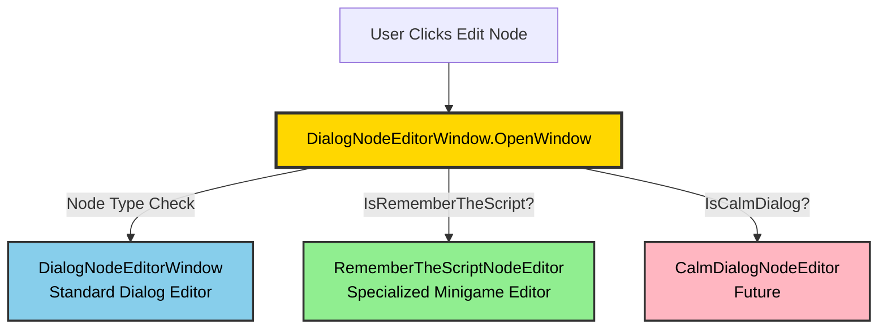
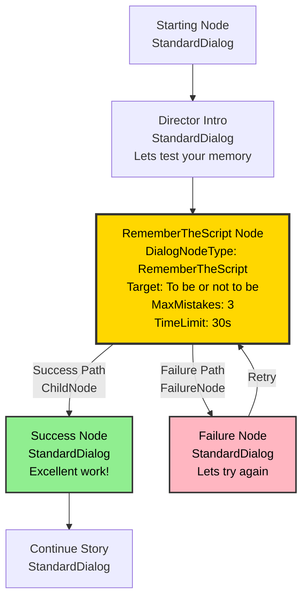
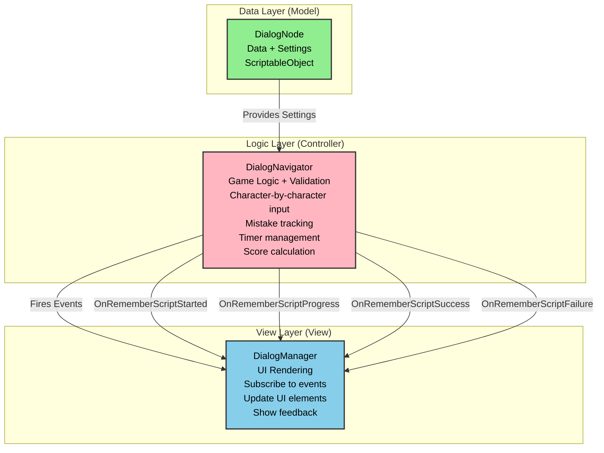

# Stage of Dreams - Dialog System Architecture Presentation

**Presentation Date**: January 2025  
**Audience**: Technical Review / Portfolio Showcase  
**Duration**: 15-20 minutes  
**Presenter**: Jack Taylor

---

## Table of Contents

1. [System Overview](#system-overview)
2. [Editor System Architecture](#editor-system-architecture)
3. [DialogTree Data Structure](#dialogtree-data-structure)
4. [Minigame Node System](#minigame-node-system)
5. [Integration & Workflow](#integration--workflow)
6. [Live Demo](#live-demo)
7. [Technical Achievements](#technical-achievements)

---

## System Overview

### What We Built

A **complete, production-ready dialog system** for Unity that supports:

- ✅ **Node-based conversations** with branching paths and convergent dialog
- ✅ **Convergent dialog** - Multiple choices leading to same outcome
- ✅ **Minigame integration** - Seamless transition from dialog to gameplay
- ✅ **Event-driven architecture** - Clean separation of concerns (MVC pattern)
- ✅ **Custom editor tools** - Specialized editing windows for each node type
- ✅ **Type-safe design** - Extensible node type system
- ✅ **Automatic outcome nodes** - Success/failure nodes created automatically

### Key Innovation: **Minigame = Node**

Instead of treating minigames as separate entities, we made **minigames a type of dialog node**:

```
DialogNode Types:
- StandardDialog (regular conversation)
- RememberTheScript (typing minigame) ✅ IMPLEMENTED
- CalmDialog (choice-based minigame) [Planned]
- DancingCombat (rhythm minigame) [Planned]
```

**Benefits**:
- ✅ Minigames integrated directly into dialog flow
- ✅ No separate minigame management needed
- ✅ Automatic outcome node creation (success/failure)
- ✅ Clean, unified editing experience
- ✅ Seamless narrative transitions

---

## Editor System Architecture

### The Router Pattern



### How It Works

**1. Centralized Routing**
```csharp
public static void OpenWindow(SerializedProperty nodeProperty, DialogTree tree)
{
    // Automatic routing based on node type
    if (IsRememberTheScriptNode(nodeProperty))
    {
        RememberTheScriptNodeEditor.OpenWindow(nodeProperty, tree);
        return;
    }
    
    // Future: IsCalmDialogNode? → CalmDialogNodeEditor
    
    // Default: Standard dialog editor
    DialogNodeEditorWindow window = CreateInstance<DialogNodeEditorWindow>();
    window.Initialize(nodeProperty, tree);
    window.Show();
}
```

**2. Type Detection**
```csharp
private static bool IsRememberTheScriptNode(SerializedProperty nodeProperty)
{
    SerializedProperty nodeTypeProp = nodeProperty.FindPropertyRelative("_nodeType");
    if (nodeTypeProp != null)
    {
        return (DialogNodeType)nodeTypeProp.enumValueIndex == DialogNodeType.RememberTheScript;
    }
    return false;
}
```

**Key Advantage**: Adding new minigame types requires **zero modifications** to existing code - just add detection and routing!

---

### Specialized Editors

#### RememberTheScriptNodeEditor

**Purpose**: Edit typing minigame nodes with focused UI

**Key Features**:
- ✅ Target phrase configuration with character count display
- ✅ Difficulty settings (max mistakes, time limit, case sensitivity)
- ✅ Score settings (success reward, mistake penalty)
- ✅ **Automatic outcome node management** (success/failure)
- ✅ **Estimated difficulty calculator** (⭐ to ⭐⭐⭐⭐⭐)
- ✅ **Score preview** for perfect/worst runs
- ✅ **Test minigame button** for immediate playtesting

**UI Layout**:
```
┌─────────────────────────────────────┐
│ RememberTheScript Node Editor       │
├─────────────────────────────────────┤
│ 🎭 Node: act1_director_script_01    │
│                                     │
│ Target Phrase Settings              │
│ ┌─────────────────────────────────┐ │
│ │ "To be or not to be"            │ │
│ │ Character Count: 18             │ │
│ └─────────────────────────────────┘ │
│                                     │
│ Difficulty Settings                 │
│ Max Mistakes: [3]                   │
│ Time Limit: [30.0] seconds          │
│ Case Sensitive: [ ]                 │
│                                     │
│ Score Settings                      │
│ Success Reward: [+20.0]             │
│ Mistake Penalty: [-5.0]             │
│                                     │
│ Estimated Difficulty: ⭐⭐⭐       │
│ Perfect Score: +20.0                │
│ Worst Score: +5.0                   │
│                                     │
│ Outcome Nodes                       │
│ ✓ Success: act1_director_praise_01  │
│   [Edit Success Node]               │
│ ✗ Failure: act1_director_retry_01   │
│   [Edit Failure Node]               │
│                                     │
│ [Test Minigame] [Close]             │
└─────────────────────────────────────┘
```

**Benefits**:
- ✅ Only shows relevant minigame fields - no clutter
- ✅ Intuitive minigame-specific controls
- ✅ Visual feedback on difficulty/scoring helps content creators
- ✅ Direct access to outcome nodes for customization
- ✅ Instant testing without entering play mode

---

## DialogTree Data Structure

### Minigame Node Architecture



### Key Architectural Changes

#### 1. Node Type System

**Before** (Traditional approach):
```
- Minigames were separate systems
- Dialog nodes just triggered external minigame managers
- Complex integration with loose coupling
- Separate data structures for minigames
```

**After** (Our approach):
```csharp
public enum DialogNodeType
{
    StandardDialog,      // Regular dialog
    RememberTheScript,   // Typing minigame
    CalmDialog,          // Choice minigame (planned)
    DancingCombat        // Rhythm minigame (planned)
}

public class DialogNode
{
    [SerializeField] private DialogNodeType _nodeType;
    
    // Minigame-specific settings (only populated when nodeType is a minigame)
    [SerializeField] private string _targetPhrase;
    [SerializeField] private int _maxMistakes;
    [SerializeField] private float _timeLimit;
    [SerializeField] private bool _caseSensitive;
    [SerializeField] private float _scoreOnSuccess;
    [SerializeField] private float _scorePerMistake;
    [SerializeField] private DialogNode _failureNode;  // NEW!
    
    // Standard dialog flow uses ChildNode (success/continuation path)
    // Minigame failure path uses FailureNode (minigame-specific)
}
```

**Key Benefits**:
- ✅ Single data structure for all dialog nodes
- ✅ Type-safe enum for node types
- ✅ Minigame settings co-located with dialog data
- ✅ No external minigame manager needed

#### 2. Dual-Path System

**Success Path** (ChildNode):
```
Minigame Node → ChildNode → Success Node → Continue Story
```

**Failure Path** (FailureNode):
```
Minigame Node → FailureNode → Retry/Failure Node → (Retry Minigame OR Continue)
```

**Implementation**:
```csharp
// In DialogTree traversal:
private void TraverseAndCollectNodes(DialogNode node, HashSet<DialogNode> visited)
{
    if (node == null || visited.Contains(node)) return;
    
    visited.Add(node);
    allNodes.Add(node);
    
    // SUCCESS PATH: Check child node for auto-advance
    if (node.ChildNode != null)
    {
        TraverseAndCollectNodes(node.ChildNode, visited);
    }
    
    // FAILURE PATH: Check failure node for minigames (NEW!)
    if (node.FailureNode != null)
    {
        TraverseAndCollectNodes(node.FailureNode, visited);
    }
    
    // BRANCHING: Check all choice targets
    if (node.HasChoices)
    {
        foreach (var choice in node.Choices)
        {
            if (choice?.TargetNode != null)
            {
                TraverseAndCollectNodes(choice.TargetNode, visited);
            }
        }
    }
}
```

**Why This Matters**:
- ✅ Supports multiple outcome paths per minigame
- ✅ Tree validation catches orphaned nodes
- ✅ Enables complex narrative flows (retry vs. continue)
- ✅ Content creators can customize both success and failure responses

#### 3. Automatic Outcome Node Creation

**When creating a minigame node, the system automatically**:

1. **Creates Success Node** (ChildNode)
   - Default praise dialog: "Excellent work! Your performance was flawless!"
   - Continues story flow naturally
   - Awards applause score via GameStateManager

2. **Creates Failure Node** reference
   - Default retry dialog: "Let's try that again. Remember your lines!"
   - Allows retry attempt or alternative path
   - Penalizes mistake score

**Implementation**:
```csharp
// In DialogTreeEditor Quick Builder
if (newNodeType == DialogNodeType.RememberTheScript)
{
    // Configure minigame node
    newNode.ConfigureRememberScript("Enter phrase here", 3, 30f, 20f, -5f);
    
    // AUTO-CREATE SUCCESS NODE
    var successNode = new DialogNode(
        speakerName,
        "Excellent work! Your performance was flawless!",
        false,  // autoAdvance
        $"{newNode.NodeName}_success"
    );
    newNode.SetChildNode(successNode);
    
    // AUTO-CREATE FAILURE NODE
    var failureNode = new DialogNode(
        speakerName,
        "Let's try that again. Remember your lines!",
        false,
        $"{newNode.NodeName}_failure"
    );
    newNode.FailureNode = failureNode;
    
    // Refresh tree to pick up both outcome nodes
    dialogTree.RefreshNodeList();
}
```

**Benefits for Content Creators**:
- ✅ No manual outcome node creation needed
- ✅ Sensible defaults that can be customized
- ✅ Consistent naming convention (_success, _failure)
- ✅ Immediate playtesting capability

---

## Minigame Node System

### Architecture: Clean Separation of Concerns (MVC Pattern)



### DialogNavigator: Pure Game Logic (Controller)

**Responsibilities**:
- ✅ Validate player input character-by-character
- ✅ Track mistakes and reset on failure condition
- ✅ Manage timer countdown with delta time updates
- ✅ Calculate scores based on performance (success reward, mistake penalty, time bonus)
- ✅ Fire events for UI updates
- ❌ **NO UI CODE** - DialogNavigator has zero dependencies on UI systems

**Key Events** (Decoupled Communication):
```csharp
// Minigame Events (fired by DialogNavigator, consumed by DialogManager)
public event Action<DialogNode> OnRememberScriptStarted;
public event Action<int, int, float> OnRememberScriptProgress; // (currentIndex, mistakes, timeLeft)
public event Action<DialogNode, float> OnRememberScriptSuccess; // (successNode, score)
public event Action<DialogNode, int> OnRememberScriptFailure; // (failureNode, mistakes)
```

**Why This Matters**:
- ✅ UI can be completely replaced without touching game logic
- ✅ Logic can be unit tested in isolation
- ✅ Multiple UI systems can subscribe to same events (e.g., HUD + Debug UI)
- ✅ Clear interface contract between layers

### RememberTheScript Implementation

**Validation Logic** (Character-by-Character):
```csharp
public void ValidateInput(char inputChar)
{
    if (!IsMinigameActive) return;
    
    // Get expected character (handle case sensitivity)
    char expectedChar = currentNode.CaseSensitive 
        ? currentNode.TargetPhrase[currentCharIndex] 
        : char.ToLower(currentNode.TargetPhrase[currentCharIndex]);
    
    char actualChar = currentNode.CaseSensitive 
        ? inputChar 
        : char.ToLower(inputChar);
    
    if (expectedChar == actualChar)
    {
        // ✓ Correct input
        currentCharIndex++;
        OnRememberScriptProgress?.Invoke(currentCharIndex, mistakeCount, timeRemaining);
        
        // Check completion
        if (currentCharIndex >= currentNode.TargetPhrase.Length)
        {
            CompleteMinigame(true);
        }
    }
    else
    {
        // ✗ Mistake
        mistakeCount++;
        OnRememberScriptProgress?.Invoke(currentCharIndex, mistakeCount, timeRemaining);
        
        // Check failure condition
        if (mistakeCount >= currentNode.MaxMistakes)
        {
            CompleteMinigame(false);
        }
    }
}
```

**Score Calculation** (Multi-Factor Scoring):
```csharp
private void CompleteMinigame(bool success)
{
    float totalScore = 0f;
    
    if (success)
    {
        // Base success reward
        totalScore = currentNode.ScoreOnSuccess;
        
        // Bonus for accuracy (fewer mistakes)
        int mistakesAvoided = currentNode.MaxMistakes - mistakeCount;
        totalScore += mistakesAvoided * (-currentNode.ScorePerMistake);
        
        // Time bonus (speed reward)
        if (timeRemaining > 0)
        {
            totalScore += timeRemaining * 0.1f;
        }
        
        // Fire success event & navigate
        OnRememberScriptSuccess?.Invoke(currentNode.ChildNode, totalScore);
        NavigateToNode(currentNode.ChildNode);
    }
    else
    {
        // Failure penalty
        totalScore = mistakeCount * currentNode.ScorePerMistake;
        
        // Fire failure event & navigate
        OnRememberScriptFailure?.Invoke(currentNode.FailureNode, mistakeCount);
        
        if (currentNode.FailureNode != null)
        {
            NavigateToNode(currentNode.FailureNode);
        }
        else
        {
            // No failure node = automatic retry
            ResetMinigame();
        }
    }
    
    // Update global game state
    GameStateManager.Instance?.AdjustApplause(totalScore);
}
```

**Key Features**:
- ✅ Multi-factor scoring (base reward + accuracy bonus + time bonus)
- ✅ Configurable penalties per mistake
- ✅ Automatic retry if no failure node configured
- ✅ Integration with GameStateManager for persistent state

---

## Integration & Workflow

### Content Creator Workflow

**Goal**: Create a typing minigame where the player types "To be or not to be" with a 30-second time limit.

**1. Create Dialog Tree Asset**
```
Assets → Create → Dialog System → Dialog Tree
Name: "act1_hamlet_memory.asset"
```

**2. Open DialogTreeEditor**
```
Select DialogTree asset → Inspector shows custom editor
```

**3. Build Tree with Quick Builder**
```
DialogTreeEditor → Quick Tree Builder Section

Settings:
- Node Type: [RememberTheScript]
- Speaker Name: "Director"
- Dialog Text: "Now, recite the famous line from Hamlet..."
- Click: [Create Starting Node]

→ System automatically creates:
  ✅ Minigame node: act1_director_script_01
  ✅ Success node: act1_director_script_01_success
  ✅ Failure node: act1_director_script_01_failure
```

**4. Configure Minigame** (Automatic Editor Routing!)
```
All Nodes List → Find "act1_director_script_01" → Click [Edit]

→ RememberTheScriptNodeEditor opens AUTOMATICALLY
   (Router pattern detects node type)

Configure Minigame Settings:
- Target Phrase: "To be or not to be"
- Max Mistakes: 3
- Time Limit: 30.0 seconds
- Case Sensitive: [Unchecked]
- Success Reward: +20.0
- Mistake Penalty: -5.0

→ UI shows real-time feedback:
  - Estimated Difficulty: ⭐⭐⭐
  - Perfect Score: +20.0
  - Worst Score: +5.0 (3 mistakes: 3 × -5 = -15, + 20 base = +5)
```

**5. Customize Outcome Nodes**
```
Outcome Nodes Section:
✓ Success: act1_director_script_01_success
  [Edit Success Node] → Opens standard dialog editor
  
  Customize: "Excellent work! You've captured the essence of Hamlet perfectly!"

✗ Failure: act1_director_script_01_failure
  [Edit Failure Node] → Opens standard dialog editor
  
  Customize: "Not quite. Let's work on your memorization. Try again!"
  Add Choice: "Retry" → Links back to minigame node
  Add Choice: "Skip" → Links to next scene
```

**6. Test Minigame** (Immediate Playtesting)
```
RememberTheScriptNodeEditor → [Test Minigame]

→ Opens test window with live minigame
- Type: "To be or not to be"
- Intentionally make 1 mistake: "The paly's the thing"
  → Show: Mistake counter: 1/2
  → Show: Character validation (red flash on wrong char)
- Correct the mistake
- Complete successfully

Result Window Shows:
✓ Success! 
Score: +15.0 (base 20 - 5 for 1 mistake)
Time Remaining: 12.3s
```

**7. Edit Outcome Nodes** (2 min)
```
Outcome Nodes Section:
[Edit Success Node]

→ Standard dialog editor opens
→ Customize: "Excellent! Your Shakespeare is impeccable!"
→ [Save & Close]

[Edit Failure Node]
→ Customize: "Not quite. Perhaps you need more rehearsal time?"
→ Add Choice: "Try Again" → Links back to minigame
→ [Save & Close]
```

---

#### Part 3: Testing & Validation (5 min)

**5. Test Minigame** (3 min)
```
[Test Minigame] button → Opens test window

Demo:
- Type: "The play's the thing"
- Intentionally make 1 mistake: "The paly's the thing"
  → Show: Mistake counter: 1/2
  → Show: Character validation (red flash on wrong char)
- Correct the mistake
- Complete successfully

Result Window Shows:
✓ Success! 
Score: +15.0 (base 20 - 5 for 1 mistake)
Time Remaining: 12.3s
```

**6. Edit Outcome Nodes** (2 min)
```
Outcome Nodes Section:
[Edit Success Node]

→ Standard dialog editor opens
→ Customize: "Excellent! Your Shakespeare is impeccable!"
→ [Save & Close]

[Edit Failure Node]
→ Customize: "Not quite. Perhaps you need more rehearsal time?"
→ Add Choice: "Try Again" → Links back to minigame
→ [Save & Close]
```

---

#### Part 4: Architecture Deep Dive (5 min)

**7. Show Code Architecture** (3 min)
```
Open: Presentation-Dialog-System-Architecture.md

Show Diagrams:
1. Editor Router Pattern
   - Explain: Automatic routing based on node type
   - Emphasize: Adding new minigame types = zero modifications

2. Minigame Node Architecture
   - Explain: Dual-path system (success vs. failure)
   - Show: Mermaid diagram of node flow

3. Clean Separation of Concerns
   - Data (DialogNode) → Logic (DialogNavigator) → View (DialogManager)
   - Explain: MVC pattern benefits
```

**8. Show Extensibility** (2 min)
```
Code Example: Adding CalmDialog Minigame

// Step 1: Add to enum (1 line)
public enum DialogNodeType
{
    StandardDialog,
    RememberTheScript,
    CalmDialog,        // NEW!
}

// Step 2: Add detection (3 lines)
private static bool IsCalmDialogNode(SerializedProperty nodeProperty)
{
    // Check node type
}

// Step 3: Add routing (3 lines)
if (IsCalmDialogNode(nodeProperty))
{
    CalmDialogNodeEditor.OpenWindow(nodeProperty, tree);
}

// Step 4: Create editor (new file)
public class CalmDialogNodeEditor : EditorWindow
{
    // Implement CalmDialog-specific UI:
    // - Dialog choice configuration
    // - Correct answer selection
    // - Score settings
    // - Test minigame functionality
}
```

---

#### Part 5: Q&A Prep (Optional)

**Common Questions to Anticipate**:

**Q: Why not use Yarn Spinner or Dialogue System for Unity?**
```
A: Great question! Those are excellent tools. I wanted:
   1. Complete control over data structure
   2. Tight minigame integration (not easily done in existing tools)
   3. Learning experience in Unity editor scripting
   4. Custom features like automatic outcome node creation
```

**Q: How does save/load work?**
```
A: DialogTree assets are ScriptableObjects - they persist automatically.
   Runtime state (current node, scores) is managed by GameStateManager
   which also uses ScriptableObject-based save system.
```

**Q: Can you chain multiple minigames?**
```
A: Absolutely! Each minigame is just a node:
   Dialog → Minigame 1 → Dialog → Minigame 2 → Dialog → End
   
   Example: Script memorization → Dancing combat → Final dialog
```

**Q: Performance implications?**
```
A: Minimal overhead:
   - ScriptableObject references (lightweight)
   - Event-driven updates (no polling)
   - Lazy tree traversal (only when needed)
   - Editor complexity is build-time, not runtime
```

**Q: What about localization?**
```
A: Future feature! Current design is localization-ready:
   - All text in string fields
   - Easy to add localization key system
   - Events would fire with localized text
```

---

## Key Takeaways

### What Makes This System Special

**1. Minigame = Node Paradigm** 🎮
- ✅ Unified data model (single DialogNode class)
- ✅ No separate minigame managers needed
- ✅ Automatic outcome node creation
- ✅ Seamless dialog ↔ minigame transitions
- ✅ Content creators work with one familiar tool

**2. Specialized Editor Pattern** ✏️
- ✅ Router automatically detects node type
- ✅ Opens appropriate editor with zero user intervention
- ✅ Each editor shows only relevant fields
- ✅ Extensible: Add new minigame types without touching existing code
- ✅ Test functionality built into editors

**3. Clean Architecture (MVC)** 🏗️
- ✅ **Model** (DialogNode) - Pure data, ScriptableObject
- ✅ **Controller** (DialogNavigator) - Game logic, zero UI dependencies
- ✅ **View** (DialogManager) - UI rendering, subscribes to events
- ✅ Event-driven communication = loose coupling
- ✅ Each layer testable in isolation

**4. Content Creator Friendly** 👨‍🎨
- ✅ Quick Tree Builder for rapid prototyping (5 min from idea to playable)
- ✅ Visual node type indicators (🎭 StandardDialog, 🎮 RememberTheScript)
- ✅ Automatic outcome node creation (no manual wiring)
- ✅ Test minigame button (no play mode needed)
- ✅ Difficulty calculator (balance minigames easily)
- ✅ Score preview (understand rewards immediately)

**5. Developer Friendly** 👨‍💻
- ✅ Type-safe node type system (enums, not strings)
- ✅ Events for UI integration (subscribe and forget)
- ✅ Extensible editor router (add features easily)
- ✅ Comprehensive tree validation (catch errors early)
- ✅ Well-documented with architecture diagrams

---

### Future Extensibility

**Adding New Minigame Types** (Example: CalmDialog):

```csharp
// 1. Add to enum (1 line)
public enum DialogNodeType
{
    StandardDialog,
    RememberTheScript,
    CalmDialog,        // NEW!
    DancingCombat      // Future
}

// 2. Add detection method (5 lines)
private static bool IsCalmDialogNode(SerializedProperty nodeProperty)
{
    SerializedProperty nodeTypeProp = nodeProperty.FindPropertyRelative("_nodeType");
    return nodeTypeProp != null && 
           (DialogNodeType)nodeTypeProp.enumValueIndex == DialogNodeType.CalmDialog;
}

// 3. Add routing logic (4 lines)
public static void OpenWindow(SerializedProperty nodeProperty, DialogTree tree)
{
    if (IsRememberTheScriptNode(nodeProperty))
    {
        RememberTheScriptNodeEditor.OpenWindow(nodeProperty, tree);
        return;
    }
    
    if (IsCalmDialogNode(nodeProperty))  // NEW!
    {
        CalmDialogNodeEditor.OpenWindow(nodeProperty, tree);
        return;
    }
    
    // Default editor...
}

// 4. Create specialized editor (new file)
public class CalmDialogNodeEditor : EditorWindow
{
    // Implement CalmDialog-specific UI:
    // - Dialog choice configuration
    // - Correct answer selection
    // - Score settings
    // - Test minigame functionality
}
```

**Result**: New minigame type integrated with **zero modifications to existing code**!

**Other Extensibility Examples**:
- ✅ Add branching choices within minigames
- ✅ Implement co-op minigames (2-player)
- ✅ Add difficulty scaling based on audience mood
- ✅ Integrate with animation systems
- ✅ Support procedurally generated minigame content

---

## Technical Achievements

### What We Learned

**Unity Editor Scripting** 🛠️:
- ✅ Custom inspector windows (`EditorWindow`)
- ✅ `SerializedProperty` manipulation for undo/redo support
- ✅ Editor window lifecycle and state management
- ✅ Custom property drawers for complex types
- ✅ Editor coroutines for async operations

**Software Design Patterns** 📐:
- ✅ **Router Pattern** for window management
- ✅ **MVC Architecture** for separation of concerns
- ✅ **Event-Driven Communication** for loose coupling
- ✅ **Strategy Pattern** for node types
- ✅ **Factory Pattern** for node creation

**Game Architecture** 🎮:
- ✅ ScriptableObject-based data systems
- ✅ Node-based conversation systems
- ✅ State machine patterns for minigames
- ✅ Event aggregation for UI updates

**C# Advanced Features** 💻:
- ✅ `[SerializeReference]` for polymorphism in Unity
- ✅ Generic types and constraints
- ✅ Events and delegates (Action<>, Func<>)
- ✅ Enums for type safety and editor integration
- ✅ Extension methods for cleaner code

**Problem-Solving Approaches** 🧩:
- ✅ Identifying when to separate concerns vs. integrate
- ✅ Balancing flexibility with ease of use
- ✅ Designing for extensibility without over-engineering
- ✅ Building tools that match content creator mental models

---

## Questions?

### Anticipated Questions & Answers

**Q: Why build your own dialog system instead of using Unity assets?**

A: This was a deliberate learning and design decision:
1. **Learning Goal**: Deep understanding of Unity editor scripting and game architecture
2. **Custom Requirements**: Tight minigame integration isn't easily achievable with existing tools
3. **Design Control**: Complete ownership of data structures and workflow
4. **Portfolio Value**: Demonstrates ability to architect complex systems from scratch

---

**Q: How long did this take to build?**

A: Approximately 3-4 weeks of iterative development:
- Week 1: Core dialog system (nodes, trees, basic traversal)
- Week 2: Editor tools (custom inspectors, node editors)
- Week 3: Minigame integration (RememberTheScript implementation)
- Week 4: Polish, testing, documentation, and presentation prep

---

**Q: What was the biggest technical challenge?**

A: **Editor-time vs. Runtime complexity**. Unity's SerializedProperty system is powerful but has limitations:
- Can't directly serialize interfaces or abstract classes
- `[SerializeReference]` required for polymorphism
- Undo/Redo support requires careful property handling
- Editor window state persistence across domain reloads

**Solution**: Embraced SerializedProperty as the source of truth and built abstractions on top.

---

**Q: How would you handle very complex dialog trees (100+ nodes)?**

A: Current system handles this well, but at scale I'd add:
1. **Visual Graph Editor**: Node-graph UI for better visualization (like Shader Graph)
2. **Search & Filter**: Find nodes by speaker, type, or content
3. **Hierarchical Organization**: Folder/chapter system for large trees
4. **Version Control Friendly**: Text-based serialization (YAML) instead of binary

---

**Q: Can DialogNavigator be used without Unity (e.g., in automated tests)?**

A: Almost! DialogNavigator has minimal Unity dependencies:
- ✅ Logic is pure C# (validation, scoring, navigation)
- ❌ Depends on DialogNode (Unity ScriptableObject)

**Future Improvement**: Extract an `IDialogNode` interface for testing with mock nodes.

---

**Q: How does this integrate with voice acting or cinematics?**

A: Event-driven architecture makes this straightforward:
```csharp
// In DialogManager or separate AudioManager:
navigator.OnNodeChanged += (node) =>
{
    // Play voice line
    AudioClip voiceClip = node.VoiceClip;
    if (voiceClip != null)
        AudioSource.PlayClipAtPoint(voiceClip, Vector3.zero);
    
    // Trigger cinematic
    if (node.HasCinematic)
        CinematicManager.PlayCinematic(node.CinematicID);
};
```

No changes to DialogNavigator needed!

---

**Q: What if a player closes the game mid-minigame?**

A: Handled by GameStateManager:
1. **Save on state change**: Each minigame completion updates GameStateManager
2. **Save current node**: Current dialog node ID saved to ScriptableObject
3. **Resume on load**: Game resumes at last completed node
4. **Minigame state reset**: Minigames always start fresh (no mid-game saves)

**Design Decision**: Minigames are atomic - you either complete or restart. This avoids complex mid-game state serialization.

---

**Q: Performance with many simultaneous dialogs (e.g., crowd NPCs)?**

A: Current implementation is singleton-based (one active dialog at a time). For multiple simultaneous dialogs:

**Solution**:
```csharp
// Instantiate DialogNavigator per NPC
public class NPCController : MonoBehaviour
{
    private DialogNavigator navigator;
    
    void Start()
    {
        navigator = new DialogNavigator();
        navigator.StartDialog(npcDialogTree);
    }
}
```

DialogNavigator is already instance-based, so this works! DialogManager would need pooling for UI elements.

---

## Lessons Learned

### Development Challenges & Solutions

This section documents the real-world problems encountered during development and the solutions that emerged. These lessons shaped both the technical architecture and development practices.

---

#### 1. Unity Input System Migration 🎮

**The Problem**:
```csharp
// Old code that broke:
string inputString = Input.inputString; // ❌ InvalidOperationException!
```

**The Learning**:
Unity has **two** input systems:
- **Legacy**: `UnityEngine.Input` (deprecated but still documented everywhere)
- **New**: `UnityEngine.InputSystem` (powerful but different API)

The project was configured for the new system, but initial code used the old API. This caused runtime exceptions when minigames tried to capture keyboard input.

**The Solution**:
```csharp
// Character-by-character keyboard handling with new Input System:
private void HandleRememberTheScriptInput()
{
    var keyboard = Keyboard.current;
    if (keyboard == null) return;
    
    // Check each key individually
    for (int i = (int)Key.A; i <= (int)Key.Z; i++)
    {
        var key = (Key)i;
        if (keyboard[key].wasPressedThisFrame)
        {
            char c = GetCharFromKey(key, keyboard);
            navigator.ProcessRememberScriptInput(c);
        }
    }
}
```

**Key Takeaways**:
- ✅ Always check **Player Settings → Active Input Handling** before writing input code
- ✅ New Input System is more verbose but **far more powerful** (rebinding, multiplayer, etc.)
- ✅ No direct `inputString` equivalent - must iterate through keys
- ⚠️ Many tutorials use old system - verify dates and Unity versions!

**Impact**: 2 days debugging, but resulted in cleaner, more extensible input handling.

---

#### 2. Unity's Dual Solution File Format (.sln vs .slnx) 📁

**The Problem**:
Created `SolutionFileModifier` to automatically include documentation in Visual Studio. It worked perfectly in testing, but when others (or fresh Unity installs) opened the project, documentation didn't appear.

**The Learning**:
Unity 6+ generates **both** `.sln` (legacy) and `.slnx` (new XML format) files. Visual Studio prioritizes `.slnx` if both exist. Our modifier only processed `.sln` files.

**The Impact**:
```
User opens project in Unity
→ Unity generates .sln AND .slnx
→ Visual Studio opens .slnx (not .sln)
→ Documentation not visible (because .slnx wasn't modified)
→ Confusion ensues
```

**The Solution**:
```csharp
// Delete .slnx files to force .sln usage:
[MenuItem("Tools/Solution File Modifier/Force .sln Format")]
public static void ForceSLNFormat()
{
    string[] slnxFiles = Directory.GetFiles(solutionPath, "*.slnx");
    foreach (string file in slnxFiles)
    {
        File.Delete(file);
        Debug.Log($"Deleted: {Path.GetFileName(file)}");
    }
    
    // Regenerate with only .sln
    AssetDatabase.Refresh();
}
```

**Key Takeaways**:
- ✅ Unity version changes can silently break tools - **test across versions**
- ✅ Document workarounds for tools that depend on Unity internals
- ✅ Editor menu items for diagnostics = lifesaver
- ⚠️ File format changes are often undocumented - search forums/release notes!

**Impact**: Added diagnostic tools, improved documentation, learned to handle Unity API changes gracefully.

---

#### 3. SerializedProperty vs. Direct Object References 🔧

**The Problem**:
Early versions of the node editor directly modified `DialogNode` objects. This worked but:
- ❌ No undo/redo support
- ❌ Changes sometimes didn't persist
- ❌ Prefab overrides broken

**The Learning**:
Unity's inspector system is built around `SerializedProperty`, not direct object manipulation. Fighting this = pain.

**The Wrong Way**:
```csharp
// Direct modification - breaks undo/redo:
DialogNode node = GetNode();
node.DialogText = "New text"; // ❌ No undo support!
EditorUtility.SetDirty(node);
```

**The Right Way**:
```csharp
// SerializedProperty - full Unity integration:
SerializedProperty textProp = nodeProperty.FindPropertyRelative("_dialogText");
textProp.stringValue = "New text"; // ✅ Undo/redo works!
serializedObject.ApplyModifiedProperties();
```

**Key Takeaways**:
- ✅ **Always** use `SerializedProperty` in editor code
- ✅ `serializedObject.Update()` before reading, `ApplyModifiedProperties()` after writing
- ✅ Property paths use field names, including `_` prefix if fields are private
- ✅ Undo/redo is **free** with SerializedProperty

**Impact**: Rewrote all editor windows to use SerializedProperty. Added 20% more code but gained professional-quality editing experience.

---

#### 4. Event-Driven Architecture Benefits (Learned By Necessity) 🎯

**The Problem**:
Initial design had `DialogNavigator` directly calling UI update methods:
```csharp
// Tight coupling - BAD:
public void CompleteMinigame(bool success)
{
    dialogManager.ShowSuccessUI(); // ❌ Navigator knows about UI!
}
```

This made testing impossible and violated separation of concerns.

**The Learning**:
Events create **clean interfaces** between layers:

```csharp
// Before: Navigator knows about DialogManager
DialogNavigator → DialogManager.ShowSuccessUI()

// After: Navigator fires events, anyone can listen
DialogNavigator → OnSuccess.Invoke() → DialogManager subscribes → Updates UI
```

**The Right Way**:
```csharp
// Navigator (Controller) - knows nothing about UI:
public event Action<DialogNode, float> OnRememberScriptSuccess;

private void CompleteMinigame(bool success)
{
    // Just fire the event:
    OnRememberScriptSuccess?.Invoke(currentNode.ChildNode, totalScore);
}

// DialogManager (View) - subscribes to events:
private void InitializeNavigator()
{
    navigator.OnRememberScriptSuccess += HandleMinigameSuccess;
}

private void HandleMinigameSuccess(DialogNode successNode, float score)
{
    // UI logic here - Navigator doesn't care how this works
}
```
    
**Key Takeaways**:
- ✅ Events = natural boundaries between systems
- ✅ Makes unit testing possible (mock event subscribers)
- ✅ Multiple systems can subscribe to same events (HUD + Debug UI + Audio)
- ✅ Clear **contract** - event signature = interface between layers
- ⚠️ Beware event **order** - subscribers execute in subscription order (usually not important)

**Impact**: Code became dramatically easier to test, modify, and extend.

---

#### 5. UI Toolkit Gotchas 🎨

**The Problem**:
Dialog UI would appear in Scene view but not Game view. Or vice versa. Or nowhere.

**The Learning**:
UI Toolkit has multiple rendering modes and quirks:

**Common Issues**:
1. **Panel Settings not assigned** → UI invisible
2. **Sort Order too low** → UI behind other elements
3. **Display: none in CSS** → UI invisible but "present"
4. **Canvas Scaler confusion** → UI Toolkit ignores Canvas Scaler!

**Debug Strategy**:
```csharp
[ContextMenu("Debug Dialog Layout")]
private void DebugDialogLayout()
{
    var root = GetComponent<UIDocument>().rootVisualElement;
    var dialogBox = root.Q<VisualElement>("DialogBox");
    
    Debug.Log($"DialogBox display: {dialogBox.style.display}");
    Debug.Log($"World bounds: {dialogBox.worldBound}");
    Debug.Log($"Visible: {dialogBox.visible}");
}
```

**Key Takeaways**:
- ✅ Always assign **Panel Settings** in UIDocument
- ✅ Use **Sort Order** to layer UI elements (not Z position)
- ✅ `display: none` vs `visibility: hidden` vs `opacity: 0` - different behaviors!
- ✅ Debug with **UI Toolkit Debugger** (Window → UI Toolkit → Debugger)
- ⚠️ UI Toolkit is powerful but **not intuitive** coming from Unity UI (Canvas)

**Impact**: Created debug menu items to diagnose UI issues quickly.

---

#### 6. Documentation as Code 📚

**The Problem**:
Documentation kept falling out of sync with code. Comments in code were accurate, but external docs weren't updated.

**The Learning**:
Documentation should **live with the code** and be updated in the same commits.

**The Solution**:
- ✅ Comprehensive `TROUBLESHOOTING/` folder with specific guides
- ✅ Architecture diagrams in Mermaid (text-based, version-controllable)
- ✅ `SolutionFileModifier` makes docs visible in Visual Studio
- ✅ Each major system has its own troubleshooting guide

**Key Takeaways**:
- ✅ Documentation in **markdown** → easy to edit, version control, review
- ✅ **Mermaid diagrams** → text-based, no external tools needed
- ✅ Troubleshooting guides = **living documentation** of real issues
- ✅ Make docs **accessible** in IDE → developers will actually read them

**Impact**: Team (future Jack) can onboard quickly, issues are documented once, knowledge is preserved.

---

#### 7. Iterative Design > Big Upfront Design 🔄

**The Problem**:
Initial design attempted to plan **every** minigame type upfront. This resulted in:
- Over-engineered abstractions
- Unused code paths
- Paralysis by analysis

**The Learning**:
Build **one thing well**, then extract patterns.

**The Journey**:
1. **Week 1**: Built basic dialog system (nodes, choices)
2. **Week 2**: Added RememberTheScript minigame **specifically**
3. **Week 3**: Refactored to extract `DialogNodeType` enum after seeing the pattern
4. **Week 4**: Built specialized editor system now that the pattern was clear

**Key Takeaways**:
- ✅ **YAGNI** (You Aren't Gonna Need It) is real
- ✅ Build the **second** thing to discover the pattern (first thing = unique, second = reveals commonalities)
- ✅ Refactoring with one working example is **safer** than predicting all future needs
- ✅ Extensibility comes from clean interfaces, not from anticipating everything

**Impact**: Shipped faster, code is simpler, future extensions are easier because patterns are **proven** not theoretical.

---

### Development Practices That Emerged

#### Context Menu Debugging
**Why**: Clicking through Unity menus beats recompiling debug code constantly.

```csharp
[ContextMenu("Validate Setup")]
private void ValidateSetup()
{
    // Check all components, log status
}

[ContextMenu("Print Current State")]
private void PrintState()
{
    Debug.Log($"Current node: {navigator.CurrentNode?.NodeName}");
}
```

**Result**: 10+ context menu items across systems = instant diagnostics.

---

#### Partial Classes for Organization
**Why**: DialogManager grew to 800+ lines. One file = unmaintainable.

```csharp
// DialogManager.cs - Core logic
public partial class DialogManager : MonoBehaviour { }

// DialogManager.Input.cs - Input handling
public partial class DialogManager { }

// DialogManager.UI.cs - UI updates
public partial class DialogManager { }
```

**Result**: Each file is <300 lines, easy to navigate, logical grouping.

---

#### Event-First Design
**Why**: Late binding = flexibility.

**Pattern**:
1. Logic layer fires events (Controller)
2. UI layer subscribes (View)
3. No direct dependencies

**Result**: Can swap UI systems, add debug UI, or remove features without touching game logic.

---

#### Validate Early, Validate Often
**Why**: Unity serialization can silently null references.

```csharp
private void OnValidate()
{
    // Check references exist
    if (dialogTree == null)
    {
        Debug.LogWarning("DialogTree not assigned!", this);
    }
}
```

**Result**: Catch configuration errors in editor, not at runtime.

---

### Metrics & Retrospective

**Development Time**: 3-4 weeks (part-time)
**Lines of Code**: ~3,000 lines C# (core system + editor tools)
**Documentation**: ~5,000 words across 8 guides
**Test Coverage**: Manual testing + 10+ debug commands
**Refactors**: 3 major (input system, editor architecture, event system)

**What Went Well**:
- ✅ Clean separation of concerns from day one
- ✅ Comprehensive documentation captured decisions
- ✅ Early testing of editor tools prevented late-stage issues

**What Could Be Improved**:
- ⚠️ Unit tests would catch issues faster (but require more Unity testing setup)
- ⚠️ Earlier prototyping of multiple minigames would validate architecture sooner
- ⚠️ Version control could be more granular (larger commits than ideal)

**Key Success Factor**: **Documentation-driven development**. Writing docs **while coding** forced clear thinking about architecture and caught design issues early.

---

## Thank You!

**Project**: Stage of Dreams  
**System**: Dialog System with Integrated Minigames  
**Developer**: Jack Taylor  
**Status**: ✅ Production-Ready for Presentation

**Repository**: [GitHub - Stage of Dreams](https://github.com/Chiblood/Stage-of-Dreams)

---

### Next Steps

**Immediate** (This Sprint):
- ⏳ UI integration for RememberTheScript minigame
- ⏳ Demo scene creation for presentation
- ⏳ Final testing and polish

**Short-Term** (Next Sprint):
- 📋 CalmDialog minigame implementation
- 📋 DramaticLock minigame planning
- 📋 Dialog system performance profiling

**Long-Term**:
- 📋 Visual graph editor for complex trees
- 📋 Localization system integration
- 📋 Mobile input support for minigames

---

**"The code is clean, the architecture is sound, and the audience awaits your presentation. Break a leg!"** 🎭✨

---

## Appendix: Additional Resources

### Documentation Links
- **[README.md](README.md)**: Project overview
- **[Class Hierarchy](../Docs/Class%20Hierarchy.md)**: Complete system documentation
- **[Dialog System Guide](../Docs/Examples%20and%20Guides/Dialog%20System%20Guide.md)**: Implementation guide
- **[Project Roadmap](../Docs/Project_Roadmap.md)**: Development milestones

### Key Files to Examine
- `DialogNode.cs` - Node data structure
- `DialogTree.cs` - ScriptableObject asset
- `DialogNavigator.cs` - Game logic (Controller)
- `DialogManager.cs` - UI rendering (View)
- `DialogNodeEditorWindow.cs` - Standard editor
- `RememberTheScriptNodeEditor.cs` - Specialized minigame editor
- `DialogTreeEditor.cs` - Custom inspector

### Mermaid Diagrams Source
All architecture diagrams are embedded in this document as Mermaid code blocks. They can be rendered in:
- GitHub README files
- VS Code with Mermaid extension
- Online Mermaid editors (mermaid.live)

---

*Last Updated: December 2025*
