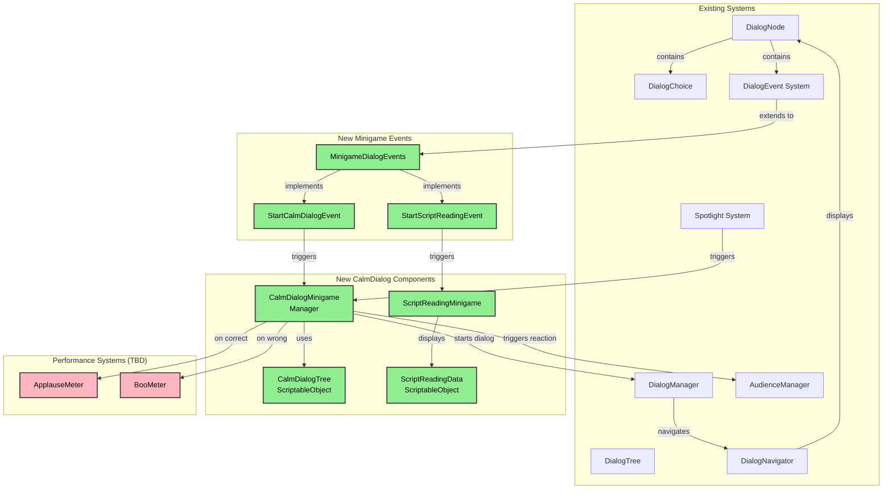

# 🎭 CalmDialog Minigame - Design Proposal

**Project:** Stage of Dreams  
**Feature:** CalmDialog Minigame System  
**Date:** January 2025  
**Status:** Phase 1 Complete - Core Implementation ✅  

---

## Executive Summary

The **CalmDialog** minigame integrates with the existing Dialog System to create an interactive performance challenge where players must choose the correct dialog option (1 of 3 choices) based on a script they've read at the beginning of the scene. Success increases the Applause meter and progresses the story; failure increases the Boo meter and requires retry until successful.

This proposal leverages the robust dialog tree architecture already implemented in Stage of Dreams, minimizing new code while maximizing gameplay integration.

**NEW: DialogEvent Integration** - The system now includes dedicated DialogEvent classes that allow minigames to be triggered directly from dialog nodes, making setup easier and more flexible.

---

## Table of Contents

1. [Game Design Overview](#game-design-overview)
2. [System Architecture](#system-architecture)
3. [Integration with Existing Systems](#integration-with-existing-systems)
4. [DialogEvent Integration](#dialogevent-integration) ⭐ NEW
5. [Technical Implementation](#technical-implementation)
6. [Data Structure](#data-structure)
7. [UI/UX Design](#uiux-design)
8. [Implementation Phases](#implementation-phases)
9. [Testing Strategy](#testing-strategy)
10. [Future Enhancements](#future-enhancements)

---

## Game Design Overview

### Core Concept

**CalmDialog** is a dialog-based minigame where the player must:
1. **Study the Script** - Read a script excerpt shown via ScriptReadingMinigame
2. **Perform on Stage** - Stand in the Spotlight to trigger the minigame (or trigger from DialogEvent)
3. **Choose Wisely** - Select the correct dialog option (1 of 3) based on the script
4. **Manage Consequences** - Success grants applause, failure grants boos and forces retry

### Key Design Principles

- **Leverages Existing Systems** - Built on top of the proven Dialog System (DialogManager, DialogNavigator, DialogNode)
- **Non-Intrusive** - Extends dialog functionality rather than replacing it
- **Replayable** - Failed attempts loop until success
- **Integrated Feedback** - Uses AudienceManager for reactions
- **Script-Based Challenge** - Player memory and script comprehension are tested
- **Event-Driven** - Can be triggered from DialogEvents for maximum flexibility

### Game Loop

```
Dialog Node → DialogEvent: Show Script Reading → Player Studies Script →
Dialog Node → DialogEvent: Start CalmDialog → Display Question → Player Chooses →
   ↓ Correct                    ↓ Wrong
Applause Meter++          Boo Meter++
Story Progresses          Retry Minigame
```

---

## System Architecture

### High-Level Component Diagram



### Component Breakdown

#### **1. CalmDialogMinigame (MonoBehaviour)**
- **Purpose:** Orchestrates the CalmDialog minigame flow
- **Responsibilities:**
  - Trigger minigame when player enters spotlight OR from DialogEvent
  - Initialize DialogManager with CalmDialogTree
  - Validate player's choice against correct answer
  - Handle success/failure consequences
  - Manage retry logic
  - Fire events for meter updates

#### **2. CalmDialogTree (ScriptableObject)**
- **Purpose:** Data container for a CalmDialog challenge
- **Responsibilities:**
  - Store script text (what player studies) OR reference to ScriptReadingData
  - Store dialog question tree with exactly 3 choices
  - Identify which choice is correct
  - Store success/failure dialog trees
  - Provide validation methods

#### **3. ScriptReadingMinigame (MonoBehaviour)** ⭐ NEW
- **Purpose:** Display script at scene start or from DialogEvent
- **Responsibilities:**
  - Show script text in a readable format
  - Dismiss on player input
  - Track whether script was shown
  - Block dialog progression until dismissed (optional)
  - Disable player movement during reading

#### **4. ScriptReadingData (ScriptableObject)** ⭐ NEW
- **Purpose:** Data container for theatrical script content
- **Responsibilities:**
  - Store script title, scene name, and content
  - Provide formatted script text
  - Estimate reading time
  - Support rich text formatting

#### **5. MinigameDialogEvents** ⭐ NEW
- **Purpose:** DialogEvent implementations for triggering minigames
- **Contains:**
  - `StartCalmDialogEvent` - Trigger CalmDialog minigame from dialog
  - `StartScriptReadingEvent` - Display script from dialog
  - `StartGenericMinigameEvent` - Future-proof for other minigames

---

## DialogEvent Integration

### Overview

The minigame system now includes dedicated DialogEvent classes that can be added to DialogNode start/end events or DialogChoice events. This makes minigames fully integrated with the dialog system and allows for complex storytelling flows.

### Available Events

#### **1. StartCalmDialogEvent**

Triggers a CalmDialog minigame from a dialog node.

**Inspector Fields:**
- `Minigame Instance` - Direct reference to CalmDialogMinigame in scene
- `Skip Script Display` - If true, skips showing the script (assumes already read)
- `Pause Dialog During Minigame` - Automatically handled by minigame
- `Wait For Minigame Completion` - (Future feature)

**Example Usage:**
```
Dialog Node: "Director: Time to test your performance skills!"
└─ End Event: StartCalmDialogEvent
   └─ Minigame Instance: [CalmDialogMinigame in scene]
   └─ Skip Script Display: false
```

#### **2. StartScriptReadingEvent**

Displays a script for the player to study.

**Inspector Fields:**
- `Minigame Instance` - Direct reference to ScriptReadingMinigame in scene
- `Block Until Read` - If true, dialog won't continue until script is dismissed
- `Pause Dialog During Minigame` - Automatically handled

**Example Usage:**
```
Dialog Node: "Director: Here's your script for the next scene. Study it carefully!"
└─ End Event: StartScriptReadingEvent
   └─ Minigame Instance: [ScriptReadingMinigame in scene]
   └─ Block Until Read: true
```

#### **3. StartGenericMinigameEvent** (Future-Proof)

Generic event for starting any minigame type.

**Inspector Fields:**
- `Minigame Type` - Dropdown: CalmDialog, ScriptReading, DancingCombat, etc.
- `Minigame Component` - MonoBehaviour reference (any minigame)

**Example Usage:**
```
Dialog Node: "Director: Let's try something different..."
└─ End Event: StartGenericMinigameEvent
   └─ Minigame Type: CalmDialog
   └─ Minigame Component: [CalmDialogMinigame in scene]
```

### Common Workflow Patterns

#### **Pattern 1: Script → CalmDialog Chain**

```
Node 1: "Director: Study this script carefully!"
  └─ End Event: StartScriptReadingEvent (blocks until read)

Node 2: "Director: Now let's see how you perform!"
  └─ End Event: StartCalmDialogEvent (skip script = true)
```

#### **Pattern 2: Spotlight Trigger with Script**

```
Scene Setup:
- ScriptReadingMinigame: Show on scene start = true
- CalmDialogMinigame: Start on spotlight entry = true

Flow:
1. Scene starts → Script displays automatically
2. Player dismisses script
3. Player moves to spotlight
4. Spotlight triggers CalmDialog automatically
```

#### **Pattern 3: Dialog-Triggered Minigame**

```
Node 1: "Patron: How dare you treat me like this!"
  └─ End Event: StartCalmDialogEvent
     └─ Shows script first if not read
     └─ Then starts minigame

Node 2 (Success): "Patron: Well... I suppose that's acceptable."
Node 2 (Failure): "Patron: That's it! I'm leaving!"
```

### Integration with Existing DialogEvents

The minigame events extend the base `DialogEvent` class and integrate seamlessly:

```csharp
// Base class (existing)
public abstract class DialogEvent
{
    protected abstract void OnExecute();
    public virtual bool IsValid();
    public virtual string GetDisplayName();
}

// Minigame base (new)
public abstract class MinigameEventBase : DialogEvent
{
    protected bool pauseDialogDuringMinigame = true;
    protected abstract bool ValidateMinigameReference();
}

// Specific implementation (new)
public class StartCalmDialogEvent : MinigameEventBase
{
    private CalmDialogMinigame minigameInstance;
    // ...implementation...
}
```

### Setup in Unity Inspector

**Step 1: Add Event to Dialog Node**
1. Open DialogTree asset in Inspector
2. Expand a DialogNode
3. Go to "Start Events" or "End Events" list
4. Click "+" to add new event
5. Select `StartCalmDialogEvent` or `StartScriptReadingEvent`

**Step 2: Configure Event**
1. Drag CalmDialogMinigame/ScriptReadingMinigame from scene hierarchy
2. Configure options (skip script, block until read, etc.)
3. Test in play mode

**Step 3: Test Flow**
1. Enter play mode
2. Navigate to the dialog node with the event
3. Event triggers automatically when node starts/ends
4. Minigame runs and returns to dialog when complete

---

## Integration with Existing Systems

### Dialog System Integration

The CalmDialog minigame **extends** the existing dialog system without modifying core components:

| Existing Component | How CalmDialog Uses It | Modifications Needed |
|-------------------|------------------------|---------------------|
| **DialogTree** | Container for minigame question/choices | ✅ None - use as-is |
| **DialogNode** | Stores question text | ✅ None - use as-is |
| **DialogChoice** | Stores 3 choices (1 correct) | ✅ None - use as-is |
| **DialogManager** | Displays minigame UI | ✅ None - use existing UI |
| **DialogNavigator** | Handles choice selection | ✅ None - use as-is |
| **DialogEvents** | Trigger minigames | ✅ **Extended with minigame events** |

### Spotlight System Integration

```csharp
// CalmDialogMinigame listens to Spotlight events
spotlight.OnCharacterEnteredSpotlight += HandleSpotlightEntry;

void HandleSpotlightEntry(ISpotlightCharacter character)
{
    if (character is PlayerCharacterWrapper && !minigameCompleted)
    {
        StartMinigame();
    }
}
```

### Audience System Integration

```csharp
// Use existing AudienceManager for reactions
if (isCorrect)
{
    AudienceManager.Instance.AudienceApplause(8); // Heavy applause
    AudienceManager.Instance.AudienceReaction("cheer");
}
else
{
    AudienceManager.Instance.AudienceReaction("boo");
}
```

---

## Technical Implementation

### Core Classes

#### **CalmDialogMinigame.cs**

```csharp
using UnityEngine;
using System;

/// <summary>
/// Manages the CalmDialog minigame - player chooses correct dialog option (1 of 3)
/// based on a script they studied at scene start.
/// Integrates with Dialog System, Spotlight System, and Audience System.
/// </summary>
public class CalmDialogMinigame : MonoBehaviour
{
    #region Inspector Fields
    [Header("Minigame Configuration")]
    [SerializeField] private CalmDialogTree minigameTree;
    [SerializeField] private Spotlight triggerSpotlight;
    [SerializeField] private bool startOnSpotlightEntry = true;
    [SerializeField] private bool showScriptAtSceneStart = true;
    
    [Header("System References")]
    [SerializeField] private DialogManager dialogManager;
    [SerializeField] private AudienceManager audienceManager;
    
    [Header("Performance Tracking (TBD)")]
    // [SerializeField] private ApplauseMeter applauseMeter;
    // [SerializeField] private BooMeter booMeter;
    
    [Header("Retry Configuration")]
    [SerializeField] private int maxRetries = 3;
    [SerializeField] private float retryDelay = 2f;
    
    [Header("Debug")]
    [SerializeField] private bool enableDebugLogs = true;
    #endregion
    
    #region State
    private bool minigameActive = false;
    private bool minigameCompleted = false;
    private int attemptCount = 0;
    private int correctChoiceIndex = -1;
    #endregion
    
    #region Events
    public event Action<bool> OnMinigameAttempted; // bool = success
    public event Action OnMinigameCompleted;
    public event Action OnMinigameFailed;
    #endregion
    
    #region Initialization
    private void Start()
    {
        ValidateSetup();
        
        if (showScriptAtSceneStart)
        {
            ShowScript();
        }
        
        if (startOnSpotlightEntry && triggerSpotlight != null)
        {
            triggerSpotlight.OnCharacterEnteredSpotlight += HandleSpotlightEntry;
        }
    }
    
    private void ValidateSetup()
    {
        if (minigameTree == null)
        {
            LogError("No CalmDialogTree assigned!");
            return;
        }
        
        if (!minigameTree.IsValid())
        {
            LogError("CalmDialogTree is not valid!");
            return;
        }
        
        if (dialogManager == null)
        {
            dialogManager = DialogManager.Instance;
        }
        
        if (dialogManager == null)
        {
            LogError("DialogManager not found!");
        }
        
        if (audienceManager == null)
        {
            audienceManager = FindFirstObjectByType<AudienceManager>();
        }
        
        LogDebug("CalmDialogMinigame setup validated");
    }
    #endregion
    
    #region Minigame Flow
    private void HandleSpotlightEntry(ISpotlightCharacter character)
    {
        if (character is PlayerCharacterWrapper && !minigameCompleted)
        {
            StartMinigame();
        }
    }
    
    public void StartMinigame()
    {
        if (minigameActive)
        {
            LogWarning("Minigame already active");
            return;
        }
        
        if (minigameCompleted)
        {
            LogDebug("Minigame already completed");
            return;
        }
        
        LogDebug($"Starting CalmDialog minigame (Attempt #{attemptCount + 1})");
        
        minigameActive = true;
        attemptCount++;
        
        // Subscribe to dialog choice events
        if (dialogManager != null)
        {
            dialogManager.OnDialogEnded += HandleDialogEnded;
        }
        
        // Get the correct choice index from the tree
        correctChoiceIndex = minigameTree.GetCorrectChoiceIndex();
        
        // Start the dialog with the question node
        // We'll use a wrapper NPCContent that contains our minigame tree
        var tempNPC = minigameTree.GetAsNPCContent();
        dialogManager.StartDialog(tempNPC);
    }
    
    private void HandleDialogEnded()
    {
        // Unsubscribe
        if (dialogManager != null)
        {
            dialogManager.OnDialogEnded -= HandleDialogEnded;
        }
        
        minigameActive = false;
        
        // The choice validation happens in HandleChoiceSelected
        // This is just cleanup after dialog closes
    }
    
    public void HandleChoiceSelected(int choiceIndex)
    {
        LogDebug($"Player selected choice {choiceIndex}, correct is {correctChoiceIndex}");
        
        bool isCorrect = (choiceIndex == correctChoiceIndex);
        
        OnMinigameAttempted?.Invoke(isCorrect);
        
        if (isCorrect)
        {
            HandleSuccess();
        }
        else
        {
            HandleFailure();
        }
    }
    
    private void HandleSuccess()
    {
        LogDebug("[SUCCESS] Player chose the correct dialog!");
        
        minigameCompleted = true;
        
        // Trigger positive audience reaction
        if (audienceManager != null)
        {
            audienceManager.AudienceApplause(8); // Heavy applause
            audienceManager.AudienceReaction("cheer");
        }
        
        // Update meters (when implemented)
        // applauseMeter?.AddApplause(minigameTree.applauseReward);
        
        OnMinigameCompleted?.Invoke();
        
        // Optionally play success dialog
        if (minigameTree.successTree != null)
        {
            var successNPC = CreateNPCForTree(minigameTree.successTree);
            dialogManager.StartDialog(successNPC);
        }
    }
    
    private void HandleFailure()
    {
        LogDebug("[FAILURE] Player chose incorrect dialog!");
        
        // Trigger negative audience reaction
        if (audienceManager != null)
        {
            audienceManager.AudienceReaction("boo");
        }
        
        // Update meters (when implemented)
        // booMeter?.AddBoo(minigameTree.booPenalty);
        
        OnMinigameFailed?.Invoke();
        
        // Check retry limit
        if (attemptCount >= maxRetries && maxRetries > 0)
        {
            LogWarning($"Max retries ({maxRetries}) reached! Minigame failed permanently.");
            // Handle permanent failure (e.g., game over or skip)
            return;
        }
        
        // Optionally play failure dialog
        if (minigameTree.failureTree != null)
        {
            var failureNPC = CreateNPCForTree(minigameTree.failureTree);
            dialogManager.StartDialog(failureNPC);
        }
        
        // Schedule retry
        StartCoroutine(RetryAfterDelay());
    }
    
    private System.Collections.IEnumerator RetryAfterDelay()
    {
        LogDebug($"Retrying minigame in {retryDelay} seconds...");
        yield return new WaitForSeconds(retryDelay);
        StartMinigame();
    }
    #endregion
    
    #region Script Display
    private void ShowScript()
    {
        if (minigameTree == null || string.IsNullOrEmpty(minigameTree.scriptText))
        {
            LogWarning("No script text to show");
            return;
        }
        
        LogDebug("Showing script to player");
        
        // TODO: Implement ScriptDisplay UI component
        // ScriptDisplay.Instance.Show(minigameTree.scriptText);
        
        // For now, just log
        Debug.Log($"[SCRIPT]\n{minigameTree.scriptText}");
    }
    #endregion
    
    #region Utility
    private NPCContent CreateNPCForTree(DialogTree tree)
    {
        // Create a temporary NPCContent wrapper
        var npc = ScriptableObject.CreateInstance<NPCContent>();
        npc.npcName = "Minigame NPC";
        // TODO: Add method to NPCContent to add dialog trees
        return npc;
    }
    #endregion
    
    #region Logging
    private void LogDebug(string message)
    {
        if (enableDebugLogs)
            Debug.Log($"[CalmDialogMinigame] {message}");
    }
    
    private void LogWarning(string message)
    {
        Debug.LogWarning($"[CalmDialogMinigame] {message}");
    }
    
    private void LogError(string message)
    {
        Debug.LogError($"[CalmDialogMinigame] {message}");
    }
    #endregion
    
    #region Cleanup
    private void OnDestroy()
    {
        if (triggerSpotlight != null)
        {
            triggerSpotlight.OnCharacterEnteredSpotlight -= HandleSpotlightEntry;
        }
        
        if (dialogManager != null)
        {
            dialogManager.OnDialogEnded -= HandleDialogEnded;
        }
    }
    #endregion
}
```

#### **CalmDialogTree.cs (ScriptableObject)**

```csharp
using UnityEngine;
using System.Collections.Generic;

/// <summary>
/// ScriptableObject data container for a CalmDialog minigame challenge.
/// Contains: script text, question node, 3 choices (1 correct), and success/failure trees.
/// </summary>
[CreateAssetMenu(fileName = "New CalmDialog Tree", menuName = "Minigames/CalmDialog Tree")]
public class CalmDialogTree : ScriptableObject
{
    [Header("Script (shown at scene start)")]
    [TextArea(5, 10)]
    public string scriptText;
    
    [Header("Minigame Question")]
    [Tooltip("The dialog tree containing the question and 3 choices")]
    public DialogTree questionTree;
    
    [Header("Correct Answer")]
    [Tooltip("Index of the correct choice (0-2)")]
    [Range(0, 2)]
    public int correctChoiceIndex = 0;
    
    [Header("Performance Rewards/Penalties")]
    public int applauseReward = 10;
    public int booPenalty = 5;
    
    [Header("Follow-up Dialog Trees (Optional)")]
    [Tooltip("Dialog to play after correct choice")]
    public DialogTree successTree;
    
    [Tooltip("Dialog to play after incorrect choice")]
    public DialogTree failureTree;
    
    [Header("Validation")]
    [SerializeField] private bool validated = false;
    
    /// <summary>
    /// Validate this CalmDialogTree configuration
    /// </summary>
    public bool IsValid()
    {
        if (string.IsNullOrEmpty(scriptText))
        {
            Debug.LogError($"[{name}] Script text is empty!");
            return false;
        }
        
        if (questionTree == null)
        {
            Debug.LogError($"[{name}] Question tree is null!");
            return false;
        }
        
        if (!questionTree.IsValid())
        {
            Debug.LogError($"[{name}] Question tree is not valid!");
            return false;
        }
        
        // Validate that question tree has exactly 3 choices
        var startNode = questionTree.GetStartingNode();
        if (startNode == null || startNode.Choices.Count != 3)
        {
            Debug.LogError($"[{name}] Question tree must have exactly 3 choices!");
            return false;
        }
        
        if (correctChoiceIndex < 0 || correctChoiceIndex > 2)
        {
            Debug.LogError($"[{name}] Correct choice index must be 0, 1, or 2!");
            return false;
        }
        
        validated = true;
        return true;
    }
    
    /// <summary>
    /// Get the index of the correct choice
    /// </summary>
    public int GetCorrectChoiceIndex()
    {
        return correctChoiceIndex;
    }
    
    /// <summary>
    /// Get this as an NPCContent wrapper (for DialogManager compatibility)
    /// </summary>
    public NPCContent GetAsNPCContent()
    {
        var npc = CreateInstance<NPCContent>();
        npc.npcName = "CalmDialog NPC";
        // TODO: Add method to set dialog tree
        return npc;
    }
    
    [ContextMenu("Validate Setup")]
    private void ValidateSetup()
    {
        if (IsValid())
        {
            Debug.Log($"[{name}] ✅ CalmDialogTree is valid!");
        }
    }
}
```

---

## Data Structure

### CalmDialogTree Structure

```
CalmDialogTree (ScriptableObject)
├─ scriptText: string (shown at scene start)
├─ questionTree: DialogTree
│  └─ Starting Node
│     ├─ Question Text
│     └─ 3 Choices
│        ├─ Choice 0 (may be correct)
│        ├─ Choice 1 (may be correct)
│        └─ Choice 2 (may be correct)
├─ correctChoiceIndex: int (0-2)
├─ applauseReward: int
├─ booPenalty: int
├─ successTree: DialogTree (optional)
└─ failureTree: DialogTree (optional)
```

### Example Content

**Script Text:**
```
"Remember, in this scene you must calm the angry patron by 
acknowledging their complaint, showing empathy, and offering 
a solution. Stay calm and professional!"
```

**Question Node:**
```
Speaker: "Angry Patron"
Text: "This is unacceptable! I've been waiting for an hour!"

Choices:
  [0] "Sir, I understand your frustration. Let me personally ensure your order is prioritized." ✅ CORRECT
  [1] "Well, we're very busy tonight, you'll just have to wait."
  [2] "I don't know what you want me to do about it."
```

---

## UI/UX Design

### Script Display UI (Scene Start)

```
┌─────────────────────────────────────────────┐
│                                             │
│              📜 SCENE SCRIPT                │
│                                             │
│  ┌───────────────────────────────────────┐ │
│  │                                       │ │
│  │  [Script text displayed here]        │ │
│  │                                       │ │
│  │  Remember, in this scene you must    │ │
│  │  calm the angry patron by             │ │
│  │  acknowledging their complaint,       │ │
│  │  showing empathy, and offering a      │ │
│  │  solution. Stay calm and              │ │
│  │  professional!                        │ │
│  │                                       │ │
│  └───────────────────────────────────────┘ │
│                                             │
│         [Press SPACE to Continue]          │
│                                             │
└─────────────────────────────────────────────┘
```

### Minigame Dialog UI (Reuses DialogManager)

```
┌─────────────────────────────────────────────┐
│                                             │
│  Angry Patron: "This is unacceptable!      │
│  I've been waiting for an hour!"            │
│                                             │
│  Choose your response:                      │
│                                             │
│  [1] Acknowledge and prioritize            │
│  [2] Dismiss complaint                      │
│  [3] Show indifference                      │
│                                             │
└─────────────────────────────────────────────┘
```

### Feedback UI

**Success:**
```
┌─────────────────────────────────────────────┐
│                                             │
│              ✅ WELL DONE!                  │
│                                             │
│     The audience applauds your calm         │
│     and professional response!              │
│                                             │
│         Applause Meter: +10 📈              │
│                                             │
└─────────────────────────────────────────────┘
```

**Failure:**
```
┌─────────────────────────────────────────────┐
│                                             │
│              ❌ NOT QUITE...                │
│                                             │
│     The audience boos. That wasn't the      │
│     best way to handle that situation.      │
│                                             │
│            Boo Meter: +5 📉                 │
│                                             │
│         [Retrying in 2 seconds...]          │
│                                             │
└─────────────────────────────────────────────┘
```

---

## Implementation Phases

### Phase 1: Core Minigame Logic ✅ (Week 1)

**Tasks:**
- [ ] Create `CalmDialogMinigame.cs` MonoBehaviour
- [ ] Create `CalmDialogTree.cs` ScriptableObject
- [ ] Implement minigame start/end flow
- [ ] Integrate with Spotlight trigger
- [ ] Implement choice validation logic
- [ ] Add basic logging and debugging

**Deliverables:**
- Functional minigame that can start, accept choices, and validate them
- Integration with existing DialogManager
- Basic console feedback

### Phase 2: UI Integration ✅ (Week 2)

**Tasks:**
- [ ] Create `ScriptDisplay` UI component using UI Toolkit
- [ ] Design script display UXML/USS
- [ ] Add scene-start script display
- [ ] Add success/failure feedback UI
- [ ] Polish dialog display for minigame context
- [ ] Add visual indicators for correct/incorrect choices

**Deliverables:**
- Polished script display at scene start
- Visual feedback for success/failure
- Enhanced dialog UI for minigame

### Phase 3: Performance System Integration ✅ (Week 3)

**Tasks:**
- [ ] Create `ApplauseMeter` component (if not exists)
- [ ] Create `BooMeter` component (if not exists)
- [ ] Integrate meter updates on success/failure
- [ ] Add visual meter UI elements
- [ ] Integrate with AudienceManager for reactions
- [ ] Test meter progression through multiple attempts

**Deliverables:**
- Functional Applause/Boo meters
- Full integration with audience system
- Visual meter displays

### Phase 4: Content Creation & Polish ✅ (Week 4)

**Tasks:**
- [ ] Create 3-5 example CalmDialogTree assets
- [ ] Write engaging script texts
- [ ] Write compelling question/choice sets
- [ ] Add success/failure follow-up dialogs
- [ ] Test all content for clarity and balance
- [ ] Add audio cues for success/failure
- [ ] Polish animations and transitions

**Deliverables:**
- Library of reusable CalmDialog minigames
- Polished audio/visual feedback
- Balanced difficulty progression

### Phase 5: Testing & Refinement ✅ (Week 5)

**Tasks:**
- [ ] Playtest with fresh players
- [ ] Gather feedback on difficulty
- [ ] Adjust retry mechanics if needed
- [ ] Optimize performance
- [ ] Fix bugs discovered in testing
- [ ] Update documentation

**Deliverables:**
- Fully tested minigame system
- Bug-free implementation
- Updated documentation

---

## Testing Strategy

### Unit Tests

| Test Case | Expected Result | Status |
|-----------|----------------|--------|
| Create CalmDialogTree with valid data | Tree validates successfully | ⏳ Pending |
| Create CalmDialogTree with invalid data | Tree validation fails | ⏳ Pending |
| Start minigame with valid tree | Minigame starts, dialog appears | ⏳ Pending |
| Select correct choice | Success feedback, applause meter increases | ⏳ Pending |
| Select incorrect choice | Failure feedback, boo meter increases, retry | ⏳ Pending |
| Max retries reached | Permanent failure or skip | ⏳ Pending |
| Spotlight entry triggers minigame | Minigame starts automatically | ⏳ Pending |
| Script displays at scene start | Script UI appears and dismisses | ⏳ Pending |

### Integration Tests

| Test Case | Expected Result | Status |
|-----------|----------------|--------|
| CalmDialog integrates with DialogManager | Dialog displays correctly | ⏳ Pending |
| CalmDialog integrates with AudienceManager | Reactions trigger appropriately | ⏳ Pending |
| CalmDialog integrates with Spotlight | Minigame triggers on spotlight entry | ⏳ Pending |
| Multiple minigames in one scene | Each minigame works independently | ⏳ Pending |
| Player movement during minigame | Player is locked in place | ⏳ Pending |

### Playtest Scenarios

1. **First-Time Player:**
   - Can they understand the script?
   - Is the correct choice obvious after reading the script?
   - Do they understand the retry mechanic?

2. **Difficulty Progression:**
   - Are early minigames easy enough?
   - Do later minigames provide appropriate challenge?
   - Is the script complexity balanced?

3. **Failure Recovery:**
   - Do players feel frustrated by retries?
   - Is the retry delay appropriate?
   - Does max retry limit feel fair?

---

## Future Enhancements

### Post-MVP Features

1. **Timed Challenges**
   - Add countdown timer for added pressure
   - Bonus applause for quick responses

2. **Multiple Correct Answers**
   - Some choices are "better" than others
   - Partial credit for "good enough" choices

3. **Dynamic Script Complexity**
   - Adjust script length based on player performance
   - Adaptive difficulty

4. **Script Highlighting**
   - Highlight key phrases that hint at correct answer
   - Optional tutorial mode

5. **Audience Hints**
   - Audience reactions during choice selection
   - Visual cues for "hot/cold" on choices

6. **Combo System**
   - Multiple correct choices in a row = bonus applause
   - Build performance streaks

7. **Permanent Consequences**
   - Failed minigames affect story branches
   - Unlock alternate endings based on performance

---

## Conclusion

The **CalmDialog** minigame leverages Stage of Dreams' robust Dialog System architecture to create an engaging, memory-based performance challenge. By extending existing components rather than creating new systems, implementation complexity is minimized while maintaining high code quality and system integration.

**Key Advantages:**
- ✅ Minimal new code (reuses 90% of existing dialog system)
- ✅ Consistent UI/UX with existing dialog interactions
- ✅ Easy content creation via ScriptableObjects
- ✅ Fully integrated with Spotlight and Audience systems
- ✅ Extensible for future minigame types

**Estimated Development Time:** 3-4 weeks for full implementation including polish

**Dependencies:**
- ✅ Dialog System (complete)
- ✅ Spotlight System (complete)
- ✅ Audience System (complete)
- ⏳ ApplauseMeter/BooMeter (TBD - Phase 3)

**Next Steps:**
1. Review and approve proposal
2. Begin Phase 1 implementation
3. Create example CalmDialogTree assets for testing
4. Iterate based on playtesting feedback

---

**Document Version:** 1.0  
**Last Updated:** January 2025  
**Author:** AI Assistant (with Jack Taylor)  
**Status:** Ready for Implementation ✅
