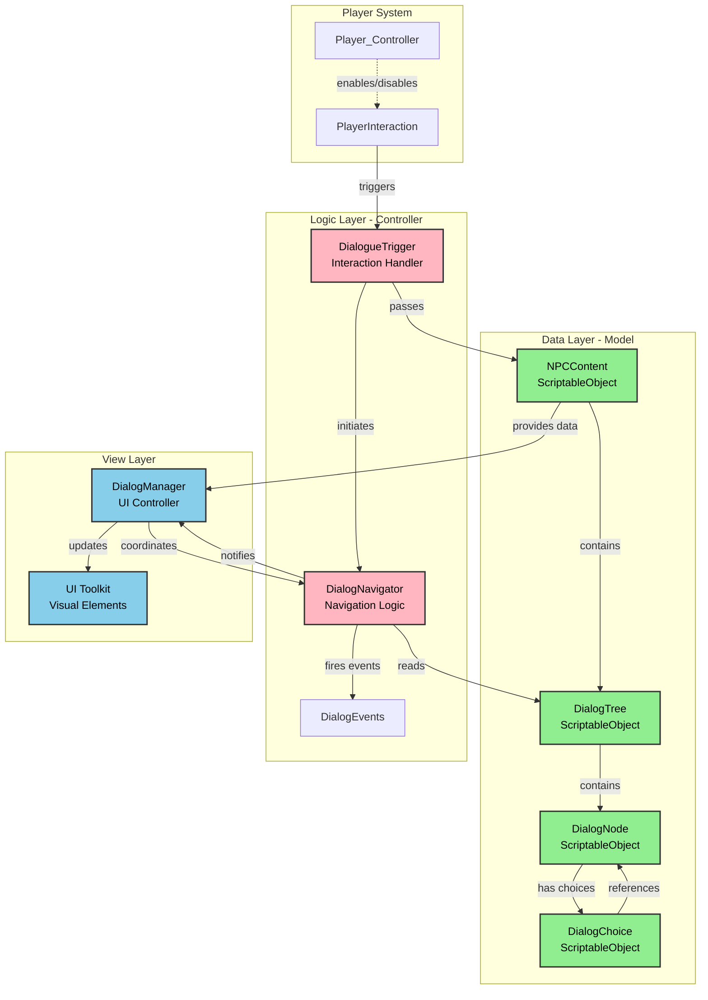
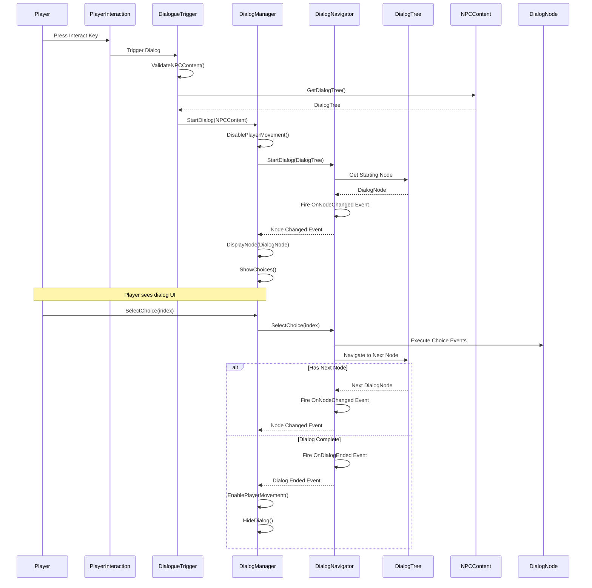
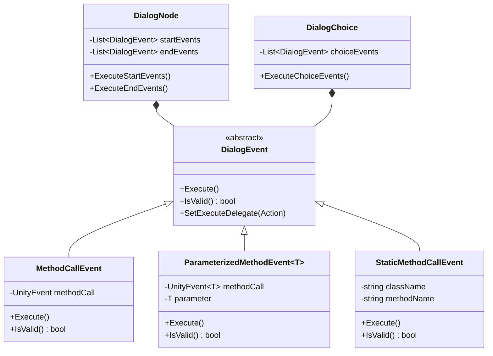
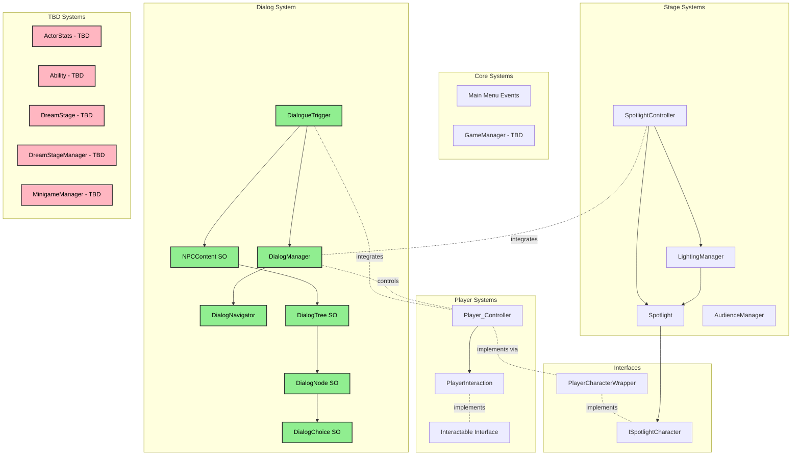
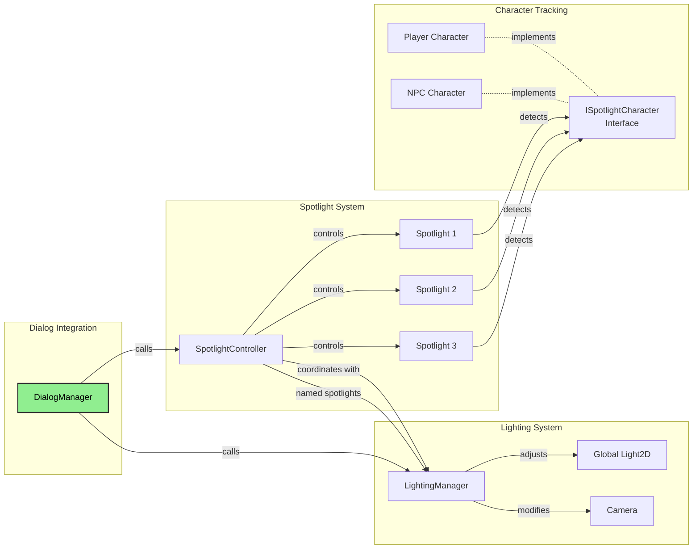
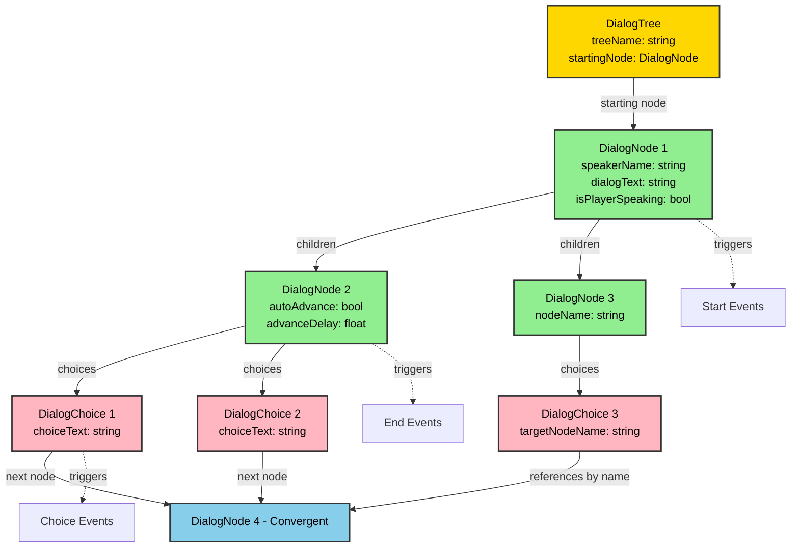

# Stage of Dreams - Class Hierarchy

## Architecture Diagrams

### Dialog System Architecture (MVC Pattern)



### Dialog Flow Sequence



### Dialog Event System



### Complete Class Hierarchy Overview



### Spotlight & Lighting Integration



### Data Structure: Dialog Tree



---

## Dialog System - Detailed Architecture

### Pattern: Model-View-Controller (MVC) with Event-Driven Communication

### Components

#### A. Data Layer (Model)
- **`DialogTree`** (ScriptableObject): Container for entire conversation tree
  - Stores starting node and manages node collection
  - Provides tree traversal and validation methods
  - Supports named nodes for convergent dialog paths
  
- **`DialogNode`** (ScriptableObject): Individual conversation node
  - Properties: speaker name, dialog text, player speaking flag
  - Supports: auto-advance, choices, parent/child relationships
  - Events: start events, end events
  
- **`DialogChoice`** (ScriptableObject): Choice option in dialog
  - Properties: choice text, target node, choice events
  - Supports: named node references, convergent paths

#### B. Logic Layer (Controller)
- **`DialogNavigator`**: Navigation logic engine
  - Manages current node and navigation state
  - Handles choice selection and auto-advance
  - Fires navigation events (node changed, dialog ended, custom actions)
  
- **`DialogueTrigger`**: Interaction trigger component
  - Bridges player interaction with dialog system
  - Validates NPC content and starts dialog sessions
  - Manages dialog lifecycle events

#### C. View Layer
- **`DialogManager`**: UI controller
  - Manages UI Toolkit elements (UXML/USS)
  - Displays dialog text and choices
  - Handles user input for choices
  - Coordinates with DialogNavigator

### Integration Flow
```
Player Interaction → DialogueTrigger → DialogManager → DialogNavigator
                                            ↓
                                       NPC Content
                                            ↓
                                       Dialog Tree
```

### Key Features
- **Convergent Paths**: Multiple choices can lead to same node via named references
- **Event System**: Custom events can be triggered at node start/end or choice selection
- **Validation**: Comprehensive validation at multiple levels (tree, node, choice)
- **Auto-Advance**: Nodes can automatically progress after delay
- **Method Delegates**: Events support both UnityEvents and direct method calls

### Event System Pattern
**Observer pattern with polymorphic event types**

#### Base Event Class:
```csharp
public abstract class DialogEvent
{
    - Execute(): Triggers the event
    - IsValid(): Validates event configuration
    - SetExecuteDelegate(Action): Supports method delegates
}
```

#### Implemented Event Types:
- `MethodCallEvent`: Execute custom methods
- `ParameterizedMethodEvent<T>`: Execute methods with parameters
- `StaticMethodCallEvent`: Call static methods via reflection

#### Usage Pattern:
```csharp
// At node start/end
node.AddStartEvent(new MethodCallEvent());
node.AddEndEvent(new MethodCallEvent());

// At choice selection
choice.AddChoiceEvent(new ParameterizedMethodEvent<string>());
```

---

## Scripts Folder: Core Classes

### ✓ Main Menu Events.cs
- **Properties:**
  - `UIDocument _document`
  - `List<Button> _menuButtons`
  - `AudioSource _audioSource`
- **Methods:**
  - `Awake()`
  - `OnMenuButtonClicked(ClickEvent evt, string buttonName)`
  - `OnDestroy()`
  - `OnStartButtonClicked()`
  - `OnSettingsButtonClicked()`
  - `OnExitButtonClicked()`
- **Description:** Handles main menu UI interactions using UI Toolkit, manages scene transitions and application exit

### ⏳ GameManager.cs (TBD)
- **Properties:**
  - `GameState currentGameState`
  - `int currentDreamIndex`
  - `bool isInTurnBasedMode`
  - `DreamStage activeDreamStage`
  - `ActorStats playerStats`
- **Methods:**
  - `StartGame()`
  - `LoadDreamStage(int stageIndex)`
  - `SwitchGameState(GameState newState)`
  - `EndGame()`
  - `SaveGameProgress()`
  - `LoadGameProgress()`
- **Description:** Controls game state, scene transitions, and dream progression

## PlayerScripts Folder

### ✓ Player_Controller.cs (PlayerScript.cs)
- **Properties:**
  - `float _moveSpeed = 5f`
  - `bool inSpotlight`
  - `bool canMove = true`
  - `Vector2 _moveDir`
  - `Rigidbody2D _rb`
  - `Animator _animator`
  - `SpriteRenderer _spriteRenderer`
  - `PlayerInput _playerInput`
  - `PlayerInteraction _playerInteraction`
- **Methods:**
  - `Awake()`
  - `Update()`
  - `FixedUpdate()`
  - `GatherInput()`
  - `MovementUpdate()`
  - `DisableMovement()`
  - `EnableMovement()`
  - `IsMoving()`
- **Description:** Handles player movement, input processing, and integration with dialog/spotlight systems

### ✓ PlayerInteraction.cs
- **Properties:**
  - Referenced in PlayerScript but implementation details not fully examined
- **Description:** Handles player interaction system (separate from movement)

### ✓ Interactable.cs
- **Description:** Base interface/class for interactable objects

## StageScripts Folder

### ✓ Spotlight.cs
- **Properties:**
  - `float radius = 1.5f`
  - `LayerMask characterLayer`
  - `SpotlightMovementType movementType`
  - `float moveSpeed = 2f`
  - `Transform targetToFollow`
  - `Vector2 movementBounds`
  - `float randomMoveInterval = 3f`
  - `bool trackAllCharacters = true`
  - `PlayerScript specificPlayer`
  - `bool startVisible = true`
  - `float fadeSpeed = 2f`
  - `float baseIntensity = 20f`
  - `HashSet<ISpotlightCharacter> charactersInSpotlight`
  - `Light2D spotlightLight`
  - `SpriteRenderer spotlightRenderer`
- **Methods:**
  - `Awake()`, `Start()`, `Update()`
  - `AppearSpotlight()`, `DisappearSpotlight()`
  - `ShowSpotlightInstant()`, `HideSpotlightInstant()`
  - `ToggleSpotlight()`, `IsVisible()`, `IsFullyVisible()`
  - `SetMovementType()`, `MoveToPosition()`, `SetTarget()`
  - `StartRandomMovement()`, `StopMovement()`
  - `GetCharactersInSpotlight()`, `HasCharacterInSpotlight()`
  - `SetIntensity()`, `SetColor()`, `SetRadius()`
- **Events:**
  - `OnCharacterEnteredSpotlight`, `OnCharacterExitedSpotlight`
  - `OnSpotlightMoved`, `OnSpotlightAppeared`, `OnSpotlightDisappeared`
- **Description:** Advanced spotlight system with visibility control, movement patterns, and character detection using Light2D integration

### ✓ SpotlightController.cs
- **Properties:**
  - `Spotlight mainSpotlight`
  - `Transform[] performers`
  - `float performanceTime = 30f`
  - `bool autoStartPerformance = false`
  - `Spotlight[] spotlightsForDialog`
  - `LightingManager lightingManager`
  - `bool enableLightingEffects = true`
- **Methods:**
  - `Start()`, `OnDestroy()`, `Update()`
  - `ShowSpotlightByName(string)`, `HideSpotlightByName(string)`
  - `ShowSpotlight1-3()`, `HideSpotlight1-3()` (Unity Inspector methods)
  - `ShowMainStageSpotlight()`, `ShowLeftSpotlight()`, `ShowRightSpotlight()`
  - `SetSpotlightColor()`, `SetSpotlightIntensity()`
  - `EnableDarkLighting()`, `DisableDarkLighting()`, `ToggleDarkLighting()`
  - `StartPerformance()`, `StopPerformance()`
  - `StartRandomMovement()`, `FollowCharacter()`
- **Description:** High-level controller for coordinating multiple spotlights and lighting effects, integrates with dialog system

### ✓ LightingManager.cs
- **Properties:**
  - `Light2D globalLight`
  - `Camera mainCamera`
  - `float normalAmbientIntensity = 1f`
  - `float darkAmbientIntensity = 0.1f`
  - `Color normalBackgroundColor`, `Color darkBackgroundColor`
  - `float transitionSpeed = 2f`
  - `bool startInDarkMode = false`
  - `Spotlight[] namedSpotlights`
  - `bool isDarkMode`, `bool isTransitioning`
- **Methods:**
  - `Awake()`, `Update()`
  - `EnableDarkMode()`, `DisableDarkMode()`, `ToggleDarkMode()`
  - `SetDarkModeInstant(bool)`, `SetAmbientIntensity(float)`
  - `SetBackgroundColor(Color)`, `IsDarkMode()`, `IsTransitioning()`
  - `ShowSpotlight1-5()`, `HideSpotlight1-5()` (Unity Inspector methods)
  - `ShowMainStageSpotlight()`, `ShowLeftSideSpotlight()`, etc.
  - `ShowAllNamedSpotlights()`, `HideAllNamedSpotlights()`
  - `RefreshNamedSpotlights()`
- **Events:**
  - `OnDarkModeEnabled`, `OnDarkModeDisabled`, `OnLightingTransitionComplete`
- **Description:** Manages global lighting states and dramatic lighting effects, integrates with dialog system

### ✓ AudienceManager.cs
- **Properties:**
  - `AudioSource audienceAudioSource`
  - `ParticleSystem applauseParticles`
  - `Animator audienceAnimator`
  - `AudioClip lightApplauseClip`, `heavyApplauseClip`, `laughterClip`, `gaspClip`, `booClip`
  - `float baseVolume = 0.7f`
  - `bool enableDebugLogs = true`
- **Methods:**
  - `Start()`, `OnValidate()`
  - `AudienceApplause(int intensity)` (1-10 scale)
  - `AudienceReaction(string reactionType)` (laugh, gasp, boo, cheer)
  - `SetAudienceMood(float moodLevel)` (0.0-1.0 scale)
  - `CreateSilence()`, `StandingOvation()`
  - `BoostEngagement(float amount)`
  - `LogPerformanceEvent(string)` (static method)
- **Description:** Manages audience reactions and feedback, designed for Unity Event integration from dialog nodes

## Dialog System

### ✓ DialogManager.cs
- **Properties:**
  - `UIDocument uiDocument`
  - `VisualTreeAsset dialogVisualTree`
  - `string interactActionName = "Interact"`
  - `bool enableInputLogging`, `enableDebugLogs`, `validateOnStart`
  - `GroupBox dialogBox`, `Label dialogLabel`
  - `Button choiceButton1-5`
  - `PlayerInput playerInput`, `InputAction interactAction`
  - `DialogNavigator navigator`
  - `bool isUIActive`, `isInitialized`
  - `NPCContent currentNPC`, `DialogTree currentTree`
  - `int dialogSessionCount`
- **Methods:**
  - `Awake()`, `Start()`, `Update()`, `OnDestroy()`
  - `InitializeDialogManager()`, `InitializeNavigator()`, `InitializeUI()`, `InitializeInput()`
  - `ValidateSetup()`, `ValidateNPCContent()`
  - `StartDialog(NPCContent)`, `StartDialog(NPCContent, string)`
  - `HandleNodeChanged(DialogNode)`, `HandleCustomAction()`, `HandleDialogEnded()`
  - `DisplayNode(DialogNode)`, `ShowChoices()`, `HideChoices()`, `HideDialog()`
  - `OnChoiceClicked(int)`, `AdvanceDialog()`, `EndDialog()`
  - `IsDialogActive()`, `GetNavigationState()`, `IsReady()`
- **Events:**
  - `OnDialogStarted`, `OnDialogEnded`, `OnNodeDisplayed`, `OnCustomActionHandled`
- **Description:** Singleton dialog manager handling UI display and integration with DialogNavigator, supports UI Toolkit

### ✓ DialogNavigator.cs
- **Properties:**
  - Details not fully examined but integrated with DialogManager
- **Methods:**
  - `StartDialog()`, `AdvanceDialog()`, `SelectChoice()`, `EndDialog()`
  - `GetCurrentState()`, `IsActive`
- **Events:**
  - `OnNodeChanged`, `OnCustomActionTriggered`, `OnDialogEnded`
- **Description:** Handles dialog tree navigation logic, separate from UI concerns

### ✓ DialogueTrigger.cs
- **Properties:**
  - `bool triggerOnSpotlight`, `triggerOnInteraction`, `triggerOnProximity`
  - `float interactionRange = 2f`, `proximityRange = 1.5f`
  - `bool requireInteractionInput = true`
  - `KeyCode interactionKey = KeyCode.E`
  - `NPCContent targetNPC`
  - `string specificDialogTree`
  - `bool canRetrigger`, `float retriggerDelay = 10f`
  - `DialogManager dialogManager`, `PlayerScript player`
  - `bool hasTriggered`, `isWaitingForInput`
- **Methods:**
  - `Start()`, `Update()`, `OnDestroy()`, `OnDisable()`
  - `InitializeReferences()`, `ValidateSetup()`, `ValidateNPCContent()`
  - `IsReadyToTrigger()`, `CheckSpotlightTrigger()`, `CheckInteractionTrigger()`, `CheckProximityTrigger()`
  - `PassNPCContent()`, `PrepareNPCForDialog()`
  - `SubscribeToDialogEvents()`, `HandleDialogManagerEnded()`
  - `ResetTrigger()`, `ManualTrigger()`
  - `SetTriggerType()`, `SetTargetNPC()`
  - `GetTargetDialogTree()`, `GetSetupStatus()`
- **Events:**
  - `OnDialogTriggered`, `OnDialogEnded`
- **Description:** Unified dialog trigger system supporting multiple trigger conditions and comprehensive validation

## World/Dialog Data Classes

### ✓ Dialog Node.cs (DialogNode)
- **Properties:**
  - Details not fully examined but used throughout dialog system
- **Description:** Core dialog node structure with choices and events

### ✓ Dialog Tree.cs (DialogTree)
- **Properties:**
  - Details not fully examined but used throughout dialog system
- **Methods:**
  - `IsValid()`, `GetMainDialogTree()`
- **Description:** Container for dialog nodes and navigation structure

### ✓ Dialog Choice.cs (DialogChoice)
- **Properties:**
  - Details not fully examined but integrated with dialog system
- **Description:** Individual choice options within dialog nodes

### ✓ NPC Content.cs (NPCContent)
- **Properties:**
  - `string npcName`
  - Dialog trees and content (details not fully examined)
- **Methods:**
  - `HasValidDialogContent()`, `GetDialogTree(string)`, `GetMainDialogTree()`
  - `OnDialogStarted()`, `OnDialogEnded()`
- **Description:** Container for NPC data including dialog trees, used by dialog triggers

### ✓ Example NPC.cs
- **Description:** Example implementation or template for NPCs

## Interfaces

### ✓ ISpotlightCharacter
- **Methods:**
  - `Vector2 GetPosition()`
  - `string GetCharacterName()`
  - `void SetInSpotlight(bool)`
  - `bool IsInSpotlight()`
- **Description:** Interface for characters that can be tracked by spotlights

### ✓ PlayerCharacterWrapper
- **Description:** Wrapper to make PlayerScript compatible with ISpotlightCharacter interface

## TBD Classes (Not Yet Implemented)

### ⏳ ActorStats.cs (TBD)
- **Properties:**
  - `int _health = 100`
  - `float _applauseMeter = 0f`
  - `float _booMeter = 0f`
  - `bool _hasMask = false`
  - `int maxHealth = 100`
  - `float maxApplause = 100f`
  - `float maxBoo = 100f`
- **Methods:**
  - `TakeDamage(int damage)`
  - `Heal(int amount)`
  - `AddApplause(float amount)`
  - `AddBoo(float amount)`
  - `ResetMeters()`
  - `GetHealthPercentage()`
  - `GetApplausePercentage()`
  - `GetBooPercentage()`
- **Description:** Stores health, applause meter, boo meter, and mask state

### ⏳ Ability.cs (TBD)
- **Properties:**
  - `string abilityName`
  - `string description`
  - `float cooldown`
  - `bool isAvailable = true`
  - `ActorStats requiredStats`
- **Methods:**
  - `virtual Execute(ActorStats stats)`
  - `virtual CanExecute(ActorStats stats)`
  - `StartCooldown()`
  - `ResetCooldown()`
- **Description:** Base class for abilities like "PumpUpAudience", "ImprovedDialogue", "UseProp"

### ⏳ DreamStage.cs (TBD)
- **Properties:**
  - `string stageName`
  - `Act[] acts` // Act I, II, III
  - `ClimaxBox climaxBox`
  - `int currentActIndex`
  - `bool isCompleted`
- **Methods:**
  - `StartStage()`
  - `ProgressToNextAct()`
  - `TriggerClimaxBox()`
  - `CompleteStage()`
  - `GetCurrentAct()`
- **Description:** Defines dream structure: Act I, II, III, ClimaxBox

### ⏳ DreamStageManager.cs (TBD)
- **Properties:**
  - `DreamStage[] availableStages`
  - `int currentStageIndex`
  - `bool isTransitioning`
  - `float transitionDuration = 2f`
- **Methods:**
  - `LoadStage(int stageIndex)`
  - `TransitionToNextStage()`
  - `UnloadCurrentStage()`
  - `StartTransition()`
  - `CompleteTransition()`
- **Description:** Manages transitions between dream stages and loading scenes

### ⏳ MinigameManager.cs (TBD)
- **Properties:**
  - `MinigameType currentMinigame`
  - `bool isMinigameActive`
  - `float minigameTimer`
  - `int score`
  - `int requiredScore`
  - `ActorStats playerStats`
- **Methods:**
  - `StartMinigame(MinigameType type)`
  - `EndMinigame(bool success)`
  - `CalmDialogue()` // 3 dialogue options, 1 correct
  - `RememberTheScript()` // Type out a word/phrase
  - `DancingCombat()` // Press arrow keys in rhythm
  - `DramaticLock()` // Button mash followed by typing script
  - `CheckMinigameSuccess()`
  - `GiveReward(int applause, int score)`
- **Description:** Handles minigame activation, success/failure conditions, and rewards

## TBD Data Classes

### ⏳ AudienceMember.cs (TBD)
- **Properties:**
  - `string memberName`
  - `float mood`
  - `Sprite memberSprite`
  - `Vector3 seatPosition`
- **Methods:**
  - `ReactToPerformance(float impact)`
  - `GetReactionSprite()`
- **Description:** Individual audience member with mood and reactions

### ⏳ Act.cs (TBD)
- **Properties:**
  - `string actName`
  - `List<DialogueData> actDialogue`
  - `List<MinigameType> requiredMinigames`
  - `bool isCompleted`
- **Methods:**
  - `StartAct()`
  - `CompleteAct()`
- **Description:** Represents one act within a dream stage

### ⏳ ClimaxBox.cs (TBD)
- **Properties:**
  - `MinigameType climaxMinigame`
  - `float timeLimit`
  - `int requiredScore`
- **Methods:**
  - `TriggerClimax()`
  - `CompleteClimax(bool success)`
- **Description:** Special climax encounter for each dream stage

## Enums (Implementation Status Unknown)

### public enum GameState
- `Exploration` // Player moving around stage
- `Dialogue` // in dialogue with NPC
- `TurnBased` // Turn-based combat mode
- `Minigame` // Playing one of the 4 minigames
- `Transition` // switching between scenes/acts

### public enum MinigameType
- `CalmDialogue` // Choose correct dialogue (1 of 3 options)
- `RememberTheScript` // Type out a word/phrase
- `DancingCombat` // Press arrow keys in rhythm
- `DramaticLock` // Button mash + type script combo

### public enum AudienceReaction
- `Applause` // Positive reaction from the audience
- `Boo` // Negative reaction from the audience
- `Confused` // Audience is unsure how to react

### public enum SpotlightMovementType
- `Static` // Doesn't move
- `Random` // Moves to random positions within bounds
- `FollowTarget` // Follows a specific target

## Legend
- ✓ **Implemented** - Class is fully implemented and functional
- ⏳ **TBD (To Be Developed)** - Class is planned but not yet implemented
- ❌ **Deprecated** - No longer in use

## Notes
- The dialog system is highly developed with comprehensive validation and event systems
- Spotlight and lighting systems are feature-complete with advanced functionality
- Player controller integrates well with other systems
- Most core gameplay systems are implemented except for minigames and stage management
- The architecture supports easy extension for the remaining TBD classes
- **Last Updated**: Documentation consolidated with coding patterns, standardized status indicators