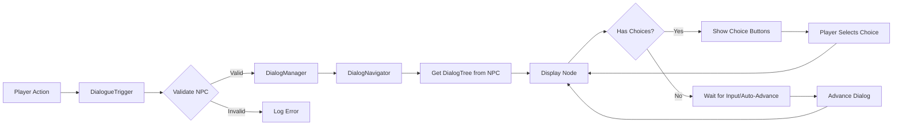

# Dialog System - Complete User Guide

**Last Updated**: Nov 29, 2025  
**Status**: ✅ Production Ready  
**For**: Game Designers, Content Creators, Developers

---

## Table of Contents

1. [Overview](#overview)
2. [Architecture](#architecture)
3. [Quick Start](#quick-start)
4. [Creating Dialog Trees](#creating-dialog-trees)
5. [Editing Workflow](#editing-workflow)
6. [Dialog Node Types](#dialog-node-types)
7. [Node ID System](#node-id-system)
8. [Setting Up Triggers](#setting-up-triggers)
9. [Common Tasks](#common-tasks)
10. [Best Practices](#best-practices)
11. [Troubleshooting](#troubleshooting)

---

## Overview

The **Stage of Dreams** dialog system provides a flexible, node-based conversation framework with:

- ✅ **Branching Conversations** - Player choices that affect story flow
- ✅ **Convergent Paths** - Multiple choices leading to same outcome
- ✅ **Auto-Advance** - Timed or manual dialog progression
- ✅ **Event Integration** - Hook into game systems (start performances, trigger minigames, etc.)
- ✅ **Multiple Triggers** - Spotlight detection, player interaction, proximity
- ✅ **Reusable Content** - ScriptableObject-based dialog trees
- ✅ **Visual Editor** - Dedicated windows for editing complex trees

### Key Components

| Component | Purpose | Location |
|-----------|---------|----------|
| **DialogTree** | Container for entire conversation | `Assets/World/` (ScriptableObject) |
| **DialogNode** | Single line of dialog with choices | Part of DialogTree |
| **DialogChoice** | Player choice option | Part of DialogNode |
| **DialogManager** | Displays UI and manages active dialog | `Scripts/Dialog/` (Scene Singleton) |
| **DialogNavigator** | Handles tree navigation logic | Internal to DialogManager |
| **DialogueTrigger** | Activates dialog based on conditions | `Scripts/Dialog/` (Component) |
| **NPCContent** | Holds dialog trees for NPCs | `World/` (ScriptableObject) |

---

## Architecture

### Data Flow

```
DialogTree (Asset)
    ↓
NPCContent (Asset)
    ↓
DialogueTrigger (Component) → Detects player
    ↓
DialogManager (Singleton) → Displays UI
    ↓
DialogNavigator (Internal) → Handles logic
```

### Integration Flow



---

## Quick Start

### 1. Create Your First Dialog Tree

**Right-click in Project Window:**
```
Create > Dialog System > Dialog Tree
```

**Name it:** `NPC_FirstConversation`

**Select the asset** and use the **Quick Tree Builder**:
- **Speaker Name**: "Director"
- **Dialog Text**: "Welcome to the stage! Are you ready to perform?"
- Click **"Create Starting Node"**

### 2. Add Choices

**In Inspector:**
- Expand **Dialog Flow** section
- Click **"✏ Edit Starting Node"** button
- New window opens

**In Node Editor Window:**
- Scroll to **Choices Management** section
- Click **"+ Add New Choice"** (twice)
- Edit choice text:
  - Choice 1: "I'm ready!"
  - Choice 2: "I need more practice"

### 3. Create Target Nodes

**Back in DialogTree Inspector:**
- Use **Quick Tree Builder** to add nodes
- OR in Node Editor, create targets inline

### 4. Set Up NPC

**Create NPCContent asset:**
```
Right-click > Create > Stage of Dreams > NPC Content
```

**Configure:**
- **NPC Name**: "Stage Director"
- **Main Dialog Tree**: Assign your `NPC_FirstConversation` tree

### 5. Set Up Trigger

**In Scene:**
- Select NPC GameObject (or create one)
- Add Component: **DialogueTrigger**

**Configure DialogueTrigger:**
- **Trigger On Interaction**: ✓ (Enabled)
- **Target NPC**: Assign your NPCContent asset
- **Interaction Radius**: 2.0

### 6. Test It!

**Play Mode:**
- Move player near NPC
- Press **E** key (interact)
- Dialog UI appears!

---

## Creating Dialog Trees

### Using Quick Tree Builder (Fastest)

**For Linear Conversations:**

1. Select DialogTree asset
2. Go to **Quick Tree Builder** section
3. Fill in first line:
   - Speaker: "Director"
   - Text: "First line of dialog"
4. Click **"Create Starting Node"**
5. Fill in next line and click **"Add Sequential Node"**
6. Repeat for each line

**Result:** Simple linear conversation chain

### Using Node Editor Windows (Flexible)

**For Branching Conversations:**

1. Select DialogTree asset
2. Click **"✏ Edit Starting Node"**
3. In Node Editor:
   - Edit dialog content
   - Add choices in **Choices Management** section
   - Use **Tree Navigation** to move between nodes
4. Open multiple windows for complex branching

### Dialog Tree Structure

```
DialogTree: "Act1_Director_Intro"
├─ Starting Node (Director): "Welcome!"
│  ├─ Choice 1: "I'm excited!" 
│  │  └─ Node: (Player) "Let's do this!"
│  │     └─ Node: (Director) "That's the spirit!"
│  └─ Choice 2: "I'm nervous"
│     └─ Node: (Player) "What if I fail?"
│        └─ Node: (Director) "Everyone feels that way..."
```

---

## Editing Workflow

### Inspector Overview (Read-Only Navigation)

When you select a DialogTree:

**Tree Information** (Editable)
- Tree Name and Description
- Settings toggles

**Dialog Flow** (Read-Only Preview)
- Starting Node preview
- **"✏ Edit Starting Node"** button
- List of all nodes with **"Edit"** buttons

**Quick Actions**
- Validate Tree
- Print Structure
- Refresh Nodes

### Node Editor Window (Main Editing)

**Opening a Window:**
- Click **"✏ Edit"** button in Inspector
- OR click navigation buttons in another Node Editor window

**Window Sections:**

#### 1. Node Identification
- **Node Name/ID**: Unique identifier (e.g., `act1_director_intro_01`)
- **Position**: Shows "3 of 10 nodes"

**Best Practice:** Use Node ID Generator tool:
```
Tools > Dialog System > Generate Node ID
```

#### 2. Dialog Content
- **Speaker Name**: Character speaking
- **Dialog Text**: The actual line (large text area)
- **Is Player Speaking**: Toggle if player is talking

#### 3. Flow Control
- **Auto Advance Delay**: 
  - `0` = Wait for player input
  - `> 0` = Auto-advance after X seconds
- **Status**: Shows if node has choices or child

#### 4. Tree Navigation ⭐ (Key Feature)

**Parent Nodes:**
- Lists all nodes that lead here
- Important for convergent dialog!
- Click **[⬆ Edit Parent]** to open parent window

**Child Node:**
- Shows auto-advance target
- Click **[⬇ Edit Child]** to open child window

**Choice Targets:**
- Lists all nodes reached by player choices
- Shows choice text for context
- Click **[➜ Edit Choice X Target]** to open target window

**Example:**
```
Tree Navigation
├─ Parent Nodes: (2)
│  ├─ [⬆ Edit Parent: act1_ready] "I'm ready!"
│  └─ [⬆ Edit Parent: act1_nervous] "I'm nervous"
├─ Child Node: None
└─ Choice Targets: (3)
   ├─ [➜ Edit Choice 1: act1_perform] "Start performance"
   ├─ [➜ Edit Choice 2: act1_practice] "Practice first"
   └─ [➜ Edit Choice 3: act1_leave] "Maybe later"
```

#### 5. Choices Management
- **Add New Choice** button
- List of existing choices
- Edit choice text and targets

#### 6. Unity Events (Optional)
- OnDialogStart event
- OnDialogEnd event
- Use for simple integrations

**New DialogEvent System (Recommended):**
- Type-safe, extensible event system
- Supports method delegates and custom events
- See [Technical Reference - Event System](#) for details

**Event Types:**
- `MethodCallEvent` - Execute custom methods
- `ParameterizedMethodEvent<T>` - Methods with parameters
- `StaticMethodCallEvent` - Call static methods by name

**Example Usage:**
```csharp
// Add method delegate event
var evt = new MethodCallEvent();
evt.SetMethod(() => GameStateManager.Instance.AdjustApplause(10f));
node.AddStartEvent(evt);
```

#### 7. Quick Actions
- **Validate Node**: Check for issues
- **Clear Child**: Remove auto-advance

### Working with Multiple Windows

**Open Multiple Windows Simultaneously:**

1. Edit starting node (1 window)
2. Click "Edit Child" (2 windows)
3. Click "Edit Choice Target" (3 windows)
4. Continue as needed!

**Benefits:**
- ✅ Compare dialog side-by-side
- ✅ Edit multiple branches at once
- ✅ No constant back-and-forth clicking

**Window Management:**
- **Dock**: Drag windows together as tabs
- **Float**: Keep on second monitor
- **Close**: Changes auto-save

---

## Dialog Node Types

### 1. Linear Node (Auto-Advance)

**Purpose:** Conversation continues automatically

**Setup:**
- No choices
- Has **Child Node** set
- Optional: Auto Advance Delay > 0

**Example:**
```
Director: "Act 1, Scene 1"
   ↓ (auto-advance)
Director: "The stage is set"
   ↓ (auto-advance)
Director: "Curtain rises..."
```

**Use Cases:**
- Rapid dialog exchanges
- Cinematic sequences
- Tutorial instructions

### 2. Choice Node (Branching)

**Purpose:** Player makes decision

**Setup:**
- Has **Choices** (2-5 options)
- Each choice points to target node
- No child node (choices replace it)

**Example:**
```
Director: "What will you do?"
   ├─ "Perform bravely" → courage_path
   ├─ "Perform cautiously" → careful_path
   └─ "Ask for advice" → advice_path
```

**Use Cases:**
- Story branching
- Character relationship building
- Quest choices

### 3. Convergent Node

**Purpose:** Multiple paths lead to same outcome

**Setup:**
- Named node (e.g., `act1_convergence_01`)
- Multiple parent nodes
- Choices use **Target Node Name** to reference it

**Example:**
```
courage_path ─┐
careful_path ─┼→ [act1_convergence_01]: "The show begins"
advice_path ──┘
```

**Use Cases:**
- Merging story branches
- Shared outcomes after choices
- Reducing redundant dialog

### 4. End Node

**Purpose:** Conversation ends

**Setup:**
- No choices
- No child node
- Navigator automatically ends dialog

**Example:**
```
Director: "Break a leg!"
   (END - dialog closes)
```

**Use Cases:**
- Natural conversation endings
- Scene transitions
- Triggering gameplay

---

## Node ID System

### Why Use Node IDs?

**Problems Without IDs:**
- Can't reference nodes by name
- Convergent paths difficult
- Hard to debug tree structure
- Tree validation incomplete

**Benefits of IDs:**
- ✅ Unique node identification
- ✅ Enable convergent dialog
- ✅ Better debugging
- ✅ Professional organization

### Naming Convention

**Format:** `[act]_[location]_[speaker]_[sequence]`

**Examples:**
```
act1_stage_director_intro_01
act1_stage_director_intro_02
act1_backstage_player_reflection_01
act2_spotlight_director_challenge_01
```

**Template Breakdown:**
- `act1` - Which act/chapter
- `stage` - Location or context
- `director` - Primary speaker
- `intro` - Dialog topic/scene
- `01` - Sequence number

### Using the Generator Tool

**Method 1: Menu**
```
Tools > Dialog System > Generate Node ID
```

**Method 2: Inspector** (when enabled)
- In Node Editor window
- Click **"Generate ID"** button
- ID automatically filled

**Generated Format:**
```
act1_main_speaker_scene_01
```

**Customize as needed** for your project structure!

### Best Practices

✅ **DO:**
- Use consistent naming scheme project-wide
- Name important nodes (branches, convergence points)
- Use generator for consistency
- Update IDs if you reorganize

❌ **DON'T:**
- Leave convergent nodes unnamed
- Use duplicate IDs
- Use spaces or special characters
- Change IDs after other nodes reference them

---

## Setting Up Triggers

### DialogueTrigger Component

**Three Trigger Types:**

1. **Spotlight Trigger**
   - Activates when player enters spotlight
   - Requires interaction key press
   - Use for: Performance scenes, stage moments

2. **Interaction Trigger**
   - Activates when player presses interact key nearby
   - Range-based detection
   - Use for: NPCs, objects, story triggers

3. **Proximity Trigger**
   - Activates automatically when player is near
   - No input required
   - Use for: Automatic story moments, cutscenes

**Can combine multiple types!**

### Setup Examples

#### NPC Conversation

**GameObject Setup:**
```
NPC_Director
├─ Sprite Renderer
├─ Collider 2D
├─ NPCContent (Script, or reference to asset)
└─ DialogueTrigger
```

**DialogueTrigger Settings:**
- ✅ **Trigger On Interaction**: Enabled
- ⬜ **Trigger On Spotlight**: Disabled
- ⬜ **Trigger On Proximity**: Disabled
- **Interaction Radius**: 2.0
- **Target NPC**: Auto-detected (same GameObject)

**Behavior:** Player walks up, presses E, dialog starts

#### Spotlight Performance

**GameObject Setup:**
```
Performance_Spotlight
├─ Spotlight (Component)
├─ Light 2D
├─ NPCContent (Reference to performance dialog)
└─ DialogueTrigger
```

**DialogueTrigger Settings:**
- ⬜ **Trigger On Interaction**: Disabled
- ✅ **Trigger On Spotlight**: Enabled
- ⬜ **Trigger On Proximity**: Disabled
- **Require Interaction Input**: Enabled
- **Target Spotlight**: Auto-detected
- **Target NPC**: Assign performance NPCContent

**Behavior:** Player enters spotlight, presses E, performance dialog starts

#### Automatic Story Trigger

**GameObject Setup:**
```
Story_Trigger_Zone
├─ Box Collider 2D (Trigger)
├─ NPCContent (Reference to story dialog)
└─ DialogueTrigger
```

**DialogueTrigger Settings:**
- ⬜ **Trigger On Interaction**: Disabled
- ⬜ **Trigger On Spotlight**: Disabled
- ✅ **Trigger On Proximity**: Enabled
- **Proximity Radius**: 3.0
- **Can Retrigger**: Disabled (one-time only)
- **Target NPC**: Assign story NPCContent

**Behavior:** Player enters zone, dialog auto-starts

### Multiple Dialog Trees

**NPCContent with Multiple Trees:**

```csharp
// In Inspector:
Main Dialog Tree: "npc_greeting"
Additional Dialog Trees:
  - "npc_quest"
  - "npc_shop"
  - "npc_ending"
```

**DialogueTrigger Selection:**

```csharp
// In Inspector:
Specific Dialog Tree: "npc_quest"
```

**Use Cases:**
- Quest giver with multiple quests
- Shop NPC with greeting vs. shopping dialog
- Story NPCs with different conversations based on progress

---

## Common Tasks

### Task 1: Create a Linear Conversation

**Goal:** Simple back-and-forth dialog

**Steps:**
1. Create DialogTree: `npc_simple_chat`
2. Use **Quick Tree Builder**:
   ```
   Speaker: "NPC"
   Text: "Hello there!"
   Click: "Create Starting Node"
   
   Speaker: "Player"
   Text: "Hi! How are you?"
   Click: "Add Sequential Node"
   
   Speaker: "NPC"
   Text: "I'm doing well, thanks!"
   Click: "Add Sequential Node"
   ```
3. Done! 3-node linear conversation

**Result:**
```
NPC: "Hello there!"
  ↓
Player: "Hi! How are you?"
  ↓
NPC: "I'm doing well, thanks!"
  (END)
```

### Task 2: Create a Branching Dialog

**Goal:** Player choice affects story

**Steps:**
1. Create DialogTree: `npc_branching_chat`
2. Create starting node with Quick Builder
3. Click **"✏ Edit Starting Node"**
4. In Node Editor:
   - Scroll to **Choices Management**
   - Click **"+ Add New Choice"** (twice)
   - Edit choice 1: "Tell me a joke"
   - Edit choice 2: "Tell me your story"
5. Create target nodes for each choice
6. Navigate to targets using **Tree Navigation**

**Result:**
```
NPC: "What would you like to know?"
  ├─ "Tell me a joke" → NPC: "Why did the actor..."
  └─ "Tell me your story" → NPC: "I was born..."
```

### Task 3: Create Convergent Paths

**Goal:** Multiple choices lead to same outcome

**Steps:**
1. Create branch node with choices
2. Create outcome node with unique ID: `outcome_node`
3. For each choice in branch node:
   - Set **Target Node Name** to `outcome_node`
4. In DialogTree Inspector, click **"Resolve Named References"**
5. Open outcome node editor, check **Parent Nodes** section

**Result:**
```
"What will you do?"
  ├─ Choice A ─┐
  ├─ Choice B ─┼→ [outcome_node]: "You chose wisely"
  └─ Choice C ─┘
```

### Task 4: Add Auto-Advance Timing

**Goal:** Dialog advances automatically after delay

**Steps:**
1. Open node in Node Editor
2. Set **Auto Advance Delay** to `2.5` (seconds)
3. Ensure node has **Child Node** set
4. Save

**Result:** Dialog waits 2.5 seconds, then advances automatically

### Task 5: Test Dialog in Play Mode

**Debug Workflow:**

1. **Validate Tree**:
   ```
   DialogTree Inspector > Quick Actions > Validate Tree
   ```
   Check console for errors

2. **Print Structure**:
   ```
   Quick Actions > Print Structure
   ```
   Review hierarchy in console

3. **Enter Play Mode**

4. **Trigger Dialog**:
   - Use your configured trigger method
   - Watch for debug logs in console

5. **Debug Issues**:
   - Check **DialogManager** debug logs
   - Verify **NPCContent** is assigned correctly
   - Ensure **DialogueTrigger** is configured

---

## Best Practices

### Content Design

✅ **Keep Dialog Concise**
- Players read quickly
- 2-3 sentences max per node
- Use auto-advance for rapid exchanges

✅ **Meaningful Choices**
- Each choice should feel impactful
- Avoid "correct answer" choices
- Show player personality through choices

✅ **Use Convergent Paths**
- Reduce content duplication
- Maintain player agency
- Simplify tree structure

✅ **Test Early and Often**
- Validate after major changes
- Play through in context
- Check edge cases (all choices)

### Technical Organization

✅ **Naming Conventions**
- Use Node ID Generator
- Consistent format project-wide
- Descriptive tree names

✅ **Tree Modularity**
- One tree per conversation topic
- Reuse trees across NPCs when possible
- Keep trees focused (< 20 nodes ideal)

✅ **Version Control**
- DialogTree is a ScriptableObject asset
- Commit after major changes
- Use descriptive commit messages

### Performance

✅ **Tree Size**
- Large trees (50+ nodes) are fine
- Auto-update node list may slow inspector
- Disable "Auto Update" for huge trees

✅ **Event Usage**
- Use Unity Events sparingly
- Prefer custom actions in NPCContent
- Avoid heavy operations in events

### Workflow Efficiency

✅ **Multiple Windows**
- Open 5-10 windows for complex editing
- Dock related nodes together
- Close windows when done with section

✅ **Quick Tree Builder**
- Great for rapid prototyping
- Fast linear conversation creation
- Use Node Editor for complex structures

✅ **Tree Navigation**
- Primary way to move through tree
- Faster than scrolling in inspector
- Opens related nodes instantly

---

## Troubleshooting

### Dialog Won't Start

**Symptoms:** Nothing happens when trigger activates

**Checks:**
1. **DialogManager in scene?**
   ```
   Hierarchy > Search "DialogManager"
   ```
   Should find exactly one GameObject

2. **DialogueTrigger configured?**
   - Inspector > DialogueTrigger
   - Check "Ready To Trigger" field
   - Click Context Menu > "Get Setup Status"

3. **NPCContent assigned?**
   - DialogueTrigger > Target NPC field
   - NPCContent > Main Dialog Tree assigned?

4. **Dialog Tree valid?**
   - Select DialogTree asset
   - Click "Validate Tree"
   - Check console for errors

**Fix:**
```
Console error: "NPCContent has no valid dialog content"
→ Assign a DialogTree to NPCContent.mainDialogTree

Console error: "DialogManager not found"
→ Add DialogManager prefab to scene

Console error: "No starting node"
→ Create starting node in DialogTree
```

### UI Not Appearing

**Symptoms:** Dialog starts but UI doesn't show

**Checks:**
1. **UIDocument assigned?**
   ```
   DialogManager > Inspector
   - UI Document field assigned?
   - Dialog Visual Tree assigned?
   ```

2. **UI Toolkit Connection**
   ```
   Context Menu > DialogManager > Validate Setup
   Check console output
   ```

3. **Canvas Settings**
   - UIDocument > Panel Settings
   - Should have panel settings assigned

**Fix:**
```
See: Docs/UI Setup/DialogManager UI Toolkit Connection Guide.md
```

### Choices Not Working

**Symptoms:** Click choice button, nothing happens

**Checks:**
1. **Choice has target?**
   - Open node in editor
   - Check Choice Target or Target Node Name

2. **Named target resolved?**
   ```
   DialogTree Inspector > Context Menu
   Click "Resolve Named References"
   ```

3. **Console errors?**
   - Check for navigation errors
   - Look for missing node warnings

**Fix:**
```
Console: "Choice has no valid target"
→ Set choice.TargetNode or choice.TargetNodeName

Console: "Could not resolve target node name"
→ Ensure target node exists with that exact name
→ Click "Resolve Named References"
```

### Auto-Advance Not Working

**Symptoms:** Dialog doesn't advance automatically

**Checks:**
1. **Node has child?**
   - Open node in editor
   - Check "Child Node" field

2. **Delay set correctly?**
   - Auto Advance Delay > 0
   - Not too high (10+ seconds?)

3. **Has choices?**
   - Node can't have BOTH choices AND auto-advance
   - Remove choices OR remove child node

**Fix:**
```
Auto-advance delay = 0
→ Set to desired seconds (2-3 typical)

Node has choices AND child
→ Remove child (choices take precedence)
→ OR remove choices (use child for auto-advance)
```

### Tree Structure Issues

**Symptoms:** Validation errors, unexpected behavior

**Common Errors:**

```
"Duplicate node names found"
→ Ensure unique Node IDs
→ Use Node ID Generator for consistency

"Unresolved named references"
→ DialogTree > "Resolve Named References"
→ Check target node name spelling

"No end nodes found"
→ May loop indefinitely (intentional?)
→ Add end node with no choices/child

"Node has both choices AND child node"
→ Invalid structure
→ Remove one or the other
```

**Prevention:**
- Validate frequently while building
- Use Node Editor (shows errors immediately)
- Print structure to visualize tree

### Performance Issues

**Symptoms:** Editor slow when selecting DialogTree

**Cause:** Large tree with auto-update enabled

**Fix:**
```
DialogTree Inspector
- Disable "Auto Update Node List"
- Manually click "Refresh Nodes" when needed
```

### Multiple Windows Confusion

**Symptoms:** Too many windows open, lost track

**Management:**
1. Close windows you're done with
2. Dock related windows as tabs
3. Use Window > Layouts to save workspace
4. Changes auto-save, safe to close anytime

---

## Additional Resources

### Documentation
- [Dialog System Technical Reference](./Dialog-System-Technical-Reference.md) - Developer API documentation
- [Class Hierarchy](./Class Hierarchy.md) - Complete system architecture
- [Troubleshooting Guide](./TROUBLESHOOTING.MD) - Known issues and solutions
- [DialogEvents Scaffolding Guide](./DialogEvents-Scaffolding-Guide.md) - Custom event system guide

### Tools
- **Node ID Generator**: `Tools > Dialog System > Generate Node ID`
- **Tree Validation**: DialogTree Inspector > Validate Tree
- **Structure Printer**: DialogTree Inspector > Print Structure

### Unity Menu Items
- Create DialogTree: `Create > Dialog System > Dialog Tree`
- Create NPCContent: `Create > Stage of Dreams > NPC Content`

---

## Quick Reference

### Keyboard Shortcuts
| Action | Shortcut |
|--------|----------|
| Save | `Ctrl+S` |
| Refresh Inspector | `F5` |
| Play Mode | `Ctrl+P` |

### Inspector Context Menus

**DialogTree:**
- Validate Tree
- Print Structure  
- Refresh Nodes
- Resolve Named References

**DialogueTrigger:**
- Get Setup Status
- Validate Configuration
- Print Debug Info

**NPCContent:**
- Validate Dialog Content
- Print Available Trees

---

**End of Dialog System Complete Guide**

For technical implementation details, see [Dialog System Technical Reference](./Dialog-System-Technical-Reference.md).
