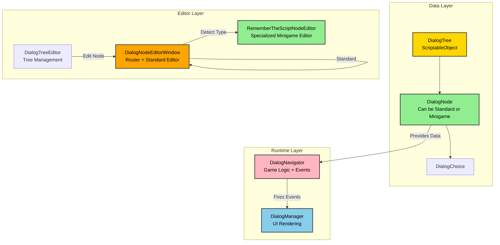
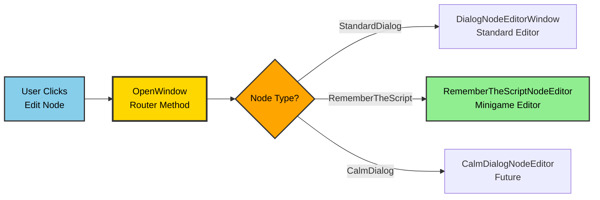
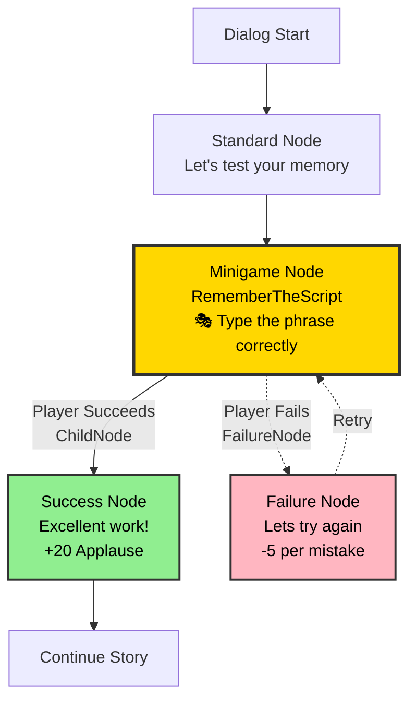
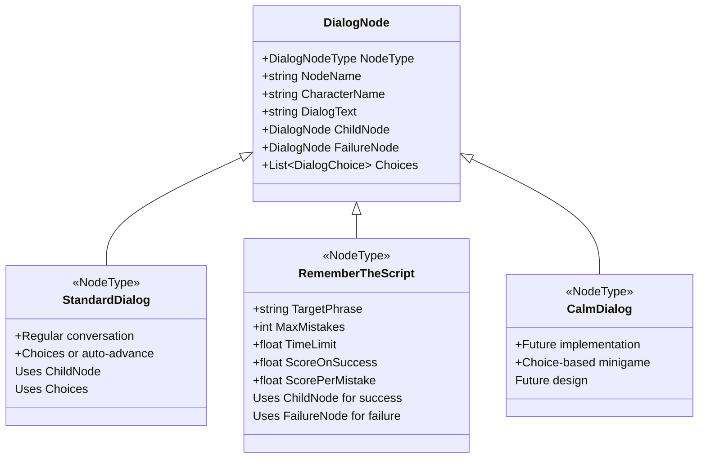
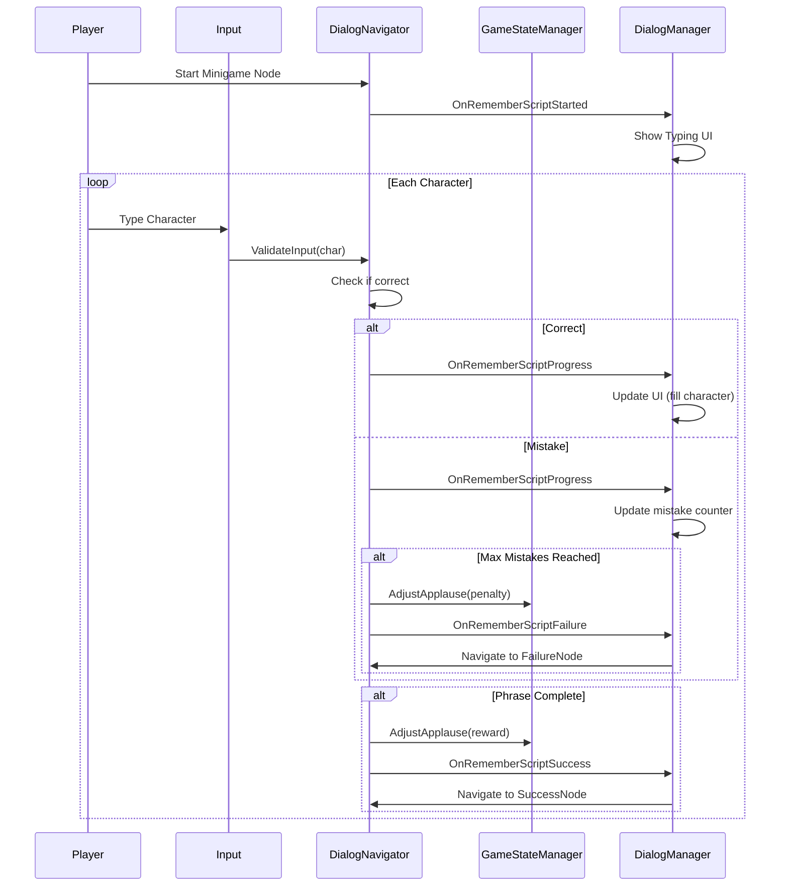
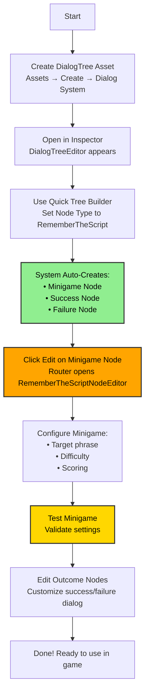

# Dialog System - Quick Reference Diagrams

**Purpose**: Quick visual reference for presentation and development  
**Last Updated**: January 2025

---

## System Architecture Overview



---

## Editor Router Pattern



---

## Minigame Node Flow



---

## Node Type Hierarchy



---

## Event Flow: Minigame Execution



---

## Content Creator Workflow



---

## Key Concepts

### Minigame = Node

**Traditional Approach**:
```
Dialog System ← → Minigame Manager ← → Individual Minigames
(Complex integration, separate systems)
```

**Our Approach**:
```
DialogNode (with NodeType = Minigame)
(Unified system, seamless integration)
```

### Dual-Path System

**Success Path**:
```
Minigame Node → ChildNode → Success Node → Continue
```

**Failure Path**:
```
Minigame Node → FailureNode → Retry Node → (Back to Minigame OR Continue)
```

### Editor Routing

```
Single Entry Point (DialogNodeEditorWindow.OpenWindow)
    ↓
Type Detection
    ↓
Route to Appropriate Editor
    • StandardDialog → DialogNodeEditorWindow
    • RememberTheScript → RememberTheScriptNodeEditor
    • Future types → Future editors
```

---

## File Locations

**Core Scripts**:
- `Assets/_Stage of Dreams_/World/Dialog Node.cs` - Node data structure
- `Assets/_Stage of Dreams_/World/Dialog Tree.cs` - Tree container
- `Assets/_Stage of Dreams_/Scripts/Dialog/DialogNavigator.cs` - Game logic
- `Assets/_Stage of Dreams_/Scripts/Dialog/DialogManager.cs` - UI rendering

**Editor Scripts**:
- `Assets/_Stage of Dreams_/Editor/DialogTreeEditor.cs` - Tree inspector
- `Assets/_Stage of Dreams_/Editor/DialogNodeEditorWindow.cs` - Standard editor + router
- `Assets/_Stage of Dreams_/Editor/RememberTheScriptNodeEditor.cs` - Minigame editor

**Documentation**:
- `Docs/Class Hierarchy.md` - Complete system documentation
- `Docs/Presentation-Dialog-System-Architecture.md` - Presentation deck
- `Docs/Dialog-System-Quick-Reference.md` - This file

---

## Color Legend

- 🟡 **Gold** - Router/Decision Points
- 🟢 **Green** - Success/Positive Outcomes
- 🔴 **Pink** - Failure/Retry/Negative Outcomes
- 🔵 **Blue** - Standard/Neutral Elements
- 🟠 **Orange** - Active/Processing Elements

---

## Quick Stats

**System Metrics**:
- ✅ 2 Node Types Implemented (StandardDialog, RememberTheScript)
- ✅ 1 Specialized Editor (RememberTheScriptNodeEditor)
- ✅ Dual-path system (ChildNode + FailureNode)
- ✅ Event-driven architecture (8+ events)
- ✅ Automatic outcome node creation
- ✅ Router pattern for editor selection
- ⏳ 2+ Future Node Types (CalmDialog, DancingCombat)

**Code Stats**:
- DialogNode: ~600 lines (data + logic)
- DialogTree: ~400 lines (tree management)
- DialogNavigator: ~800 lines (game logic)
- DialogManager: ~600 lines (UI control)
- Editor Scripts: ~2000+ lines combined

---

**End of Quick Reference**

Use these diagrams in presentations, documentation, or as development reference!
