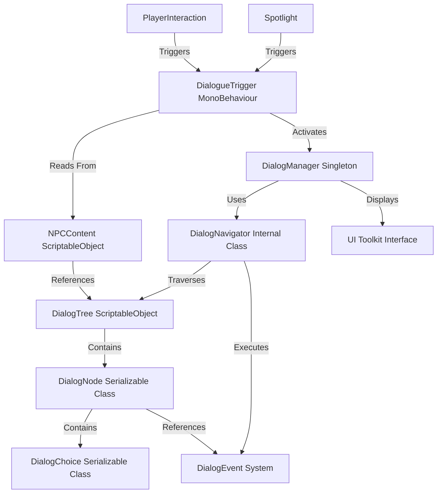

# Dialog System - Technical Reference

**Last Updated**: January 2025  
**Status**: ✅ Production Ready  
**For**: Programmers, System Integrators, Advanced Users

---

## Table of Contents

1. [System Architecture](#system-architecture)
2. [Core Classes](#core-classes)
3. [Integration Flow](#integration-flow)
4. [Event System](#event-system)
5. [Custom Actions](#custom-actions)
6. [Editor Extensions](#editor-extensions)
7. [API Reference](#api-reference)
8. [Advanced Patterns](#advanced-patterns)
9. [Performance Considerations](#performance-considerations)
10. [Extension Guide](#extension-guide)

---

## System Architecture

### High-Level Overview



### Responsibility Separation

| Layer | Components | Responsibility |
|-------|------------|----------------|
| **Data** | DialogTree, DialogNode, DialogChoice | Store conversation structure |
| **Content** | NPCContent | Organize dialog trees per NPC |
| **Activation** | DialogueTrigger, Spotlight, PlayerInteraction | Detect trigger conditions |
| **Logic** | DialogNavigator | Navigate tree structure, handle state |
| **Presentation** | DialogManager | Display UI, handle input |
| **Events** | DialogEvent, Unity Events | Game system integration |

### Design Patterns Used

- **Singleton**: DialogManager (global UI access)
- **Strategy**: DialogueTrigger (multiple trigger strategies)
- **Observer**: Event system (decoupled integration)
- **Command**: DialogEvent (encapsulated actions)
- **State**: DialogNavigator (conversation state machine)

---

## Core Classes

### 1. DialogTree (ScriptableObject)

**Location:** `Assets/_Stage of Dreams_/World/Dialog Tree.cs`

**Purpose:** Container for complete conversation structure

**Key Properties:**
```csharp
[SerializeField] public string treeName;
[SerializeField, TextArea] public string description;
[SerializeReference] public DialogNode startingNode;
[SerializeReference] private List<DialogNode> allNodes;
[SerializeField] private bool autoUpdateNodeList = true;
[SerializeField] private bool validateOnSave = true;
```

**Key Methods:**
```csharp
// Tree Management
public DialogNode GetStartingNode()
public bool IsValid()
public List<DialogNode> GetAllNodes()
public DialogNode FindNodeByName(string nodeName)
public List<DialogNode> GetConvergentNodes()
public int GetMaxDepth()

// Node Creation
public DialogNode CreateStartingNode(string speaker, string text, bool isPlayer, string nodeName)
public DialogNode AddChoiceNode(DialogNode parent, string choiceText, string speaker, string text, ...)
public DialogNode AddSequentialNode(DialogNode parent, string speaker, string text, ...)
public DialogChoice AddChoiceToNamedNode(DialogNode parent, string choiceText, string targetNodeName)

// Validation
public void ValidateTree()
public void RefreshNodeList()
public void ResolveNamedReferences()
public void PrintTreeStructure()
```

**Implementation Notes:**
- Uses `[SerializeReference]` for polymorphic node serialization
- Automatically maintains node list via tree traversal
- Supports convergent paths through named node references
- Context menu integration for editor workflows

**Memory Management:**
- ScriptableObject lives in Assets folder
- Nodes are class instances (reference types)
- Tree traversal uses `HashSet<DialogNode>` to prevent infinite loops

---

### 2. DialogNode (Serializable Class)

**Location:** `Assets/_Stage of Dreams_/World/Dialog Node.cs`

**Purpose:** Single conversation node with text, choices, and connections

**Key Properties:**
```csharp
[SerializeField] private string _nodeId;
[SerializeField] private string _characterName;
[SerializeField, TextArea(3, 6)] private string _dialogText;
[SerializeField] private bool _isPlayerSpeaking;
[SerializeField] private float _autoAdvanceDelay;

[SerializeReference] private List<DialogNode> _parentNodes;  // Tree structure
[SerializeReference] private DialogNode _childNode;          // Auto-advance
[SerializeReference] private List<DialogChoice> _choices;    // Branching

[SerializeReference] private List<DialogEvent> _startEvents;
[SerializeReference] private List<DialogEvent> _endEvents;
[SerializeField] private UnityEvent _onDialogStart;          // Legacy
[SerializeField] private UnityEvent _onDialogEnd;            // Legacy
```

**Key Methods:**
```csharp
// Node Hierarchy
public void SetChildNode(DialogNode next)
public DialogNode CreateChildNode(string speaker, string text, ...)
public void AddParentNode(DialogNode sourceNode)
public void RemoveParentNode(DialogNode sourceNode)

// Choice Management
public DialogChoice AddChoice(string text, DialogNode target, string choiceId)
public void RemoveChoice(int index)

// Event Management
public void AddStartEvent(DialogEvent evt)
public void AddEndEvent(DialogEvent evt)
public void ExecuteStartEvents()
public void ExecuteEndEvents()

// Validation
public bool IsValid()
public string GetDisplayName()
```

**Implementation Notes:**
- Maintains bidirectional parent-child relationships
- Cannot have both choices AND child node (validated)
- Auto-advance delay 0 = manual advance, > 0 = timed advance
- Supports both DialogEvent system and legacy UnityEvents

**Computed Properties:**
```csharp
public bool IsRootNode => _parentNodes?.Count == 0;
public bool HasChoices => _choices?.Count > 0;
public bool HasAutoAdvance => _childNode != null && _autoAdvanceDelay >= 0;
```

---

### 3. DialogChoice (Serializable Class)

**Location:** `Assets/_Stage of Dreams_/World/Dialog Choice.cs`

**Purpose:** Player choice option with target node

**Key Properties:**
```csharp
[SerializeField] private string _choiceText;
[SerializeField] private string _choiceId;
[SerializeField] private DialogNode _parentNode;
[SerializeReference] private DialogNode _targetNode;
[SerializeField] private string _targetNodeName;  // For convergent paths

[SerializeReference] private List<DialogEvent> _choiceEvents;
[SerializeField] private UnityEvent _onChoiceSelected;
```

**Key Methods:**
```csharp
// Target Management
public void SetTarget(DialogNode target)
public DialogNode CreateTargetNode(string speaker, string text, ...)
public void SetTargetByName(string nodeName)
public bool ResolveNamedTarget(DialogTree tree)

// Event Management
public void AddChoiceEvent(DialogEvent evt)
public void ExecuteChoiceEvents()

// Validation
public bool IsValid()
public bool IsTargetResolved()
public string GetTargetInfo()
```

**Implementation Notes:**
- Supports both direct node reference and named reference
- Named references enable convergent dialog paths
- Must call `ResolveNamedTarget()` to convert name to reference
- Choice ID used for custom action system

**Named Target Workflow:**
```csharp
// Designer sets target by name
choice.TargetNodeName = "act1_convergence_01";

// System resolves at runtime
bool resolved = choice.ResolveNamedTarget(dialogTree);

// Navigator uses resolved reference
DialogNode target = choice.TargetNode;
```

---

### 4. DialogManager (MonoBehaviour Singleton)

**Location:** `Assets/_Stage of Dreams_/Scripts/Dialog/DialogManager.cs`

**Purpose:** UI controller and dialog session manager

**Key Properties:**
```csharp
// Singleton
public static DialogManager Instance { get; private set; }

// UI References
[SerializeField] private UIDocument uiDocument;
[SerializeField] private VisualTreeAsset dialogVisualTree;
private VisualElement rootElement;
private GroupBox dialogBox;
private Label dialogLabel;
private Button choiceButton1-5;

// Navigation
private DialogNavigator navigator;

// State
private bool isUIActive;
private bool isInitialized;
private NPCContent currentNPC;
private DialogTree currentTree;
private int dialogSessionCount;

// Events
public System.Action<NPCContent, DialogTree> OnDialogStarted;
public System.Action<NPCContent> OnDialogEnded;
public System.Action<DialogNode> OnNodeDisplayed;
public System.Action<DialogChoice, NPCContent> OnCustomActionHandled;
```

**Key Methods:**
```csharp
// Public Interface
public bool StartDialog(NPCContent npc)
public bool StartDialog(NPCContent npc, string treeName)
public void AdvanceDialog()
public void EndDialog()
public bool IsDialogActive()
public DialogNavigationState GetNavigationState()
public bool IsReady()

// Internal
private bool StartDialogInternal(NPCContent npc, string treeNameOverride)
private void HandleNodeChanged(DialogNode node)
private void HandleCustomAction(DialogChoice choice, NPCContent npc)
private void HandleDialogEnded()
private void DisplayNode(DialogNode node)
```

**Initialization Sequence:**
```csharp
1. Awake()           → Singleton setup
2. Start()           → InitializeDialogManager()
3. InitializeNavigator() → Create DialogNavigator, subscribe events
4. InitializeUI()    → Get UI elements, setup buttons
5. InitializeInput() → Get PlayerInput, find interact action
6. HideDialog()      → Start with UI hidden
```

**UI Update Flow:**
```csharp
navigator.OnNodeChanged fires
    ↓
HandleNodeChanged(DialogNode node)
    ↓
DisplayNode(node)
    ↓
Update dialogLabel.text
    ↓
if (node.HasChoices)
    ShowChoices(node.Choices)
else
    HideChoices()
    ↓
if (node.AutoAdvanceDelay > 0)
    StartCoroutine(AutoAdvanceAfterDelay(delay))
```

**Implementation Notes:**
- Singleton enforced in Awake() with DontDestroyOnLoad
- Comprehensive validation at every entry point
- All errors logged with context
- Supports multiple dialog sessions per scene load
- Tracks session count and timing for analytics

---

### 5. DialogNavigator (Internal Class)

**Location:** `Assets/_Stage of Dreams_/Scripts/Dialog/DialogNavigator.cs`

**Purpose:** Pure navigation logic, no UI coupling

**Key Properties:**
```csharp
// Events
public event Action<DialogNode> OnNodeChanged;
public event Action<DialogChoice, NPCContent> OnCustomActionTriggered;
public event Action OnDialogEnded;

// State
private DialogNode currentNode;
private NPCContent currentNPC;
private DialogTree currentTree;

// Properties
public bool IsActive => currentNode != null;
public DialogNode CurrentNode => currentNode;
public NPCContent CurrentNPC => currentNPC;
```

**Key Methods:**
```csharp
// Navigation Control
public bool StartDialog(NPCContent npc, string treeNameOverride = null)
public void NavigateToNode(DialogNode node)
public void SelectChoice(int choiceIndex)
public void AdvanceDialog()
public void EndDialog()

// Advanced Navigation
public bool SwitchToTree(string treeName)
public void ForceNavigateToNode(DialogNode node)
public DialogNavigationState GetCurrentState()

// Internal
private void ExecuteNodeStartEvents(DialogNode node)
private void ExecuteNodeEndEvents(DialogNode node)
private void ExecuteChoiceEvents(DialogChoice choice)
```

**Navigation State Machine:**

```
[Idle]
  ↓ StartDialog(npc)
[Active - No Choices]
  ↓ AdvanceDialog()
[Active - With Choices]
  ↓ SelectChoice(index)
[Active - New Node]
  ↓ Node has no next? EndDialog()
[Ended]
  ↓ Fires OnDialogEnded
[Idle]
```

**Choice Selection Flow:**
```csharp
SelectChoice(int index)
    ↓
1. Validate current node has choices
2. Validate index in range
3. Get DialogChoice at index
    ↓
4. ExecuteChoiceEvents(choice)
5. Fire OnCustomActionTriggered if choice has ID
6. Call currentNPC.HandleCustomAction(choice.ChoiceId)
    ↓
7. Navigate to choice.TargetNode
   OR resolve choice.TargetNodeName
   OR EndDialog() if no target
```

**Event Execution Order:**
```
Node Navigation:
1. currentNode.ExecuteEndEvents() (previous node)
2. Set currentNode to new node
3. currentNode.ExecuteStartEvents() (new node)
4. Fire OnNodeChanged event

Choice Selection:
1. choice.ExecuteChoiceEvents()
2. Fire OnCustomActionTriggered
3. Navigate to target node (follows Node Navigation above)

Dialog End:
1. currentNode.ExecuteEndEvents() (if exists)
2. currentNPC.OnDialogEnded() (if exists)
3. Fire OnDialogEnded event
4. Clear state (currentNode, currentNPC, currentTree = null)
```

**Implementation Notes:**
- Zero UI dependencies (pure logic)
- All tree access through NPCContent methods
- Handles named node reference resolution
- Supports tree switching mid-conversation
- Comprehensive error handling and logging

---

### 6. DialogueTrigger (MonoBehaviour)

**Location:** `Assets/_Stage of Dreams_/Scripts/Dialog/DialogueTrigger.cs`

**Purpose:** Detects trigger conditions and activates dialog

**Key Properties:**
```csharp
// Trigger Configuration
[SerializeField] private bool triggerOnSpotlight;
[SerializeField] private bool triggerOnInteraction;
[SerializeField] private bool triggerOnProximity;
[SerializeField] private bool requireInteractionInput;

// References
[SerializeField] private Spotlight targetSpotlight;
[SerializeField] private NPCContent targetNPC;
[SerializeField] private string specificDialogTree;

// Settings
[SerializeField] private float interactionRadius = 2f;
[SerializeField] private float proximityRadius = 3f;
[SerializeField] private bool canRetrigger = false;
[SerializeField] private float retriggerDelay = 5f;

// State
private bool hasTriggered = false;
private bool dialogActive = false;
private float lastTriggerTime = -999f;

// Events
public event Action OnDialogTriggered;
public event Action OnDialogEnded;
```

**Key Methods:**
```csharp
// Public Interface
public void ManualTrigger()
public void SetTriggerType(bool spotlight, bool interaction, bool proximity)
public string GetSetupStatus()
public DialogTree GetTargetDialogTree()
public bool IsReadyToTrigger()

// Internal Trigger Flow
private void TryTriggerDialog()
private bool ValidateSetup()
private bool ValidateNPCDialogContent()
private void PassNPCContent()

// Event Handlers
private void OnSpotlightEntered()
private void HandleInteractionInput()
private void HandleProximityTrigger()
private void HandleDialogManagerEnded()

// Cleanup
private void PrepareNPCForDialog()
private void SubscribeToDialogEvents()
private void UnsubscribeFromDialogEvents()
```

**Trigger Type Strategies:**

**Spotlight Trigger:**
```csharp
1. Subscribe to targetSpotlight.OnPlayerEntered event
2. When fired, if requireInteractionInput:
       Set spotlightReady = true, wait for interact key
   else:
       TryTriggerDialog() immediately
3. On interact key press (if waiting):
       TryTriggerDialog()
4. Subscribe to targetSpotlight.OnPlayerExited
       Clear spotlightReady state
```

**Interaction Trigger:**
```csharp
1. Update() checks player distance every frame
2. If player within interactionRadius:
       Set interactionAvailable = true
       Wait for interact key press
3. On interact key press:
       TryTriggerDialog()
4. If player exits radius:
       Clear interactionAvailable state
```

**Proximity Trigger:**
```csharp
1. Update() checks player distance every frame
2. If player enters proximityRadius:
       TryTriggerDialog() immediately (no input required)
3. Once triggered, if !canRetrigger:
       Disable further triggers
   else:
       Wait retriggerDelay seconds before allowing again
```

**Validation Layers:**

```csharp
TryTriggerDialog()
    ↓
ValidateSetup()
  - DialogManager.Instance exists?
  - targetNPC assigned?
  - At least one trigger type enabled?
    ↓
ValidateNPCDialogContent()
  - targetNPC.HasValidDialogContent()?
  - If specificDialogTree set, tree exists?
  - Tree.IsValid()?
    ↓
PassNPCContent()
  - PrepareNPCForDialog() → calls npc.OnDialogStarted()
  - dialogManager.StartDialog(targetNPC, specificDialogTree)
  - SubscribeToDialogEvents()
  - Fire OnDialogTriggered event
```

**Implementation Notes:**
- Supports combining multiple trigger types
- Automatic targetNPC detection (same GameObject)
- Automatic targetSpotlight detection (same GameObject)
- Comprehensive debug logging with context
- Handles edge cases (rapid re-triggers, missing references)
- Integration with PlayerInput system via interact action

---

### 7. NPCContent (ScriptableObject)

**Location:** `Assets/_Stage of Dreams_/World/Character Content.cs` (base class)

**Purpose:** Container for NPC dialog trees and custom behaviors

**Key Properties:**
```csharp
[SerializeField] private string _npcName;
[SerializeField, TextArea] private string _npcDescription;
[SerializeField] private DialogTree _mainDialogTree;
[SerializeField] private DialogTree[] _additionalDialogTrees;

// State tracking
private bool _isInDialog = false;
private int _dialogCount = 0;

// Events
public event Action<string> OnCustomActionTriggered;
```

**Key Methods:**
```csharp
// Dialog Access
public DialogTree GetMainDialogTree()
public DialogTree GetDialogTree(string treeName)
public bool HasValidDialogContent()
public bool ValidateDialogContent()

// Lifecycle (Override in subclasses)
public virtual void OnDialogStarted()
public virtual void OnDialogEnded()
public virtual void HandleCustomAction(string actionId)

// Debug
public string GetDebugInfo()
[ContextMenu("Validate Dialog Content")]
```

**Custom Action Pattern:**
```csharp
// Base class provides interface
public virtual void HandleCustomAction(string actionId)
{
    OnCustomActionTriggered?.Invoke(actionId);
}

// Subclass implements game-specific logic
public class PerformanceDirectorNPC : NPCContent
{
    public override void HandleCustomAction(string actionId)
    {
        base.HandleCustomAction(actionId); // Fire event
        
        switch (actionId.ToLower())
        {
            case "start_performance":
                PerformanceManager.Instance?.StartPerformance();
                break;
                
            case "unlock_minigame":
                MinigameManager.Instance?.UnlockMinigame("calm_dialog");
                break;
                
            case "trigger_spotlight":
                FindObjectOfType<SpotlightController>()?.ActivateSpotlight();
                break;
        }
    }
}
```

**Multiple Dialog Trees:**
```csharp
// Designer setup in Inspector:
Main Dialog Tree: "greeting_dialog"
Additional Dialog Trees:
  - "quest_dialog"
  - "shop_dialog"
  - "ending_dialog"

// Runtime access:
DialogTree greeting = npc.GetMainDialogTree();
DialogTree quest = npc.GetDialogTree("quest_dialog");
DialogTree shop = npc.GetDialogTree("shop_dialog");

// Trigger specific tree:
dialogManager.StartDialog(npc, "quest_dialog");
```

**Implementation Notes:**
- Tracks dialog state (count, active status)
- Validates all dialog trees on content validation
- Extensible through inheritance (custom action handling)
- Event system for loose coupling with game systems
- Debug info includes all trees and validation status

---

## Integration Flow

### Complete Dialog Start Sequence

```
1. TRIGGER DETECTION
   Player action → DialogueTrigger detects condition
   
2. TRIGGER VALIDATION
   DialogueTrigger.ValidateSetup()
   DialogueTrigger.ValidateNPCDialogContent()
   
3. NPC PREPARATION
   targetNPC.OnDialogStarted() called
   (Custom logic: pause AI, face player, etc.)
   
4. DIALOG MANAGER START
   DialogManager.StartDialog(npc, treeName) called
   DialogManager validates state and NPC
   
5. NAVIGATOR START
   DialogNavigator.StartDialog(npc, treeName) called
   Navigator gets tree from NPC
   Navigator validates tree structure
   
6. INITIAL NODE NAVIGATION
   Navigator.NavigateToNode(tree.startingNode)
   Node start events executed
   OnNodeChanged event fired
   
7. UI DISPLAY
   DialogManager.HandleNodeChanged() receives event
   DialogManager.DisplayNode() updates UI
   Dialog box shown
   
8. PLAYER INPUT HANDLING
   If node has choices: Show choice buttons
   If node has child: Wait for advance or auto-advance
   
9. EVENT BROADCASTING
   DialogManager fires OnDialogStarted event
   External systems respond (pause game, etc.)
```

### Node Navigation Sequence

```
CHOICE SELECTION:
1. Player clicks choice button
2. DialogManager.OnChoiceClicked(index)
3. DialogNavigator.SelectChoice(index)
4. Navigator validates choice index
5. Navigator gets DialogChoice at index
6. choice.ExecuteChoiceEvents()
7. Navigator fires OnCustomActionTriggered
8. NPCContent.HandleCustomAction(choiceId)
9. Navigator resolves choice.TargetNode
10. Navigator.NavigateToNode(targetNode)
11. (Continue at Node Navigation below)

AUTO-ADVANCE:
1. Node displayed with AutoAdvanceDelay > 0
2. DialogManager starts coroutine
3. Wait AutoAdvanceDelay seconds
4. DialogManager.AdvanceDialog()
5. DialogNavigator.AdvanceDialog()
6. (Continue at Node Navigation below)

MANUAL ADVANCE:
1. Node displayed with no choices, childNode exists
2. Player presses interact key (E)
3. DialogManager detects input in Update()
4. DialogManager.AdvanceDialog()
5. DialogNavigator.AdvanceDialog()
6. (Continue at Node Navigation below)

NODE NAVIGATION:
1. Navigator.NavigateToNode(newNode)
2. currentNode.ExecuteEndEvents() (previous)
3. Set currentNode = newNode
4. newNode.ExecuteStartEvents()
5. Navigator fires OnNodeChanged
6. DialogManager.HandleNodeChanged()
7. DialogManager.DisplayNode()
8. UI updated
9. If has choices: Show buttons
   If has child: Setup advance
   If neither: Prepare to end
```

### Dialog End Sequence

```
1. END TRIGGER
   - Node has no choices AND no child
   - DialogNavigator.EndDialog() called manually
   - Error/validation failure
   
2. NAVIGATOR CLEANUP
   currentNode.ExecuteEndEvents()
   currentNPC.OnDialogEnded() called
   Navigator fires OnDialogEnded event
   Navigator clears state (node, npc, tree = null)
   
3. DIALOG MANAGER CLEANUP
   DialogManager.HandleDialogEnded()
   UI hidden
   Player movement re-enabled
   DialogManager fires OnDialogEnded event
   DialogManager clears context
   
4. TRIGGER CLEANUP
   DialogueTrigger.HandleDialogManagerEnded()
   Unsubscribe from dialog events
   Update retrigger state
   Fire OnDialogEnded event
   
5. EXTERNAL SYSTEMS
   Game systems receive OnDialogEnded events
   (Resume gameplay, update quest state, etc.)
```

---

## Event System

### DialogEvent Base Class

**Location:** `Assets/_Stage of Dreams_/Scripts/Dialog/DialogEvents.cs`

**Purpose:** Polymorphic event system for dialog integration

**Base Class:**
```csharp
[System.Serializable]
public abstract class DialogEvent
{
    [SerializeField] protected string eventName;
    [SerializeField] protected string description;
    
    public abstract void Execute();
    public abstract bool IsValid();
}
```

**Built-in Event Types:**

#### 1. LogEvent
```csharp
public class LogEvent : DialogEvent
{
    [SerializeField] private string message;
    [SerializeField] private LogType logType;
    
    public override void Execute()
    {
        Debug.Log($"[DialogEvent] {message}");
    }
}
```

#### 2. GameStateEvent
```csharp
public class GameStateEvent : DialogEvent
{
    [SerializeField] private string stateKey;
    [SerializeField] private int stateValue;
    
    public override void Execute()
    {
        GameStateManager.Instance.SetState(stateKey, stateValue);
    }
}
```

#### 3. CustomActionEvent
```csharp
public class CustomActionEvent : DialogEvent
{
    [SerializeField] private string actionId;
    
    public override void Execute()
    {
        // Handled by NPCContent.HandleCustomAction()
    }
}
```

### Creating Custom DialogEvents

**Example: Unlock Minigame Event**
```csharp
[System.Serializable]
public class UnlockMinigameEvent : DialogEvent
{
    [SerializeField] private string minigameId;
    
    public override void Execute()
    {
        if (!IsValid()) return;
        
        MinigameManager.Instance?.UnlockMinigame(minigameId);
        Debug.Log($"[OK] Unlocked minigame: {minigameId}");
    }
    
    public override bool IsValid()
    {
        if (string.IsNullOrEmpty(minigameId))
        {
            Debug.LogError("[ERROR] UnlockMinigameEvent: minigameId is empty");
            return false;
        }
        
        if (MinigameManager.Instance == null)
        {
            Debug.LogWarning("[WARNING] MinigameManager not found");
            return false;
        }
        
        return true;
    }
}
```

**Usage in Dialog Node:**
```csharp
// In editor or code
DialogNode node = tree.GetStartingNode();
node.AddStartEvent(new UnlockMinigameEvent { minigameId = "calm_dialog" });
```

### Event Execution Timing

**Node Start Events:**
- Executed when node first displayed
- Before UI update
- Use for: Setup, state changes, audio triggers

**Node End Events:**
- Executed when leaving node
- After player makes choice/advances
- Use for: Cleanup, score updates, transitions

**Choice Events:**
- Executed when player selects choice
- Before navigating to target node
- Use for: Choice-specific logic, branching effects

---

## Custom Actions

### Custom Action System

**Purpose:** String-based action IDs for game-specific behaviors

**Flow:**
```
1. Designer sets choice.ChoiceId = "start_performance"
2. Player selects choice
3. Navigator fires OnCustomActionTriggered(choice, npc)
4. NPCContent.HandleCustomAction("start_performance")
5. Subclass implements game-specific logic
```

### Implementation Pattern

**1. Define Action IDs (Constants)**
```csharp
// CustomDialogActions.cs
public static class CustomDialogActions
{
    // Performance System
    public const string START_PERFORMANCE = "start_performance";
    public const string END_PERFORMANCE = "end_performance";
    
    // Minigame System
    public const string START_CALM_DIALOG = "start_calm_dialog";
    public const string START_REMEMBER_SCRIPT = "start_remember_script";
    
    // Game State
    public const string UNLOCK_ABILITY = "unlock_ability";
    public const string TRIGGER_SPOTLIGHT = "trigger_spotlight";
    public const string SAVE_CHECKPOINT = "save_checkpoint";
}
```

**2. Implement in NPCContent Subclass**
```csharp
public class PerformanceDirectorNPC : NPCContent
{
    public override void HandleCustomAction(string actionId)
    {
        base.HandleCustomAction(actionId); // Fires event
        
        switch (actionId)
        {
            case CustomDialogActions.START_PERFORMANCE:
                StartPerformanceSequence();
                break;
                
            case CustomDialogActions.START_CALM_DIALOG:
                LaunchCalmDialogMinigame();
                break;
                
            case CustomDialogActions.UNLOCK_ABILITY:
                UnlockPlayerAbility();
                break;
                
            default:
                Debug.LogWarning($"[WARNING] Unknown action: {actionId}");
                break;
        }
    }
    
    private void StartPerformanceSequence()
    {
        // Game-specific logic
        PerformanceManager.Instance?.StartPerformance();
        GameStateManager.Instance?.StartMinigame("performance");
    }
    
    private void LaunchCalmDialogMinigame()
    {
        MinigameManager.Instance?.LoadMinigame("calm_dialog");
    }
}
```

**3. Set in Dialog Tree**
```csharp
// In DialogTree setup
DialogNode node = tree.GetStartingNode();
DialogChoice choice = node.AddChoice(
    "I'm ready to perform!",
    targetNode,
    CustomDialogActions.START_PERFORMANCE  // ChoiceId
);
```

### Best Practices

✅ **Use constants** for action IDs (avoid typos)  
✅ **Validate actions** in HandleCustomAction (log warnings)  
✅ **Document actions** in NPCContent subclass comments  
✅ **Keep actions simple** (single responsibility)  
✅ **Fire base event** before custom logic (`base.HandleCustomAction()`)

---

## Editor Extensions

### DialogTreeEditor (Custom Inspector)

**Location:** `Assets/_Stage of Dreams_/Editor/DialogTreeEditor.cs`

**Purpose:** Custom Inspector for DialogTree with read-only workflow

**Features:**
- Read-only dialog flow preview
- Edit buttons for node windows
- Quick tree builder section
- Validation and debugging tools
- Tree statistics display

**Key Methods:**
```csharp
public override void OnInspectorGUI()
{
    DrawTreeInformation();
    DrawDialogFlowPreview();
    DrawQuickTreeBuilder();
    DrawQuickTreeActions();
    DrawAdvancedTools();
}
```

### DialogNodeEditorWindow (Editor Window)

**Location:** `Assets/_Stage of Dreams_/Editor/DialogNodeEditorWindow.cs`

**Purpose:** Dedicated window for editing individual nodes

**Features:**
- Full node editing interface
- Tree navigation buttons (parents, children, choice targets)
- Choice management interface
- Unity Events integration
- Validation and quick actions

**Opening Mechanism:**
```csharp
public static void ShowWindow(DialogNode node, DialogTree tree)
{
    DialogNodeEditorWindow window = GetWindow<DialogNodeEditorWindow>();
    window.SetNode(node, tree);
    window.Show();
}
```

**Navigation Buttons:**
```csharp
private void DrawTreeNavigation()
{
    // Parent nodes
    foreach (var parent in node.ParentNodes)
    {
        if (GUILayout.Button($"⬆ Edit Parent: {parent.GetDisplayName()}"))
        {
            DialogNodeEditorWindow.ShowWindow(parent, tree);
        }
    }
    
    // Child node
    if (node.ChildNode != null)
    {
        if (GUILayout.Button($"⬇ Edit Child: {node.ChildNode.GetDisplayName()}"))
        {
            DialogNodeEditorWindow.ShowWindow(node.ChildNode, tree);
        }
    }
    
    // Choice targets
    if (node.HasChoices)
    {
        for (int i = 0; i < node.Choices.Count; i++)
        {
            var choice = node.Choices[i];
            if (choice?.TargetNode != null)
            {
                if (GUILayout.Button($"➜ Edit Choice {i+1} Target"))
                {
                    DialogNodeEditorWindow.ShowWindow(choice.TargetNode, tree);
                }
            }
        }
    }
}
```

### Property Drawers

**DialogNodePropertyDrawer:**
- Minimal preview in inspector
- Shows speaker and text preview
- "Edit in Window" button

**DialogChoicePropertyDrawer:**
- Choice text preview
- Target info display
- Compact layout for arrays

### Menu Items

**Location:** `Assets/_Stage of Dreams_/Editor/DialogTreeUtilities.cs`

```csharp
[MenuItem("Tools/Dialog System/Generate Node ID")]
public static void GenerateNodeID()
{
    // Opens dialog to generate standardized node ID
}

[MenuItem("Tools/Dialog System/Validate All Trees")]
public static void ValidateAllTrees()
{
    // Validates all DialogTree assets in project
}

[MenuItem("Tools/Dialog System/Print All Trees")]
public static void PrintAllTrees()
{
    // Console output of all tree structures
}
```

---

## API Reference

### DialogManager API

**Static Access:**
```csharp
DialogManager.Instance.StartDialog(npcContent);
DialogManager.Instance.EndDialog();
bool active = DialogManager.Instance.IsDialogActive();
```

**Events:**
```csharp
// Subscribe to events
DialogManager.Instance.OnDialogStarted += (npc, tree) => { };
DialogManager.Instance.OnDialogEnded += (npc) => { };
DialogManager.Instance.OnNodeDisplayed += (node) => { };
DialogManager.Instance.OnCustomActionHandled += (choice, npc) => { };

// Unsubscribe (important!)
DialogManager.Instance.OnDialogStarted -= handler;
```

**State Queries:**
```csharp
// Check if ready
if (DialogManager.Instance.IsReady())
{
    // Safe to start dialog
}

// Get current context
var (npc, tree, sessionCount) = DialogManager.Instance.GetCurrentDialogContext();

// Get navigation state
DialogNavigationState state = DialogManager.Instance.GetNavigationState();
if (state.hasChoices)
{
    Debug.Log($"Player has {state.choiceCount} choices");
}
```

### DialogNavigator API

**Access through DialogManager:**
```csharp
DialogNavigationState state = DialogManager.Instance.GetNavigationState();

// State properties
bool active = state.isActive;
DialogNode current = state.currentNode;
bool hasChoices = state.hasChoices;
bool autoAdvance = state.shouldAutoAdvance;
float delay = state.autoAdvanceDelay;
```

### DialogueTrigger API

**Component Methods:**
```csharp
DialogueTrigger trigger = GetComponent<DialogueTrigger>();

// Manual trigger
trigger.ManualTrigger();

// Runtime configuration
trigger.SetTriggerType(spotlight: true, interaction: false, proximity: false);

// Validation
string status = trigger.GetSetupStatus();
bool ready = trigger.IsReadyToTrigger();
DialogTree tree = trigger.GetTargetDialogTree();

// Events
trigger.OnDialogTriggered += () => { };
trigger.OnDialogEnded += () => { };
```

### NPCContent API

**Dialog Access:**
```csharp
NPCContent npc = Resources.Load<NPCContent>("NPCs/Director");

// Get dialog trees
DialogTree main = npc.GetMainDialogTree();
DialogTree quest = npc.GetDialogTree("quest_dialog");

// Validation
bool hasContent = npc.HasValidDialogContent();
bool valid = npc.ValidateDialogContent();

// State
bool inDialog = npc.IsInDialog;
int count = npc.DialogCount;

// Debug
string info = npc.GetDebugInfo();
```

### DialogTree API

**Tree Management:**
```csharp
DialogTree tree = Resources.Load<DialogTree>("Dialogs/Act1_Intro");

// Access
DialogNode start = tree.GetStartingNode();
List<DialogNode> all = tree.GetAllNodes();
DialogNode specific = tree.FindNodeByName("act1_node_05");

// Analysis
List<DialogNode> convergent = tree.GetConvergentNodes();
List<DialogNode> ends = tree.GetEndNodes();
int depth = tree.GetMaxDepth();

// Validation
bool valid = tree.IsValid();
tree.ValidateTree(); // Logs to console
tree.PrintTreeStructure(); // Logs hierarchy

// Maintenance
tree.RefreshNodeList();
tree.ResolveNamedReferences();
```

**Tree Building:**
```csharp
// Create starting node
DialogNode start = tree.CreateStartingNode(
    speaker: "Director",
    text: "Welcome!",
    isPlayer: false,
    nodeName: "act1_intro_01"
);

// Add sequential node
DialogNode next = tree.AddSequentialNode(
    parentNode: start,
    speaker: "Director",
    text: "Let's begin...",
    isPlayer: false,
    autoAdvanceDelay: 2f,
    nodeName: "act1_intro_02"
);

// Add choice node
DialogNode branch = tree.AddChoiceNode(
    parentNode: next,
    choiceText: "I'm ready!",
    speaker: "Player",
    text: "Let's do this!",
    isPlayer: true,
    customActionId: "start_performance",
    nodeName: "act1_ready_path"
);

// Add convergent choice
DialogChoice convergentChoice = tree.AddChoiceToNamedNode(
    parentNode: branch,
    choiceText: "Continue",
    targetNodeName: "act1_convergence_01"
);

// Build linear conversation
tree.CreateLinearConversation(
    speakers: new[] { "Director", "Player", "Director" },
    dialogTexts: new[] { "Hello", "Hi", "Welcome" },
    isPlayerSpeaking: new[] { false, true, false },
    nodeNames: new[] { "greet_01", "greet_02", "greet_03" }
);
```

---

## Advanced Patterns

### Pattern 1: Dynamic Dialog Selection

**Use Case:** Change dialog tree based on game state

```csharp
public class DynamicNPC : NPCContent
{
    [SerializeField] private DialogTree introDialog;
    [SerializeField] private DialogTree questDialog;
    [SerializeField] private DialogTree completionDialog;
    
    public override DialogTree GetMainDialogTree()
    {
        // Select tree based on game state
        if (!GameStateManager.Instance.HasMetNPC(npcName))
            return introDialog;
        
        if (GameStateManager.Instance.HasActiveQuest(npcName))
            return questDialog;
        
        if (GameStateManager.Instance.HasCompletedQuest(npcName))
            return completionDialog;
        
        return introDialog; // Fallback
    }
}
```

### Pattern 2: Dialog History Tracking

**Use Case:** Remember player choices across conversations

```csharp
public class HistoryTrackingNPC : NPCContent
{
    private Dictionary<string, bool> choiceHistory = new Dictionary<string, bool>();
    
    public override void HandleCustomAction(string actionId)
    {
        base.HandleCustomAction(actionId);
        
        // Track choice
        choiceHistory[actionId] = true;
        
        // Modify future dialog based on history
        if (choiceHistory.ContainsKey("rejected_offer"))
        {
            // Use different dialog tree next time
        }
    }
    
    public bool HasMadeChoice(string choiceId)
    {
        return choiceHistory.ContainsKey(choiceId);
    }
}
```

### Pattern 3: Conditional Node Display

**Use Case:** Show/hide choices based on conditions

```csharp
public class ConditionalDialogManager : MonoBehaviour
{
    private void Start()
    {
        DialogManager.Instance.OnNodeDisplayed += FilterChoices;
    }
    
    private void FilterChoices(DialogNode node)
    {
        // Hide choices that don't meet conditions
        for (int i = node.Choices.Count - 1; i >= 0; i--)
        {
            var choice = node.Choices[i];
            
            if (!MeetsCondition(choice))
            {
                // Temporarily remove choice from display
                node.Choices.RemoveAt(i);
            }
        }
    }
    
    private bool MeetsCondition(DialogChoice choice)
    {
        // Check game state, player stats, etc.
        if (choice.ChoiceId == "unlock_ability")
        {
            return GameStateManager.Instance.PlayerLevel >= 5;
        }
        
        return true; // Default: show choice
    }
}
```

### Pattern 4: Mid-Dialog Tree Switching

**Use Case:** Change conversation topic mid-dialog

```csharp
public class TreeSwitchingNPC : NPCContent
{
    public override void HandleCustomAction(string actionId)
    {
        base.HandleCustomAction(actionId);
        
        switch (actionId)
        {
            case "ask_about_quest":
                // Switch to quest dialog tree
                var navigator = DialogManager.Instance.GetNavigationState();
                if (navigator.isActive)
                {
                    // Access navigator through manager
                    // (This requires adding public method to DialogManager)
                    DialogManager.Instance.SwitchDialogTree("quest_tree");
                }
                break;
        }
    }
}

// Add to DialogManager:
public bool SwitchDialogTree(string treeName)
{
    if (navigator == null || !navigator.IsActive) return false;
    return navigator.SwitchToTree(treeName);
}
```

### Pattern 5: Dialog Analytics

**Use Case:** Track player engagement metrics

```csharp
public class DialogAnalytics : MonoBehaviour
{
    private float dialogStartTime;
    private int choicesOffered;
    private int choicesMade;
    
    private void Start()
    {
        var dm = DialogManager.Instance;
        dm.OnDialogStarted += TrackDialogStart;
        dm.OnNodeDisplayed += TrackNodeDisplay;
        dm.OnDialogEnded += TrackDialogEnd;
    }
    
    private void TrackDialogStart(NPCContent npc, DialogTree tree)
    {
        dialogStartTime = Time.time;
        choicesOffered = 0;
        choicesMade = 0;
        
        Debug.Log($"[ANALYTICS] Dialog started: {npc.npcName} - {tree.treeName}");
    }
    
    private void TrackNodeDisplay(DialogNode node)
    {
        if (node.HasChoices)
        {
            choicesOffered += node.Choices.Count;
        }
    }
    
    private void TrackDialogEnd(NPCContent npc)
    {
        float duration = Time.time - dialogStartTime;
        
        Debug.Log($"[ANALYTICS] Dialog ended: {npc.npcName}");
        Debug.Log($"  Duration: {duration:F2}s");
        Debug.Log($"  Choices offered: {choicesOffered}");
        Debug.Log($"  Choices made: {choicesMade}");
        Debug.Log($"  Engagement: {(choicesMade / (float)choicesOffered):P0}");
    }
}
```

---

## Performance Considerations

### Memory Management

**DialogTree Assets:**
- ScriptableObjects loaded into memory when referenced
- Nodes are class instances (heap allocated)
- Large trees (100+ nodes) consume ~50-100 KB
- Unload unused trees: `Resources.UnloadUnusedAssets()`

**Navigator State:**
- Minimal memory footprint (3 references)
- No caching or history (stateless)
- Safe for long-running dialogs

**UI Elements:**
- UI Toolkit uses retained mode (minimal updates)
- Only visible elements consume GPU
- Dialog box hidden when not active

### Performance Best Practices

✅ **Tree Size:**
- Keep trees under 50 nodes when possible
- Use multiple trees instead of one giant tree
- Disable "Auto Update Node List" for huge trees

✅ **Event Subscriptions:**
- Always unsubscribe in OnDestroy/OnDisable
- Use weak references for long-lived listeners
- Avoid heavy operations in event handlers

✅ **Validation:**
- Validate in editor, not at runtime
- Use `IsValid()` checks sparingly
- Cache validation results when possible

✅ **UI Updates:**
- UI Toolkit updates are efficient
- Avoid rebuilding UI every frame
- Use `MarkDirtyRepaint()` only when needed

### Profiling

**Check Dialog System Performance:**
```csharp
// Enable detailed logging
DialogManager.Instance.enableDebugLogs = true;

// Profile key operations
using UnityEngine.Profiling;

Profiler.BeginSample("DialogNavigator.SelectChoice");
navigator.SelectChoice(choiceIndex);
Profiler.EndSample();
```

**Expected Performance:**
- Dialog start: < 1ms
- Node navigation: < 0.5ms
- UI update: < 1ms
- Choice selection: < 0.5ms
- Dialog end: < 0.5ms

---

## Extension Guide

### Adding New Event Types

**1. Create Event Class:**
```csharp
[System.Serializable]
public class YourCustomEvent : DialogEvent
{
    [SerializeField] private string yourParameter;
    
    public override void Execute()
    {
        if (!IsValid()) return;
        
        // Your custom logic
        YourSystem.Instance?.DoSomething(yourParameter);
    }
    
    public override bool IsValid()
    {
        return !string.IsNullOrEmpty(yourParameter);
    }
}
```

**2. Use in Dialog:**
```csharp
node.AddStartEvent(new YourCustomEvent { yourParameter = "value" });
```

### Adding New Trigger Types

**1. Extend DialogueTrigger:**
```csharp
public class CustomTrigger : DialogueTrigger
{
    [SerializeField] private bool triggerOnCustomCondition;
    
    protected override void Update()
    {
        base.Update(); // Call base for existing triggers
        
        if (triggerOnCustomCondition && CheckCustomCondition())
        {
            ManualTrigger();
        }
    }
    
    private bool CheckCustomCondition()
    {
        // Your condition logic
        return false;
    }
}
```

### Adding New Property Drawers

**1. Create Drawer:**
```csharp
[CustomPropertyDrawer(typeof(DialogNode))]
public class EnhancedNodeDrawer : PropertyDrawer
{
    public override void OnGUI(Rect position, SerializedProperty property, GUIContent label)
    {
        // Your custom GUI
    }
    
    public override float GetPropertyHeight(SerializedProperty property, GUIContent label)
    {
        return 60f; // Your height
    }
}
```

### Extending NPCContent

**1. Create Subclass:**
```csharp
public class QuestGiverNPC : NPCContent
{
    [SerializeField] private List<Quest> availableQuests;
    
    public override DialogTree GetMainDialogTree()
    {
        // Dynamic tree selection based on quest state
        if (HasActiveQuest())
            return questProgressTree;
        
        if (HasCompletedAllQuests())
            return completionTree;
        
        return introTree;
    }
    
    public override void HandleCustomAction(string actionId)
    {
        base.HandleCustomAction(actionId);
        
        if (actionId == "accept_quest")
        {
            AcceptQuest();
        }
    }
    
    private void AcceptQuest()
    {
        // Quest system integration
    }
}
```

---

## Debugging Tips

### Enable Detailed Logging

```csharp
// In DialogManager Inspector
enableDebugLogs = true;
enableInputLogging = true;

// In DialogueTrigger Inspector
// Use Context Menu > "Print Debug Info"
```

### Common Debug Patterns

**Check Navigator State:**
```csharp
var state = DialogManager.Instance.GetNavigationState();
Debug.Log($"Active: {state.isActive}");
Debug.Log($"Current Node: {state.currentNode?.GetDisplayName()}");
Debug.Log($"Has Choices: {state.hasChoices}");
Debug.Log($"Choice Count: {state.choiceCount}");
```

**Validate Everything:**
```csharp
// Validate tree
tree.ValidateTree();

// Validate NPC
npc.ValidateDialogContent();

// Validate trigger
string status = trigger.GetSetupStatus();
Debug.Log(status);
```

**Trace Event Execution:**
```csharp
// Add debug logging to custom events
public override void Execute()
{
    Debug.Log($"[OK] Executing {GetType().Name}");
    // ... your logic
    Debug.Log($"[DONE] Finished {GetType().Name}");
}
```

---

**End of Dialog System Technical Reference**

For user-facing documentation, see [Dialog System Complete Guide](./Dialog-System-Complete-Guide.md).
