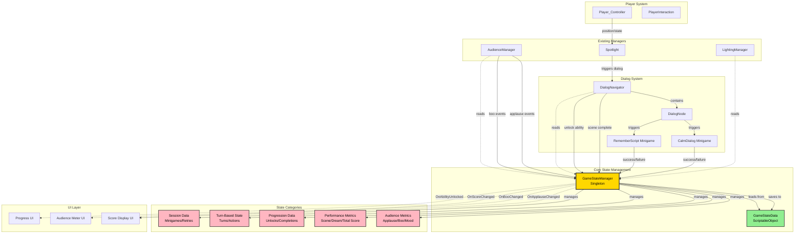
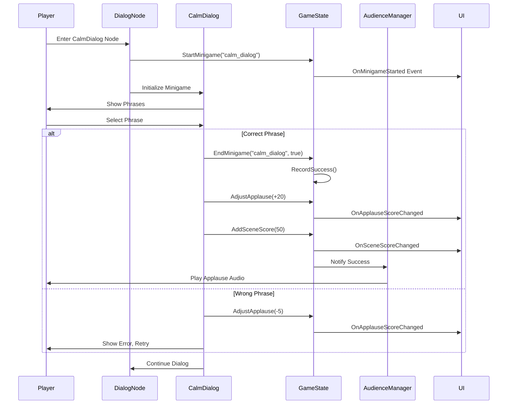
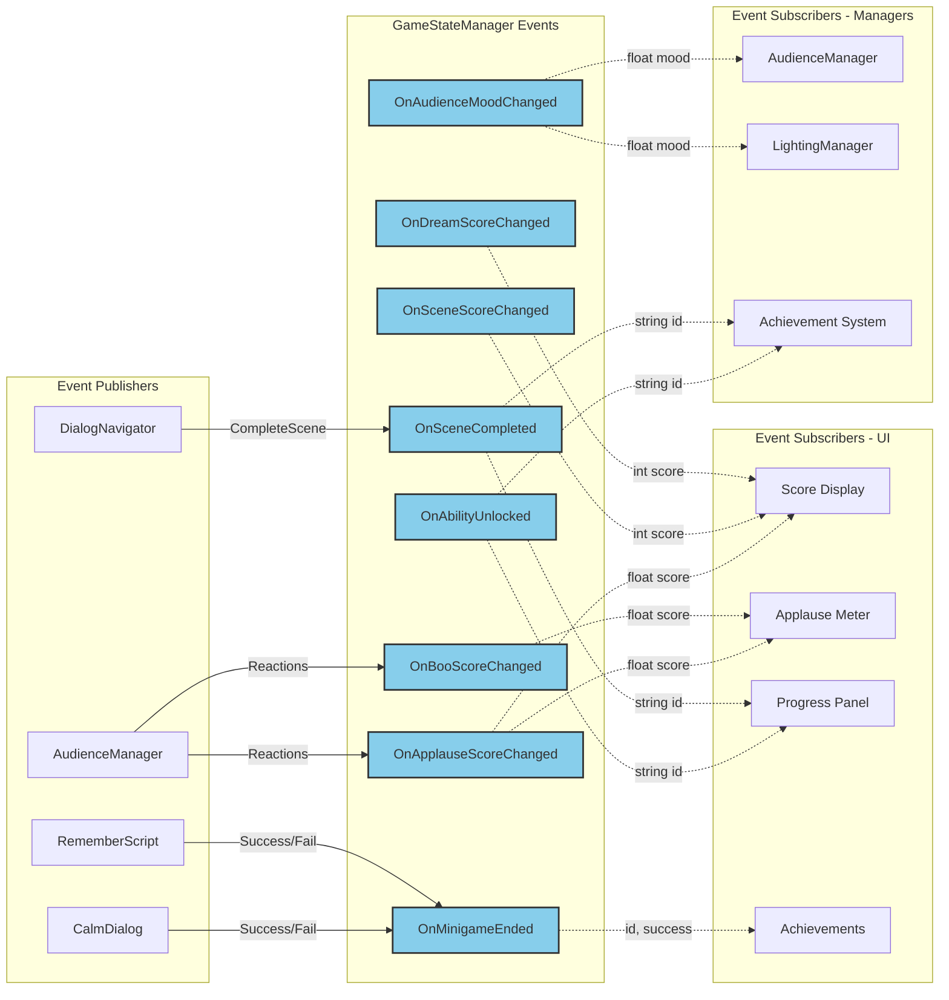
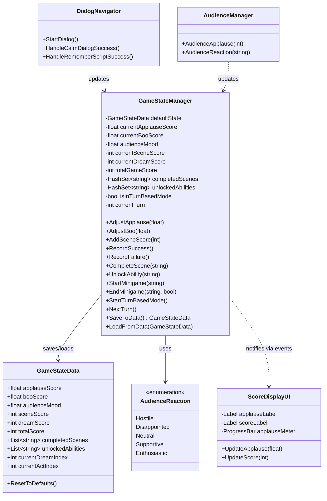
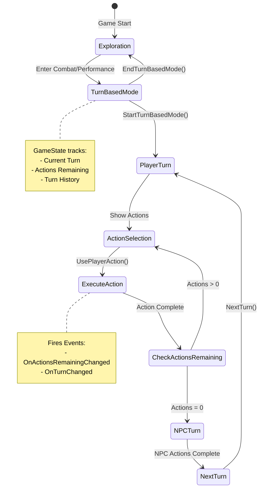
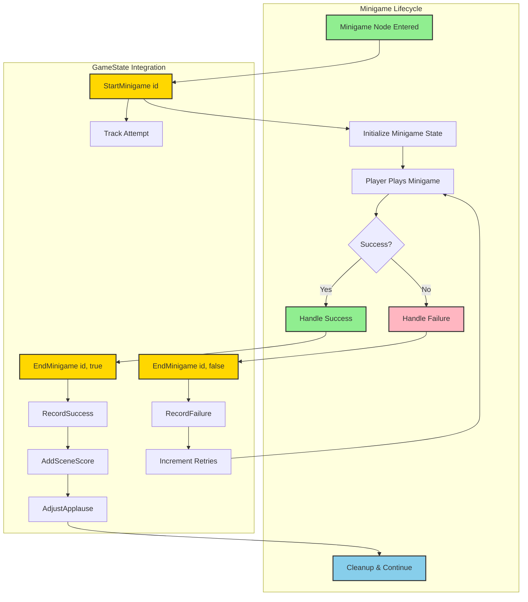

# GameState Management System - Design Proposal

**Project**: Stage of Dreams  
**Feature**: Centralized Game State Management  
**Created**: January 2025  
**Status**: ⏳ Proposal - Ready for Implementation  
**Priority**: HIGH - Foundation for minigames, audience tracking, and progression

---

## 1. Overview

### Problem Statement
Before implementing minigames like CalmDialog and RememberTheScript, we need a **centralized game state management system** to track:
- **Audience metrics** (applause, boo, mood)
- **Performance scores** (per scene, per dream)
- **Player progression** (unlocked abilities, completed scenes)
- **Turn-based state** (current turn, available actions)
- **Session data** (retries, time played, achievements)

Currently, these concerns are scattered across multiple managers (AudienceManager, DialogNavigator, etc.) with no central source of truth.

### Solution: GameStateManager Singleton
A **persistent singleton** that:
- ✅ Tracks all game metrics in one place
- ✅ Provides easy access via `GameStateManager.Instance`
- ✅ Persists across scenes (DontDestroyOnLoad)
- ✅ Supports save/load functionality
- ✅ Fires events for UI updates
- ✅ Validates state changes

---

## 2. Core Architecture

### 2.1 GameStateManager (Singleton)
**Pattern**: Singleton MonoBehaviour with ScriptableObject data backing
**Lifetime**: Persistent across scenes
**Access**: `GameStateManager.Instance`

### 2.2 GameStateData (ScriptableObject)
**Pattern**: Data-only ScriptableObject for save/load
**Purpose**: Serializable state container
**Benefits**: Easy to inspect, edit defaults, save to disk

### 2.3 Supporting Classes
- **AudienceMetrics**: Encapsulates audience-specific data
- **PerformanceMetrics**: Tracks performance scores
- **ProgressionData**: Unlocked content and completed milestones
- **SessionData**: Runtime session tracking

---

## 2.4 Architecture Diagram

### Complete System Integration



### Data Flow: Minigame Success



### Event System Architecture



### State Data Structure



### Turn-Based State Machine



### Minigame Integration Flow



---

## 3. Technical Implementation

### 3.1 GameStateManager.cs

```csharp
using UnityEngine;
using System;
using System.Collections.Generic;

/// <summary>
/// Centralized game state manager - tracks audience metrics, scores, progression, and session data.
/// Singleton pattern ensures one source of truth across all systems.
/// </summary>
public class GameStateManager : MonoBehaviour
{
    #region Singleton

    private static GameStateManager _instance;
    public static GameStateManager Instance
    {
        get
        {
            if (_instance == null)
            {
                _instance = FindFirstObjectByType<GameStateManager>();
                
                if (_instance == null)
                {
                    GameObject go = new GameObject("GameStateManager");
                    _instance = go.AddComponent<GameStateManager>();
                }
            }
            return _instance;
        }
    }

    #endregion

    #region Editor Settings

    [Header("State Configuration")]
    [SerializeField] private GameStateData defaultState;
    [SerializeField] private bool resetOnSceneLoad = false;
    [SerializeField] private bool enableDebugLogs = true;

    [Header("Audience Settings")]
    [SerializeField] private float audienceDecayRate = 1f; // Points per second of inactivity
    [SerializeField] private float audienceMoodSmoothTime = 2f; // Smooth dampening for mood changes
    
    [Header("Performance Settings")]
    [SerializeField] private int maxScorePerScene = 1000;
    [SerializeField] private int scoreThresholdForNextDream = 500;

    #endregion

    #region State Data

    // Audience Metrics
    private float _currentApplauseScore = 50f; // 0-100 scale
    private float _currentBooScore = 0f; // 0-100 scale
    private float _audienceMood = 0.5f; // 0.0 (hostile) to 1.0 (enthusiastic)
    private float _audienceMoodVelocity; // For smooth dampening
    
    // Performance Metrics
    private int _currentSceneScore = 0;
    private int _currentDreamScore = 0;
    private int _totalGameScore = 0;
    private int _consecutiveSuccesses = 0;
    private int _consecutiveFailures = 0;
    
    // Progression
    private HashSet<string> _completedScenes = new HashSet<string>();
    private HashSet<string> _unlockedAbilities = new HashSet<string>();
    private HashSet<string> _earnedAchievements = new HashSet<string>();
    private int _currentDreamIndex = 0;
    private int _currentActIndex = 0; // Act I, II, III
    
    // Turn-Based State
    private bool _isInTurnBasedMode = false;
    private int _currentTurn = 0;
    private int _playerActionsThisTurn = 0;
    private int _maxActionsPerTurn = 3;
    
    // Session Data
    private float _sessionStartTime;
    private int _totalMinigamesAttempted = 0;
    private int _totalMinigamesCompleted = 0;
    private Dictionary<string, int> _minigameRetries = new Dictionary<string, int>();

    #endregion

    #region Properties - Audience

    public float CurrentApplauseScore
    {
        get => _currentApplauseScore;
        private set
        {
            float oldValue = _currentApplauseScore;
            _currentApplauseScore = Mathf.Clamp(value, 0f, 100f);
            
            if (Math.Abs(oldValue - _currentApplauseScore) > 0.01f)
            {
                OnApplauseScoreChanged?.Invoke(_currentApplauseScore);
                UpdateAudienceMood();
            }
        }
    }

    public float CurrentBooScore
    {
        get => _currentBooScore;
        private set
        {
            float oldValue = _currentBooScore;
            _currentBooScore = Mathf.Clamp(value, 0f, 100f);
            
            if (Math.Abs(oldValue - _currentBooScore) > 0.01f)
            {
                OnBooScoreChanged?.Invoke(_currentBooScore);
                UpdateAudienceMood();
            }
        }
    }

    public float AudienceMood
    {
        get => _audienceMood;
        private set
        {
            float oldValue = _audienceMood;
            _audienceMood = Mathf.Clamp01(value);
            
            if (Math.Abs(oldValue - _audienceMood) > 0.01f)
            {
                OnAudienceMoodChanged?.Invoke(_audienceMood);
            }
        }
    }

    /// <summary>
    /// Get audience reaction category based on current mood
    /// </summary>
    public AudienceReaction CurrentAudienceReaction
    {
        get
        {
            if (_audienceMood >= 0.8f) return AudienceReaction.Enthusiastic;
            if (_audienceMood >= 0.6f) return AudienceReaction.Supportive;
            if (_audienceMood >= 0.4f) return AudienceReaction.Neutral;
            if (_audienceMood >= 0.2f) return AudienceReaction.Disappointed;
            return AudienceReaction.Hostile;
        }
    }

    #endregion

    #region Properties - Performance

    public int CurrentSceneScore
    {
        get => _currentSceneScore;
        private set
        {
            int oldValue = _currentSceneScore;
            _currentSceneScore = Mathf.Clamp(value, 0, maxScorePerScene);
            
            if (oldValue != _currentSceneScore)
            {
                OnSceneScoreChanged?.Invoke(_currentSceneScore);
            }
        }
    }

    public int CurrentDreamScore
    {
        get => _currentDreamScore;
        private set
        {
            int oldValue = _currentDreamScore;
            _currentDreamScore = Mathf.Max(0, value);
            
            if (oldValue != _currentDreamScore)
            {
                OnDreamScoreChanged?.Invoke(_currentDreamScore);
            }
        }
    }

    public int TotalGameScore
    {
        get => _totalGameScore;
        private set
        {
            int oldValue = _totalGameScore;
            _totalGameScore = Mathf.Max(0, value);
            
            if (oldValue != _totalGameScore)
            {
                OnTotalScoreChanged?.Invoke(_totalGameScore);
            }
        }
    }

    public int ConsecutiveSuccesses => _consecutiveSuccesses;
    public int ConsecutiveFailures => _consecutiveFailures;

    #endregion

    #region Properties - Progression

    public int CurrentDreamIndex
    {
        get => _currentDreamIndex;
        private set
        {
            int oldValue = _currentDreamIndex;
            _currentDreamIndex = Mathf.Max(0, value);
            
            if (oldValue != _currentDreamIndex)
            {
                OnDreamIndexChanged?.Invoke(_currentDreamIndex);
            }
        }
    }

    public int CurrentActIndex
    {
        get => _currentActIndex;
        private set
        {
            int oldValue = _currentActIndex;
            _currentActIndex = Mathf.Clamp(value, 0, 2); // Act I (0), II (1), III (2)
            
            if (oldValue != _currentActIndex)
            {
                OnActIndexChanged?.Invoke(_currentActIndex);
            }
        }
    }

    public bool IsSceneCompleted(string sceneId) => _completedScenes.Contains(sceneId);
    public bool HasAbility(string abilityId) => _unlockedAbilities.Contains(abilityId);
    public bool HasAchievement(string achievementId) => _earnedAchievements.Contains(achievementId);

    #endregion

    #region Properties - Turn-Based

    public bool IsInTurnBasedMode => _isInTurnBasedMode;
    public int CurrentTurn => _currentTurn;
    public int PlayerActionsThisTurn => _playerActionsThisTurn;
    public int MaxActionsPerTurn => _maxActionsPerTurn;
    public int RemainingActions => Mathf.Max(0, _maxActionsPerTurn - _playerActionsThisTurn);

    #endregion

    #region Properties - Session

    public float SessionDuration => Time.time - _sessionStartTime;
    public int TotalMinigamesAttempted => _totalMinigamesAttempted;
    public int TotalMinigamesCompleted => _totalMinigamesCompleted;
    public float MinigameSuccessRate => _totalMinigamesAttempted > 0 
        ? (float)_totalMinigamesCompleted / _totalMinigamesAttempted 
        : 0f;

    #endregion

    #region Events

    // Audience Events
    public event Action<float> OnApplauseScoreChanged;
    public event Action<float> OnBooScoreChanged;
    public event Action<float> OnAudienceMoodChanged;
    
    // Performance Events
    public event Action<int> OnSceneScoreChanged;
    public event Action<int> OnDreamScoreChanged;
    public event Action<int> OnTotalScoreChanged;
    
    // Progression Events
    public event Action<string> OnSceneCompleted;
    public event Action<string> OnAbilityUnlocked;
    public event Action<string> OnAchievementEarned;
    public event Action<int> OnDreamIndexChanged;
    public event Action<int> OnActIndexChanged;
    
    // Turn-Based Events
    public event Action OnTurnBasedModeStarted;
    public event Action OnTurnBasedModeEnded;
    public event Action<int> OnTurnChanged;
    public event Action<int> OnActionsRemainingChanged;
    
    // Minigame Events
    public event Action<string> OnMinigameStarted;
    public event Action<string, bool> OnMinigameEnded; // (minigame ID, success)

    #endregion

    #region Initialization

    private void Awake()
    {
        // Singleton enforcement
        if (_instance != null && _instance != this)
        {
            Destroy(gameObject);
            return;
        }
        
        _instance = this;
        DontDestroyOnLoad(gameObject);
        
        InitializeGameState();
    }

    private void InitializeGameState()
    {
        _sessionStartTime = Time.time;
        
        if (defaultState != null)
        {
            LoadFromData(defaultState);
        }
        else
        {
            ResetToDefaults();
        }
        
        LogDebug("GameStateManager initialized");
    }

    private void ResetToDefaults()
    {
        _currentApplauseScore = 50f;
        _currentBooScore = 0f;
        _audienceMood = 0.5f;
        _currentSceneScore = 0;
        _currentDreamScore = 0;
        _totalGameScore = 0;
        _consecutiveSuccesses = 0;
        _consecutiveFailures = 0;
        _completedScenes.Clear();
        _unlockedAbilities.Clear();
        _earnedAchievements.Clear();
        _currentDreamIndex = 0;
        _currentActIndex = 0;
        _isInTurnBasedMode = false;
        _currentTurn = 0;
        _playerActionsThisTurn = 0;
        _totalMinigamesAttempted = 0;
        _totalMinigamesCompleted = 0;
        _minigameRetries.Clear();
    }

    #endregion

    #region Update Loop

    private void Update()
    {
        // Smooth audience mood changes
        if (_audienceMoodSmoothTime > 0)
        {
            float targetMood = CalculateTargetMood();
            _audienceMood = Mathf.SmoothDamp(_audienceMood, targetMood, ref _audienceMoodVelocity, _audienceMoodSmoothTime);
        }
        
        // Audience decay over time (if enabled)
        if (audienceDecayRate > 0 && !_isInTurnBasedMode)
        {
            AdjustApplause(-audienceDecayRate * Time.deltaTime);
        }
    }

    /// <summary>
    /// Calculate target mood based on applause and boo scores
    /// </summary>
    private float CalculateTargetMood()
    {
        // Mood is influenced by ratio of applause to boo
        float totalReaction = _currentApplauseScore + _currentBooScore;
        
        if (totalReaction < 0.01f)
        {
            return 0.5f; // Neutral if no reactions
        }
        
        float applauseRatio = _currentApplauseScore / totalReaction;
        return applauseRatio;
    }

    /// <summary>
    /// Force immediate mood update (called after score changes)
    /// </summary>
    private void UpdateAudienceMood()
    {
        float targetMood = CalculateTargetMood();
        AudienceMood = targetMood;
    }

    #endregion

    #region Audience Methods

    /// <summary>
    /// Add or subtract from applause score
    /// </summary>
    public void AdjustApplause(float amount)
    {
        CurrentApplauseScore += amount;
        LogDebug($"Applause adjusted by {amount:F1} -> Now: {CurrentApplauseScore:F1}");
    }

    /// <summary>
    /// Add or subtract from boo score
    /// </summary>
    public void AdjustBoo(float amount)
    {
        CurrentBooScore += amount;
        LogDebug($"Boo adjusted by {amount:F1} -> Now: {CurrentBooScore:F1}");
    }

    /// <summary>
    /// Set applause score directly
    /// </summary>
    public void SetApplause(float value)
    {
        CurrentApplauseScore = value;
        LogDebug($"Applause set to {CurrentApplauseScore:F1}");
    }

    /// <summary>
    /// Set boo score directly
    /// </summary>
    public void SetBoo(float value)
    {
        CurrentBooScore = value;
        LogDebug($"Boo set to {CurrentBooScore:F1}");
    }

    /// <summary>
    /// Reset both audience scores to defaults
    /// </summary>
    public void ResetAudienceScores()
    {
        CurrentApplauseScore = 50f;
        CurrentBooScore = 0f;
        LogDebug("Audience scores reset to defaults");
    }

    #endregion

    #region Performance Methods

    /// <summary>
    /// Add points to current scene score
    /// </summary>
    public void AddSceneScore(int points)
    {
        CurrentSceneScore += points;
        CurrentDreamScore += points;
        TotalGameScore += points;
        
        LogDebug($"Added {points} points -> Scene: {CurrentSceneScore}, Dream: {CurrentDreamScore}, Total: {TotalGameScore}");
    }

    /// <summary>
    /// Record a successful action/minigame
    /// </summary>
    public void RecordSuccess()
    {
        _consecutiveSuccesses++;
        _consecutiveFailures = 0;
        
        LogDebug($"Success recorded! Consecutive successes: {_consecutiveSuccesses}");
    }

    /// <summary>
    /// Record a failed action/minigame
    /// </summary>
    public void RecordFailure()
    {
        _consecutiveFailures++;
        _consecutiveSuccesses = 0;
        
        LogDebug($"Failure recorded! Consecutive failures: {_consecutiveFailures}");
    }

    /// <summary>
    /// Reset scene score (called when starting a new scene)
    /// </summary>
    public void ResetSceneScore()
    {
        CurrentSceneScore = 0;
        LogDebug("Scene score reset");
    }

    /// <summary>
    /// Reset dream score (called when starting a new dream)
    /// </summary>
    public void ResetDreamScore()
    {
        CurrentDreamScore = 0;
        LogDebug("Dream score reset");
    }

    #endregion

    #region Progression Methods

    /// <summary>
    /// Mark a scene as completed
    /// </summary>
    public void CompleteScene(string sceneId)
    {
        if (!_completedScenes.Contains(sceneId))
        {
            _completedScenes.Add(sceneId);
            OnSceneCompleted?.Invoke(sceneId);
            LogDebug($"Scene completed: {sceneId}");
        }
    }

    /// <summary>
    /// Unlock a new ability
    /// </summary>
    public void UnlockAbility(string abilityId)
    {
        if (!_unlockedAbilities.Contains(abilityId))
        {
            _unlockedAbilities.Add(abilityId);
            OnAbilityUnlocked?.Invoke(abilityId);
            LogDebug($"Ability unlocked: {abilityId}");
        }
    }

    /// <summary>
    /// Earn an achievement
    /// </summary>
    public void EarnAchievement(string achievementId)
    {
        if (!_earnedAchievements.Contains(achievementId))
        {
            _earnedAchievements.Add(achievementId);
            OnAchievementEarned?.Invoke(achievementId);
            LogDebug($"Achievement earned: {achievementId}");
        }
    }

    /// <summary>
    /// Progress to the next dream
    /// </summary>
    public void AdvanceToDream(int dreamIndex)
    {
        CurrentDreamIndex = dreamIndex;
        ResetDreamScore();
        LogDebug($"Advanced to Dream {dreamIndex}");
    }

    /// <summary>
    /// Progress to the next act within current dream
    /// </summary>
    public void AdvanceToAct(int actIndex)
    {
        CurrentActIndex = actIndex;
        LogDebug($"Advanced to Act {actIndex + 1}"); // +1 because 0-indexed
    }

    #endregion

    #region Turn-Based Methods

    /// <summary>
    /// Start turn-based mode
    /// </summary>
    public void StartTurnBasedMode()
    {
        if (_isInTurnBasedMode)
        {
            LogWarning("Already in turn-based mode");
            return;
        }
        
        _isInTurnBasedMode = true;
        _currentTurn = 0;
        _playerActionsThisTurn = 0;
        
        OnTurnBasedModeStarted?.Invoke();
        LogDebug("Turn-based mode started");
    }

    /// <summary>
    /// End turn-based mode
    /// </summary>
    public void EndTurnBasedMode()
    {
        if (!_isInTurnBasedMode)
        {
            LogWarning("Not in turn-based mode");
            return;
        }
        
        _isInTurnBasedMode = false;
        _currentTurn = 0;
        _playerActionsThisTurn = 0;
        
        OnTurnBasedModeEnded?.Invoke();
        LogDebug("Turn-based mode ended");
    }

    /// <summary>
    /// Advance to the next turn
    /// </summary>
    public void NextTurn()
    {
        if (!_isInTurnBasedMode)
        {
            LogWarning("Not in turn-based mode - cannot advance turn");
            return;
        }
        
        _currentTurn++;
        _playerActionsThisTurn = 0;
        
        OnTurnChanged?.Invoke(_currentTurn);
        OnActionsRemainingChanged?.Invoke(RemainingActions);
        
        LogDebug($"Advanced to turn {_currentTurn}");
    }

    /// <summary>
    /// Use one player action
    /// </summary>
    public bool UsePlayerAction()
    {
        if (!_isInTurnBasedMode)
        {
            LogWarning("Not in turn-based mode");
            return false;
        }
        
        if (_playerActionsThisTurn >= _maxActionsPerTurn)
        {
            LogWarning("No actions remaining this turn");
            return false;
        }
        
        _playerActionsThisTurn++;
        OnActionsRemainingChanged?.Invoke(RemainingActions);
        
        LogDebug($"Player action used. Remaining: {RemainingActions}");
        return true;
    }

    #endregion

    #region Minigame Tracking

    /// <summary>
    /// Called when a minigame starts
    /// </summary>
    public void StartMinigame(string minigameId)
    {
        _totalMinigamesAttempted++;
        
        if (!_minigameRetries.ContainsKey(minigameId))
        {
            _minigameRetries[minigameId] = 0;
        }
        
        OnMinigameStarted?.Invoke(minigameId);
        LogDebug($"Minigame started: {minigameId} (Attempt #{_minigameRetries[minigameId] + 1})");
    }

    /// <summary>
    /// Called when a minigame ends
    /// </summary>
    public void EndMinigame(string minigameId, bool success)
    {
        if (success)
        {
            _totalMinigamesCompleted++;
            RecordSuccess();
        }
        else
        {
            _minigameRetries[minigameId]++;
            RecordFailure();
        }
        
        OnMinigameEnded?.Invoke(minigameId, success);
        LogDebug($"Minigame ended: {minigameId} - Success: {success}");
    }

    /// <summary>
    /// Get retry count for a specific minigame
    /// </summary>
    public int GetMinigameRetries(string minigameId)
    {
        return _minigameRetries.ContainsKey(minigameId) ? _minigameRetries[minigameId] : 0;
    }

    #endregion

    #region Save/Load

    /// <summary>
    /// Save current state to a GameStateData object
    /// </summary>
    public GameStateData SaveToData()
    {
        GameStateData data = ScriptableObject.CreateInstance<GameStateData>();
        
        // Audience
        data.applauseScore = _currentApplauseScore;
        data.booScore = _currentBooScore;
        data.audienceMood = _audienceMood;
        
        // Performance
        data.sceneScore = _currentSceneScore;
        data.dreamScore = _currentDreamScore;
        data.totalScore = _totalGameScore;
        data.consecutiveSuccesses = _consecutiveSuccesses;
        data.consecutiveFailures = _consecutiveFailures;
        
        // Progression
        data.completedScenes = new List<string>(_completedScenes);
        data.unlockedAbilities = new List<string>(_unlockedAbilities);
        data.earnedAchievements = new List<string>(_earnedAchievements);
        data.currentDreamIndex = _currentDreamIndex;
        data.currentActIndex = _currentActIndex;
        
        // Session
        data.totalMinigamesAttempted = _totalMinigamesAttempted;
        data.totalMinigamesCompleted = _totalMinigamesCompleted;
        
        LogDebug("Game state saved to data");
        return data;
    }

    /// <summary>
    /// Load state from a GameStateData object
    /// </summary>
    public void LoadFromData(GameStateData data)
    {
        if (data == null)
        {
            LogError("Cannot load from null data");
            return;
        }
        
        // Audience
        _currentApplauseScore = data.applauseScore;
        _currentBooScore = data.booScore;
        _audienceMood = data.audienceMood;
        
        // Performance
        _currentSceneScore = data.sceneScore;
        _currentDreamScore = data.dreamScore;
        _totalGameScore = data.totalScore;
        _consecutiveSuccesses = data.consecutiveSuccesses;
        _consecutiveFailures = data.consecutiveFailures;
        
        // Progression
        _completedScenes = new HashSet<string>(data.completedScenes);
        _unlockedAbilities = new HashSet<string>(data.unlockedAbilities);
        _earnedAchievements = new HashSet<string>(data.earnedAchievements);
        _currentDreamIndex = data.currentDreamIndex;
        _currentActIndex = data.currentActIndex;
        
        // Session
        _totalMinigamesAttempted = data.totalMinigamesAttempted;
        _totalMinigamesCompleted = data.totalMinigamesCompleted;
        
        LogDebug("Game state loaded from data");
    }

    #endregion

    #region Debugging

    [ContextMenu("Print Current State")]
    public void PrintCurrentState()
    {
        Debug.Log("=== GAME STATE ===");
        Debug.Log($"Applause: {CurrentApplauseScore:F1} | Boo: {CurrentBooScore:F1} | Mood: {AudienceMood:F2} ({CurrentAudienceReaction})");
        Debug.Log($"Scores - Scene: {CurrentSceneScore} | Dream: {CurrentDreamScore} | Total: {TotalGameScore}");
        Debug.Log($"Streaks - Successes: {ConsecutiveSuccesses} | Failures: {ConsecutiveFailures}");
        Debug.Log($"Progress - Dream: {CurrentDreamIndex} | Act: {CurrentActIndex + 1}");
        Debug.Log($"Completed Scenes: {_completedScenes.Count} | Unlocked Abilities: {_unlockedAbilities.Count}");
        Debug.Log($"Minigames - Attempted: {TotalMinigamesAttempted} | Completed: {TotalMinigamesCompleted} | Success Rate: {MinigameSuccessRate:P0}");
        Debug.Log($"Session Duration: {SessionDuration:F1}s");
        Debug.Log($"Turn-Based Active: {IsInTurnBasedMode}");
    }

    [ContextMenu("Reset All State")]
    public void ResetAllState()
    {
        ResetToDefaults();
        LogDebug("All game state reset to defaults");
    }

    [ContextMenu("Test Applause Increase")]
    private void TestApplauseIncrease()
    {
        AdjustApplause(10f);
    }

    [ContextMenu("Test Boo Increase")]
    private void TestBooIncrease()
    {
        AdjustBoo(10f);
    }

    [ContextMenu("Test Score Add")]
    private void TestScoreAdd()
    {
        AddSceneScore(50);
    }

    private void LogDebug(string message)
    {
        if (enableDebugLogs)
        {
            Debug.Log($"[GameStateManager] {message}");
        }
    }

    private void LogWarning(string message)
    {
        Debug.LogWarning($"[GameStateManager] {message}");
    }

    private void LogError(string message)
    {
        Debug.LogError($"[GameStateManager] {message}");
    }

    #endregion
}

#region Enums

public enum AudienceReaction
{
    Hostile,       // 0.0 - 0.2
    Disappointed,  // 0.2 - 0.4
    Neutral,       // 0.4 - 0.6
    Supportive,    // 0.6 - 0.8
    Enthusiastic   // 0.8 - 1.0
}

#endregion
```

---

### 3.2 GameStateData.cs (ScriptableObject)

```csharp
using UnityEngine;
using System.Collections.Generic;

/// <summary>
/// Serializable game state data for saving/loading.
/// This is a ScriptableObject so you can create default state assets in the editor.
/// </summary>
[CreateAssetMenu(fileName = "GameStateData", menuName = "Stage of Dreams/Game State Data")]
public class GameStateData : ScriptableObject
{
    [Header("Audience Metrics")]
    public float applauseScore = 50f;
    public float booScore = 0f;
    public float audienceMood = 0.5f;
    
    [Header("Performance Metrics")]
    public int sceneScore = 0;
    public int dreamScore = 0;
    public int totalScore = 0;
    public int consecutiveSuccesses = 0;
    public int consecutiveFailures = 0;
    
    [Header("Progression")]
    public List<string> completedScenes = new List<string>();
    public List<string> unlockedAbilities = new List<string>();
    public List<string> earnedAchievements = new List<string>();
    public int currentDreamIndex = 0;
    public int currentActIndex = 0;
    
    [Header("Session Data")]
    public int totalMinigamesAttempted = 0;
    public int totalMinigamesCompleted = 0;
    
    /// <summary>
    /// Create a default state configuration
    /// </summary>
    [ContextMenu("Reset to Defaults")]
    public void ResetToDefaults()
    {
        applauseScore = 50f;
        booScore = 0f;
        audienceMood = 0.5f;
        sceneScore = 0;
        dreamScore = 0;
        totalScore = 0;
        consecutiveSuccesses = 0;
        consecutiveFailures = 0;
        completedScenes.Clear();
        unlockedAbilities.Clear();
        earnedAchievements.Clear();
        currentDreamIndex = 0;
        currentActIndex = 0;
        totalMinigamesAttempted = 0;
        totalMinigamesCompleted = 0;
    }
}
```

---

## 4. Integration with Existing Systems

### 4.1 DialogNavigator Integration

```csharp
// In DialogNavigator.cs - CalmDialog minigame

private void HandleCalmDialogSuccess(string selectedPhrase, int mistakeCount)
{
    LogDebug($"[CalmDialog] Success! Selected: '{selectedPhrase}' with {mistakeCount} mistakes");
    
    // Adjust audience score based on performance
    int scoreBonus = currentCalmDialogNode.ScoreOnSuccess;
    if (mistakeCount == 0)
    {
        scoreBonus = (int)(scoreBonus * 1.5f); // 50% bonus for perfect
    }
    
    // Update GameState
    GameStateManager.Instance.AdjustApplause(scoreBonus);
    GameStateManager.Instance.AddSceneScore(scoreBonus);
    GameStateManager.Instance.RecordSuccess();
    
    // Fire success event
    OnCalmDialogSuccess?.Invoke(selectedPhrase, mistakeCount);
    
    // Continue dialog
    CleanupCalmDialog();
    AdvanceDialog();
}
```

### 4.2 AudienceManager Integration

```csharp
// In AudienceManager.cs

public void AudienceApplause(int intensity)
{
    intensity = Mathf.Clamp(intensity, 1, 10);
    
    // Update GameState
    float applauseIncrease = intensity * 5f; // Convert 1-10 to 5-50 points
    GameStateManager.Instance.AdjustApplause(applauseIncrease);
    
    // Play audio/visual feedback
    // ... existing code ...
}

public void AudienceReaction(string reactionType)
{
    // Update GameState based on reaction
    switch (reactionType.ToLower())
    {
        case "boo":
            GameStateManager.Instance.AdjustBoo(10f);
            break;
        case "applause":
        case "cheer":
            GameStateManager.Instance.AdjustApplause(10f);
            break;
    }
    
    // Play audio/visual feedback
    // ... existing code ...
}
```

### 4.3 UI Integration Example

```csharp
// Example: ScoreDisplayUI.cs

using UnityEngine;
using UnityEngine.UIElements;

public class ScoreDisplayUI : MonoBehaviour
{
    [SerializeField] private UIDocument uiDocument;
    
    private Label applauseLabel;
    private Label booLabel;
    private Label scoreLabel;
    private ProgressBar applauseMeter;
    
    private void OnEnable()
    {
        // Get UI elements
        var root = uiDocument.rootVisualElement;
        applauseLabel = root.Q<Label>("ApplauseLabel");
        booLabel = root.Q<Label>("BooLabel");
        scoreLabel = root.Q<Label>("ScoreLabel");
        applauseMeter = root.Q<ProgressBar>("ApplauseMeter");
        
        // Subscribe to GameState events
        GameStateManager.Instance.OnApplauseScoreChanged += UpdateApplause;
        GameStateManager.Instance.OnBooScoreChanged += UpdateBoo;
        GameStateManager.Instance.OnSceneScoreChanged += UpdateScore;
        
        // Initial update
        UpdateApplause(GameStateManager.Instance.CurrentApplauseScore);
        UpdateBoo(GameStateManager.Instance.CurrentBooScore);
        UpdateScore(GameStateManager.Instance.CurrentSceneScore);
    }
    
    private void OnDisable()
    {
        GameStateManager.Instance.OnApplauseScoreChanged -= UpdateApplause;
        GameStateManager.Instance.OnBooScoreChanged -= UpdateBoo;
        GameStateManager.Instance.OnSceneScoreChanged -= UpdateScore;
    }
    
    private void UpdateApplause(float score)
    {
        applauseLabel.text = $"Applause: {score:F0}";
        if (applauseMeter != null)
        {
            applauseMeter.value = score;
        }
    }
    
    private void UpdateBoo(float score)
    {
        booLabel.text = $"Boo: {score:F0}";
    }
    
    private void UpdateScore(int score)
    {
        scoreLabel.text = $"Score: {score}";
    }
}
```

---

## 5. Usage Examples

### Example 1: Starting a Minigame
```csharp
// When CalmDialog starts
GameStateManager.Instance.StartMinigame("calm_dialog");

// When CalmDialog succeeds
GameStateManager.Instance.EndMinigame("calm_dialog", success: true);
GameStateManager.Instance.AdjustApplause(20f);
GameStateManager.Instance.AddSceneScore(50);
```

### Example 2: Scene Completion
```csharp
// When player completes a scene
GameStateManager.Instance.CompleteScene("act1_scene2");
GameStateManager.Instance.ResetSceneScore();
GameStateManager.Instance.UnlockAbility("PerfectMemory");
```

### Example 3: Turn-Based Combat
```csharp
// Start turn-based mode
GameStateManager.Instance.StartTurnBasedMode();

// Player uses an action
if (GameStateManager.Instance.UsePlayerAction())
{
    // Perform action
}

// Check if turn is over
if (GameStateManager.Instance.RemainingActions <= 0)
{
    GameStateManager.Instance.NextTurn();
}

// End turn-based mode
GameStateManager.Instance.EndTurnBasedMode();
```

### Example 4: Checking Progression
```csharp
// Check if player has unlocked an ability
if (GameStateManager.Instance.HasAbility("Improvise"))
{
    // Show improvise option
}

// Check if scene is already completed
if (GameStateManager.Instance.IsSceneCompleted("tutorial_scene"))
{
    // Skip tutorial
}
```

---

## 6. Benefits

### ✅ Centralized Truth
- One source of truth for all game state
- No conflicting state across systems
- Easy to debug and inspect

### ✅ Event-Driven
- UI updates automatically via events
- Systems stay decoupled
- Easy to add new listeners

### ✅ Minigame Ready
- Tracks successes/failures
- Supports retry logic
- Records performance metrics

### ✅ Persistence Ready
- Save/load via ScriptableObject
- Easy to extend for file save system
- Can create default state assets

### ✅ Turn-Based Ready
- Built-in turn tracking
- Action management
- Easy to extend for combat

---

## 7. Implementation Checklist

### Phase 1: Core System
- [ ] Create `GameStateManager.cs`
- [ ] Create `GameStateData.cs` ScriptableObject
- [ ] Add `AudienceReaction` enum
- [ ] Test basic state tracking
- [ ] Create default state asset in Unity

### Phase 2: Integration
- [ ] Integrate with `DialogNavigator.cs` minigames
- [ ] Integrate with `AudienceManager.cs`
- [ ] Add to existing scenes
- [ ] Test event subscriptions

### Phase 3: UI
- [ ] Create score display UI
- [ ] Create audience meter UI
- [ ] Hook up to GameState events
- [ ] Test real-time updates

### Phase 4: Testing
- [ ] Test applause/boo adjustments
- [ ] Test score tracking
- [ ] Test progression flags
- [ ] Test save/load functionality

---

## 8. Future Enhancements

### Potential Additions
- **Persistent Save System**: Write GameStateData to disk
- **Cloud Saves**: Sync state across devices
- **Statistics Tracking**: Detailed analytics per minigame
- **Difficulty Scaling**: Adjust difficulty based on performance
- **Achievements System**: Complex achievement tracking
- **Leaderboards**: Compare scores with others
- **Time Attack Mode**: Speed-run tracking
- **New Game+**: Carry over progression

---

## 9. Documentation Updates

### Files to Update After Implementation
- [ ] `Class Hierarchy.md` - Add GameStateManager section
- [ ] `Project_Roadmap.md` - Mark GameState as implemented
- [ ] `Requirements.md` - Update state tracking description
- [ ] `.github\copilot-instructions.md` - Add GameState patterns
- [ ] Create `GameState-Usage-Guide.md` for developers

---

## 10. Summary

### Key Features
✅ **Singleton Pattern**: Easy global access  
✅ **Event-Driven**: Automatic UI updates  
✅ **Minigame Integration**: Tracks performance and retries  
✅ **Audience Tracking**: Applause, boo, and mood metrics  
✅ **Score System**: Scene, dream, and total scores  
✅ **Progression**: Completed content and unlocks  
✅ **Turn-Based Support**: Built-in turn management  
✅ **Save/Load Ready**: ScriptableObject data backing  
✅ **Debugging Tools**: Context menu inspection  

### Implementation Estimate
- **Phase 1**: ~3-4 hours (core system)
- **Phase 2**: ~2-3 hours (integration)
- **Phase 3**: ~2-3 hours (UI)
- **Phase 4**: ~2 hours (testing)
- **Total**: ~9-12 hours

---

**Status**: ⏳ Ready for Implementation  
**Dependencies**: None (foundational system)  
**Next Steps**: Review proposal → Approve → Implement → Test → Integrate with minigames

---

**End of Proposal**
