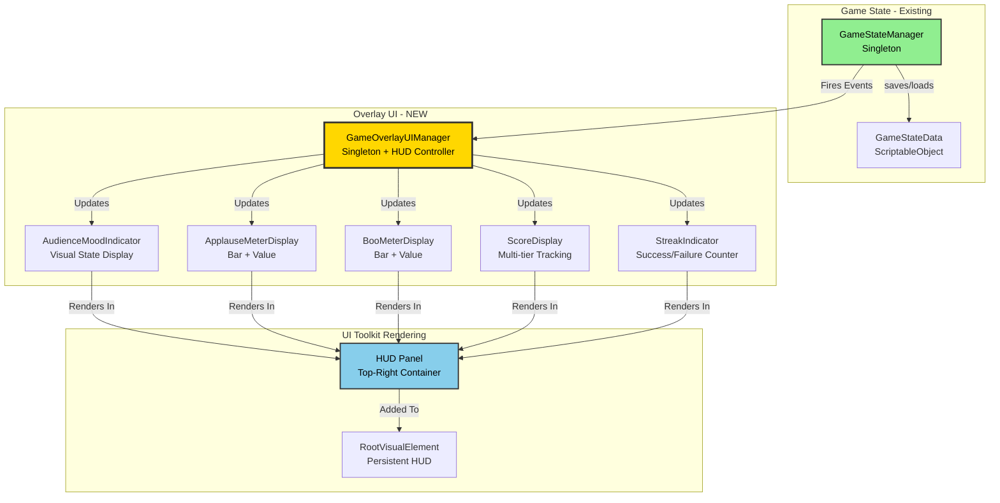
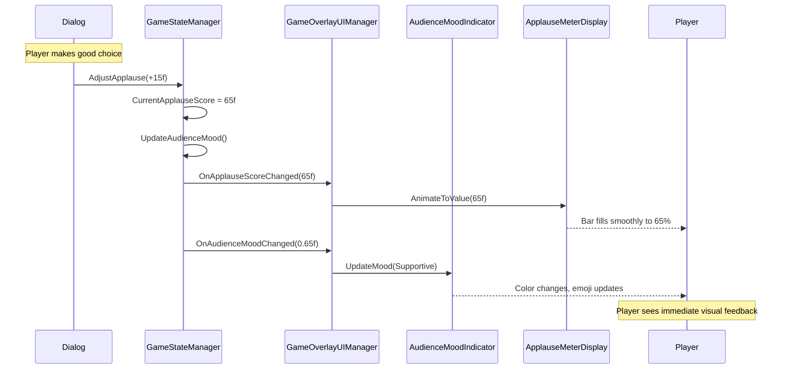

# Game Overlay UI System - Design Proposal

**Project**: Stage of Dreams  
**Feature**: In-Game HUD displaying audience metrics, score, and applause meter  
**Created**: January 2025  
**Status**: ⏳ Proposal  
**Priority**: MEDIUM - Enhances player feedback and immersion

---

## 1. Overview

### Problem Statement
[Current pain points:]
- **No visual feedback for audience reaction** - players can't see how well they're performing
- **Score tracking invisible** - scene/dream/total scores exist but aren't displayed
- **Applause meter hidden** - GameStateManager tracks applause/boo but no UI shows it
- **No performance indicators** - consecutive successes/failures not visible to player
- **Immersion break** - players don't feel connected to audience reactions

[Who is affected:]
- **Players**: Missing crucial performance feedback during gameplay
- **GameStateManager**: Has rich data but no presentation layer
- **Game Design**: Can't communicate performance mechanics visually
- **Theater atmosphere**: Lacks visual reinforcement of audience engagement

### Proposed Solution: GameOverlayUIManager
[Brief description:]
A persistent HUD that displays real-time audience metrics, performance scores, and visual indicators for player feedback. Subscribes to GameStateManager events for live updates without impacting performance.

**Key Features**:
- ✅ Audience mood indicator with visual state (Hostile → Enthusiastic)
- ✅ Applause meter (0-100) with dynamic bar fill
- ✅ Boo meter (0-100) for negative audience reactions
- ✅ Score tracking (scene, dream, total) with milestone indicators
- ✅ Streak counters (consecutive successes/failures)
- ✅ Animated transitions for state changes
- ✅ Minimalist design that doesn't obstruct gameplay

---

## 2. Core Architecture

### 2.1 GameOverlayUIManager
**Pattern**: Event Subscriber + Persistent HUD Controller  
**Lifetime**: Persistent across scenes (DontDestroyOnLoad)  
**Access**: Singleton via GameOverlayUIManager.Instance  
**Responsibilities**: 
- Subscribe to GameStateManager events
- Update HUD elements in real-time
- Animate value changes (smooth transitions)
- Handle HUD visibility toggling

### 2.2 AudienceMoodIndicator Component
**Pattern**: Visual State Machine  
**Purpose**: Display current audience reaction visually  
**Benefits**: 
- Clear at-a-glance feedback
- Color-coded for quick recognition
- Animated state transitions

### 2.3 Supporting Classes/Systems
- **ApplauseMeterDisplay**: Visual bar showing applause level
- **ScoreDisplay**: Multi-tiered score tracking (scene/dream/total)
- **StreakIndicator**: Shows consecutive successes/failures
- **OverlayAnimator**: Handles smooth value transitions

---

## 2.4 Architecture Diagrams

### System Integration



### Event Flow: Audience Reaction Updates



---

## 3. Technical Implementation

### 3.1 GameOverlayUIManager.cs

**Location**: `Assets\_Stage of Dreams_\Scripts\UI\GameOverlayUIManager.cs`

```csharp
using UnityEngine;
using UnityEngine.UIElements;
using System.Collections;

/// <summary>
/// Manages the persistent in-game HUD overlay.
/// Displays audience metrics, scores, and performance indicators.
/// Subscribes to GameStateManager events for real-time updates.
/// </summary>
public class GameOverlayUIManager : MonoBehaviour
{
    #region Singleton
    private static GameOverlayUIManager _instance;
    public static GameOverlayUIManager Instance
    {
        get
        {
            if (_instance == null)
            {
                GameObject go = new GameObject("GameOverlayUIManager");
                _instance = go.AddComponent<GameOverlayUIManager>();
                DontDestroyOnLoad(go);
            }
            return _instance;
        }
    }
    #endregion
    
    #region Editor Fields
    [Header("UI References")]
    [SerializeField] private UIDocument overlayDocument;
    [SerializeField] private VisualTreeAsset hudTemplate;
    
    [Header("Settings")]
    [SerializeField] private bool showOverlay = true;
    [SerializeField] private float animationDuration = 0.5f;
    [SerializeField] private bool enableDebugLogs = true;
    #endregion
    
    #region UI Elements
    private VisualElement hudPanel;
    private AudienceMoodIndicator moodIndicator;
    private ApplauseMeterDisplay applauseMeter;
    private BooMeterDisplay booMeter;
    private ScoreDisplay scoreDisplay;
    private StreakIndicator streakIndicator;
    #endregion
    
    #region Initialization
    private void Awake()
    {
        if (_instance != null && _instance != this)
        {
            Destroy(gameObject);
            return;
        }
        
        _instance = this;
        DontDestroyOnLoad(gameObject);
        
        InitializeOverlay();
    }
    
    private void InitializeOverlay()
    {
        // Create or get UIDocument
        if (overlayDocument == null)
        {
            overlayDocument = gameObject.AddComponent<UIDocument>();
        }
        
        if (hudTemplate != null)
        {
            overlayDocument.visualTreeAsset = hudTemplate;
        }
        
        VisualElement root = overlayDocument.rootVisualElement;
        
        // Create HUD panel
        hudPanel = new VisualElement();
        hudPanel.name = "HUDPanel";
        hudPanel.AddToClassList("hud-panel");
        root.Add(hudPanel);
        
        // Initialize components
        moodIndicator = new AudienceMoodIndicator();
        applauseMeter = new ApplauseMeterDisplay();
        booMeter = new BooMeterDisplay();
        scoreDisplay = new ScoreDisplay();
        streakIndicator = new StreakIndicator();
        
        // Add components to HUD
        hudPanel.Add(moodIndicator.GetRootElement());
        hudPanel.Add(applauseMeter.GetRootElement());
        hudPanel.Add(booMeter.GetRootElement());
        hudPanel.Add(scoreDisplay.GetRootElement());
        hudPanel.Add(streakIndicator.GetRootElement());
        
        // Subscribe to GameStateManager events
        SubscribeToGameStateEvents();
        
        // Initial update
        UpdateAllDisplays();
        
        hudPanel.style.display = showOverlay ? DisplayStyle.Flex : DisplayStyle.None;
        
        LogDebug("GameOverlayUIManager initialized");
    }
    
    private void SubscribeToGameStateEvents()
    {
        var gsm = GameStateManager.Instance;
        
        // Audience events
        gsm.OnApplauseScoreChanged += HandleApplauseChanged;
        gsm.OnBooScoreChanged += HandleBooChanged;
        gsm.OnAudienceMoodChanged += HandleMoodChanged;
        
        // Performance events
        gsm.OnSceneScoreChanged += HandleSceneScoreChanged;
        gsm.OnDreamScoreChanged += HandleDreamScoreChanged;
        gsm.OnTotalScoreChanged += HandleTotalScoreChanged;
        
        LogDebug("Subscribed to GameStateManager events");
    }
    #endregion
    
    #region Event Handlers
    private void HandleApplauseChanged(float newValue)
    {
        StartCoroutine(applauseMeter.AnimateToValue(newValue, animationDuration));
        LogDebug($"Applause: {newValue:F1}");
    }
    
    private void HandleBooChanged(float newValue)
    {
        StartCoroutine(booMeter.AnimateToValue(newValue, animationDuration));
        LogDebug($"Boo: {newValue:F1}");
    }
    
    private void HandleMoodChanged(float moodValue)
    {
        AudienceReaction reaction = CalculateReaction(moodValue);
        moodIndicator.UpdateMood(reaction, moodValue);
        LogDebug($"Mood: {reaction} ({moodValue:F2})");
    }
    
    private void HandleSceneScoreChanged(int newScore)
    {
        scoreDisplay.UpdateSceneScore(newScore);
        LogDebug($"Scene Score: {newScore}");
    }
    
    private void HandleDreamScoreChanged(int newScore)
    {
        scoreDisplay.UpdateDreamScore(newScore);
        LogDebug($"Dream Score: {newScore}");
    }
    
    private void HandleTotalScoreChanged(int newScore)
    {
        scoreDisplay.UpdateTotalScore(newScore);
        LogDebug($"Total Score: {newScore}");
    }
    
    private AudienceReaction CalculateReaction(float mood)
    {
        if (mood >= 0.8f) return AudienceReaction.Enthusiastic;
        if (mood >= 0.6f) return AudienceReaction.Supportive;
        if (mood >= 0.4f) return AudienceReaction.Neutral;
        if (mood >= 0.2f) return AudienceReaction.Disappointed;
        return AudienceReaction.Hostile;
    }
    #endregion
    
    #region Public Methods
    public void ToggleOverlay()
    {
        showOverlay = !showOverlay;
        hudPanel.style.display = showOverlay ? DisplayStyle.Flex : DisplayStyle.None;
        LogDebug($"Overlay toggled: {showOverlay}");
    }
    
    public void SetOverlayVisible(bool visible)
    {
        showOverlay = visible;
        hudPanel.style.display = visible ? DisplayStyle.Flex : DisplayStyle.None;
    }
    
    private void UpdateAllDisplays()
    {
        var gsm = GameStateManager.Instance;
        
        applauseMeter.SetValue(gsm.CurrentApplauseScore);
        booMeter.SetValue(gsm.CurrentBooScore);
        moodIndicator.UpdateMood(gsm.CurrentAudienceReaction, gsm.AudienceMood);
        scoreDisplay.UpdateSceneScore(gsm.CurrentSceneScore);
        scoreDisplay.UpdateDreamScore(gsm.CurrentDreamScore);
        scoreDisplay.UpdateTotalScore(gsm.TotalGameScore);
        streakIndicator.UpdateStreaks(gsm.ConsecutiveSuccesses, gsm.ConsecutiveFailures);
    }
    #endregion
    
    #region Cleanup
    private void OnDestroy()
    {
        if (GameStateManager.Instance != null)
        {
            var gsm = GameStateManager.Instance;
            
            gsm.OnApplauseScoreChanged -= HandleApplauseChanged;
            gsm.OnBooScoreChanged -= HandleBooChanged;
            gsm.OnAudienceMoodChanged -= HandleMoodChanged;
            gsm.OnSceneScoreChanged -= HandleSceneScoreChanged;
            gsm.OnDreamScoreChanged -= HandleDreamScoreChanged;
            gsm.OnTotalScoreChanged -= HandleTotalScoreChanged;
        }
    }
    #endregion
    
    #region Logging
    private void LogDebug(string message)
    {
        if (enableDebugLogs)
        {
            Debug.Log($"[GameOverlayUIManager] {message}");
        }
    }
    #endregion
}
```

**Key Methods**:
- `InitializeOverlay()`: Create HUD structure and subscribe to events
- `HandleApplauseChanged()`: Animate applause bar on value change
- `ToggleOverlay()`: Show/hide entire HUD
- `UpdateAllDisplays()`: Force refresh all values (for scene load)

**Events**:
- Subscribes to all relevant GameStateManager events
- Updates UI components in response to state changes

---

### 3.2 AudienceMoodIndicator.cs

**Location**: `Assets\_Stage of Dreams_\Scripts\UI\Components\AudienceMoodIndicator.cs`

```csharp
using UnityEngine;
using UnityEngine.UIElements;

/// <summary>
/// Displays audience mood with color-coded visual state.
/// Shows emoji and text label for current audience reaction.
/// </summary>
public class AudienceMoodIndicator
{
    private VisualElement rootElement;
    private Label moodLabel;
    private Label moodEmoji;
    private VisualElement moodBar;
    
    public AudienceMoodIndicator()
    {
        BuildUI();
    }
    
    private void BuildUI()
    {
        rootElement = new VisualElement();
        rootElement.name = "AudienceMoodIndicator";
        rootElement.AddToClassList("mood-indicator");
        
        // Title
        Label title = new Label("Audience Mood");
        title.AddToClassList("hud-title");
        rootElement.Add(title);
        
        // Mood emoji (large)
        moodEmoji = new Label("😐");
        moodEmoji.AddToClassList("mood-emoji");
        rootElement.Add(moodEmoji);
        
        // Mood label
        moodLabel = new Label("Neutral");
        moodLabel.AddToClassList("mood-label");
        rootElement.Add(moodLabel);
        
        // Mood bar (visual indicator)
        moodBar = new VisualElement();
        moodBar.AddToClassList("mood-bar");
        rootElement.Add(moodBar);
    }
    
    public void UpdateMood(AudienceReaction reaction, float moodValue)
    {
        // Update text
        moodLabel.text = reaction.ToString();
        
        // Update emoji
        moodEmoji.text = reaction switch
        {
            AudienceReaction.Hostile => "😠",
            AudienceReaction.Disappointed => "😕",
            AudienceReaction.Neutral => "😐",
            AudienceReaction.Supportive => "😊",
            AudienceReaction.Enthusiastic => "🤩",
            _ => "😐"
        };
        
        // Update color
        Color moodColor = reaction switch
        {
            AudienceReaction.Hostile => new Color(0.8f, 0.2f, 0.2f),
            AudienceReaction.Disappointed => new Color(0.9f, 0.6f, 0.3f),
            AudienceReaction.Neutral => new Color(0.7f, 0.7f, 0.7f),
            AudienceReaction.Supportive => new Color(0.4f, 0.8f, 0.4f),
            AudienceReaction.Enthusiastic => new Color(0.3f, 0.9f, 0.3f),
            _ => Color.gray
        };
        
        moodBar.style.backgroundColor = moodColor;
        moodBar.style.width = Length.Percent(moodValue * 100f);
    }
    
    public VisualElement GetRootElement() => rootElement;
}
```

---

### 3.3 ApplauseMeterDisplay.cs

**Location**: `Assets\_Stage of Dreams_\Scripts\UI\Components\ApplauseMeterDisplay.cs`

```csharp
using UnityEngine;
using UnityEngine.UIElements;
using System.Collections;

/// <summary>
/// Displays applause meter with animated bar fill.
/// Shows numeric value and visual bar (0-100 scale).
/// </summary>
public class ApplauseMeterDisplay
{
    private VisualElement rootElement;
    private Label valueLabel;
    private ProgressBar applauseBar;
    
    private float currentValue = 50f;
    private float targetValue = 50f;
    
    public ApplauseMeterDisplay()
    {
        BuildUI();
    }
    
    private void BuildUI()
    {
        rootElement = new VisualElement();
        rootElement.name = "ApplauseMeterDisplay";
        rootElement.AddToClassList("meter-display");
        
        // Title
        Label title = new Label("Applause");
        title.AddToClassList("meter-title");
        rootElement.Add(title);
        
        // Value label
        valueLabel = new Label("50");
        valueLabel.AddToClassList("meter-value");
        rootElement.Add(valueLabel);
        
        // Progress bar
        applauseBar = new ProgressBar();
        applauseBar.value = 50f;
        applauseBar.title = "";
        applauseBar.AddToClassList("applause-bar");
        rootElement.Add(applauseBar);
    }
    
    public void SetValue(float value)
    {
        currentValue = Mathf.Clamp(value, 0f, 100f);
        targetValue = currentValue;
        
        valueLabel.text = $"{currentValue:F0}";
        applauseBar.value = currentValue;
    }
    
    public IEnumerator AnimateToValue(float newValue, float duration)
    {
        targetValue = Mathf.Clamp(newValue, 0f, 100f);
        float startValue = currentValue;
        float elapsed = 0f;
        
        while (elapsed < duration)
        {
            elapsed += Time.deltaTime;
            currentValue = Mathf.Lerp(startValue, targetValue, elapsed / duration);
            
            valueLabel.text = $"{currentValue:F0}";
            applauseBar.value = currentValue;
            
            yield return null;
        }
        
        currentValue = targetValue;
        valueLabel.text = $"{currentValue:F0}";
        applauseBar.value = currentValue;
    }
    
    public VisualElement GetRootElement() => rootElement;
}
```

---

## 4. Integration with Existing Systems

### 4.1 Integration with GameStateManager

**No changes required** - GameStateManager already has all necessary events:
- `OnApplauseScoreChanged`
- `OnBooScoreChanged`
- `OnAudienceMoodChanged`
- `OnSceneScoreChanged`
- `OnDreamScoreChanged`
- `OnTotalScoreChanged`

GameOverlayUIManager simply subscribes to these events.

---

### 4.2 Integration with Scene Loading

**Affected Files**: Scene management / GameManager (TBD)

**Changes Required**:
```csharp
// When loading a new scene:
GameOverlayUIManager.Instance.UpdateAllDisplays();

// When starting a new scene/dream:
GameStateManager.Instance.ResetSceneScore();
GameOverlayUIManager.Instance.UpdateAllDisplays();
```

---

## 5. Usage Examples

### Example 1: Player Completes Dialog Successfully
**Scenario**: Dialog choice adds applause points

```csharp
// In dialog event:
GameStateManager.Instance.AdjustApplause(15f);

// GameOverlayUIManager automatically updates:
// - Applause bar animates from 50 → 65
// - Value label updates "50" → "65"
// - Audience mood may improve (Neutral → Supportive)
// - Mood indicator color changes green
```

**Expected Behavior**: 
- Smooth bar animation over 0.5 seconds
- Value counts up visually
- Mood indicator reflects new state

---

### Example 2: Player Completes Minigame
**Scenario**: RememberTheScript success gives score and applause

```csharp
// After minigame success:
GameStateManager.Instance.AddSceneScore(50);
GameStateManager.Instance.AdjustApplause(10f);
GameStateManager.Instance.RecordSuccess();

// GameOverlayUIManager shows:
// - Scene score: 0 → 50
// - Dream score: 0 → 50
// - Total score: 0 → 50
// - Applause: 50 → 60
// - Success streak: 1
```

---

### Example 3: Toggle HUD Visibility
**Scenario**: Player wants to hide UI for screenshots

```csharp
// Via input binding or menu option:
GameOverlayUIManager.Instance.ToggleOverlay();

// HUD fades out smoothly
// Press again to show
```

---

## 6. Benefits

### ✅ Real-Time Feedback
- Players see immediate response to their actions
- Creates satisfying feedback loop
- Enhances player engagement

### ✅ Performance Transparency
- Clear communication of game mechanics
- Players understand scoring system
- Encourages strategic decision-making

### ✅ Immersive Theater Atmosphere
- Visual representation of audience reactions
- Reinforces theater setting
- Adds tension and excitement

---

## 7. Implementation Checklist

### Phase 1: Core HUD Structure
- [ ] Create GameOverlayUIManager.cs
- [ ] Setup UIDocument and root element
- [ ] Subscribe to GameStateManager events
- [ ] **Testing**: Verify events trigger console logs

### Phase 2: Audience Indicators
- [ ] Implement AudienceMoodIndicator
- [ ] Implement ApplauseMeterDisplay
- [ ] Implement BooMeterDisplay
- [ ] **Testing**: Test mood/applause updates

### Phase 3: Score Display
- [ ] Implement ScoreDisplay component
- [ ] Show scene/dream/total scores
- [ ] Add milestone indicators (optional)
- [ ] **Testing**: Score updates correctly

### Phase 4: Polish & Animation
- [ ] Add smooth value transitions
- [ ] Create USS styling
- [ ] Add toggle visibility
- [ ] **Testing**: Smooth animations, no performance impact

---

## 8. Potential Risks & Mitigation

### Risk 1: Performance Impact from Constant Updates
**Likelihood**: Low  
**Impact**: Medium  
**Mitigation Strategy**: 
- Use event-driven updates (not per-frame polling)
- Coroutines for animations
- Cache UI element references

### Risk 2: UI Cluttering Gameplay
**Likelihood**: Medium  
**Impact**: Medium  
**Mitigation Strategy**:
- Minimalist design (top-right corner only)
- Toggle visibility option
- Semi-transparent background
- Test on small screens

### Risk 3: USS Styling Conflicts
**Likelihood**: Low  
**Impact**: Low  
**Mitigation Strategy**:
- Use unique class names prefixed with `hud-`
- Separate USS file for overlay
- Test across resolutions

---

## 9. Future Enhancements

### Potential Additions
- **Audience Reactions**: Emoji particles on big moments
- **Score Milestones**: "100 points!" popups
- **Combo System**: Visual streak multipliers
- **Audio Feedback**: Applause sound intensity
- **Minimap**: Show player location on stage

### Post-MVP Features
- **Customizable HUD**: Player can rearrange elements
- **HUD Skins**: Different visual themes
- **Advanced Stats**: WPM, accuracy, time played
- **Leaderboard Integration**: Show global rank

---

## 10. Documentation Updates

### Files to Update After Implementation
- [ ] `Class Hierarchy.md` - Add GameOverlayUIManager and components
- [ ] `.github\copilot-instructions.md` - Add UI Toolkit HUD patterns
- [ ] Create `Game-Overlay-UI-Guide.md` - Designer reference
- [ ] `TROUBLESHOOTING.MD` - Add HUD debugging tips

---

## 11. Testing Strategy

### Unit Tests
- [ ] Test GameOverlayUIManager event subscription
- [ ] Test ApplauseMeterDisplay value animation
- [ ] Test AudienceMoodIndicator state transitions
- [ ] Test ScoreDisplay multi-tier updates

### Integration Tests
- [ ] Test GameStateManager → Overlay UI updates
- [ ] Test scene load refresh
- [ ] Test rapid value changes (stress test)
- [ ] Test toggle visibility

### Manual Testing
- [ ] Test during dialog (applause changes)
- [ ] Test during minigames (score updates)
- [ ] Test mood transitions (all 5 states)
- [ ] Test on different screen sizes

---

## 12. Performance Considerations

### Memory
- **Estimated Impact**: Low
- **Optimization Strategy**: 
  - Single persistent UIDocument
  - Reuse VisualElements
  - No per-frame allocations

### CPU
- **Estimated Impact**: Very Low
- **Optimization Strategy**:
  - Event-driven (no polling)
  - Coroutines for animations
  - Minimal UI hierarchy depth

### Scalability
- **Current Scale**: 6-8 UI components
- **Future Scale**: 10-15 components (with enhancements)
- **Scaling Strategy**: Modular component system

---

## 13. Summary

### Key Features
✅ **Audience Mood Indicator**: Visual state with emoji and color  
✅ **Applause Meter**: Animated bar (0-100 scale)  
✅ **Boo Meter**: Negative reaction tracking  
✅ **Multi-Tier Scores**: Scene, dream, and total  
✅ **Streak Indicators**: Success/failure counters  
✅ **Toggle Visibility**: Can hide HUD  

### Success Criteria
- [ ] HUD displays all GameStateManager metrics
- [ ] Updates happen in real-time (<0.1s latency)
- [ ] Animations are smooth (no frame drops)
- [ ] UI doesn't obstruct gameplay
- [ ] Toggle functionality works
- [ ] Performance impact <5% CPU

### Acceptance Requirements
- All GameStateManager values visible on HUD
- Event-driven updates work reliably
- HUD persists across scene changes
- Professional visual design
- No performance degradation

---

**Status**: ⏳ Awaiting Approval  
**Dependencies**: GameStateManager (✅ Complete), UI Toolkit (✅ Ready)  
**Blocks**: Player testing, gameplay balancing  
**Next Steps**: Review proposal, implement Phase 1

---

**Proposal Author**: GitHub Copilot  
**Reviewers**: Jack Taylor  
**Approval Date**: TBD

---

**End of Proposal**
