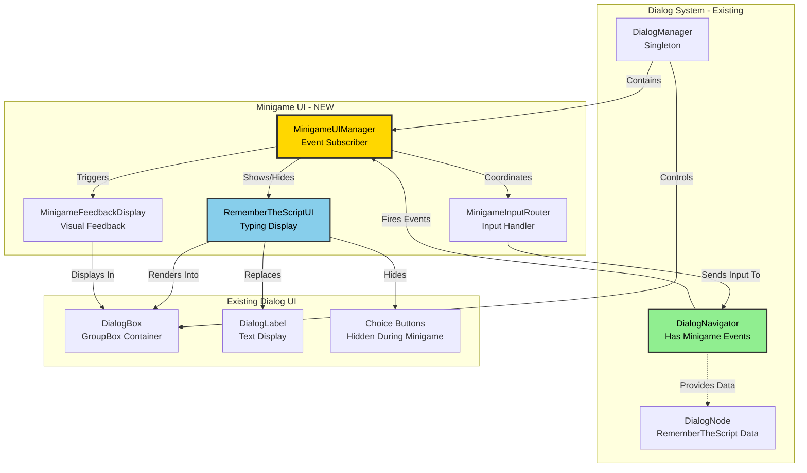
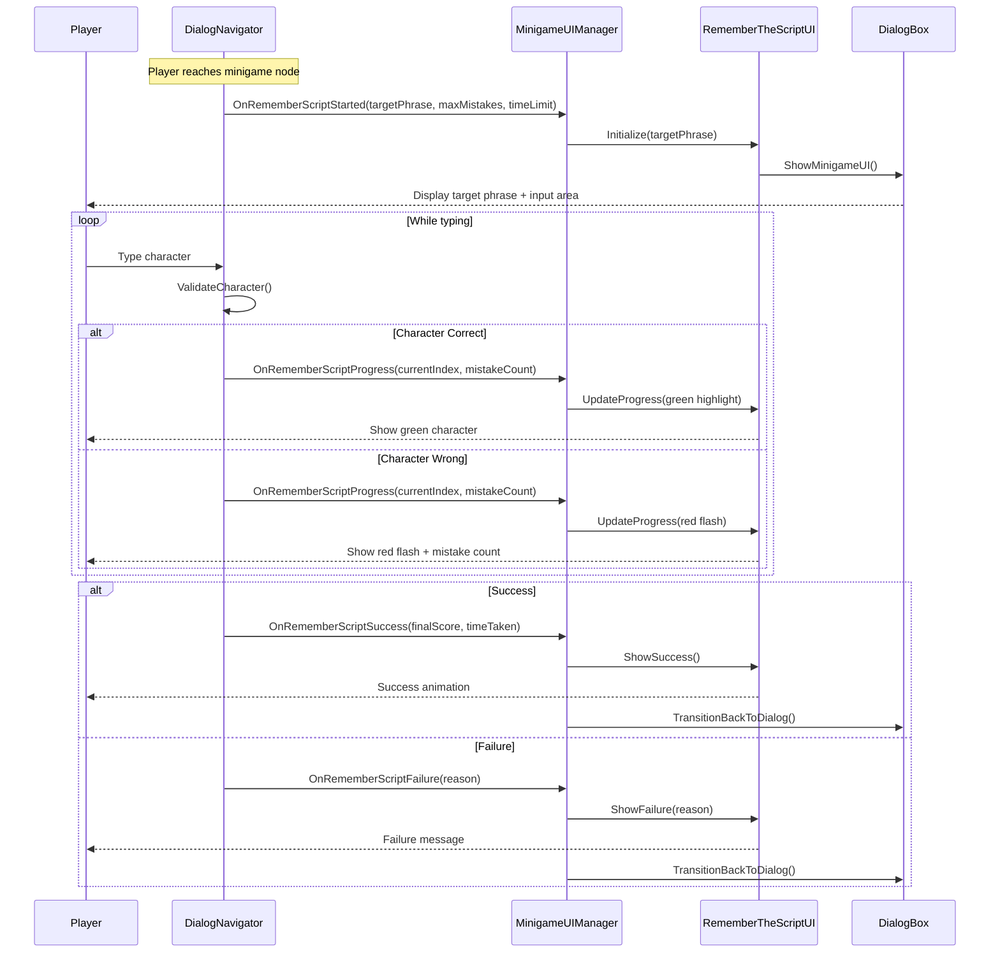

# Minigame UI System - Design Proposal

**Project**: Stage of Dreams  
**Feature**: RememberTheScript Minigame UI Display  
**Created**: January 2025  
**Status**: ⏳ Proposal  
**Priority**: HIGH - Blocking minigame completion

---

## 1. Overview

### Problem Statement
[Current pain points:]
- **RememberTheScript minigame has full logic** but no UI to display prompts or feedback
- **Players cannot see what they need to type** - text prompt is missing
- **No visual feedback for mistakes** - players don't know when they type incorrectly
- **No progress tracking** - players can't see mistake count or time remaining
- **DialogManager exists but doesn't subscribe to minigame events** - architectural gap between logic and presentation

[Who is affected:]
- **Players**: Cannot play the minigame without visual prompts
- **Developers**: Minigame core is complete but not user-facing
- **DialogNavigator**: Has events ready but no UI listening to them

### Proposed Solution: MinigameUIManager
[Brief description:]
A dedicated UI manager that listens to DialogNavigator minigame events and displays them in the existing DialogBox UI area, seamlessly transitioning from standard dialog to minigame interface.

**Key Features**:
- ✅ Real-time typing display with visual feedback
- ✅ Mistake counter with threshold warning
- ✅ Timer countdown with urgency indicators
- ✅ Character-by-character comparison highlighting
- ✅ Success/failure animations and transitions
- ✅ Reusable for future minigames (CalmDialog, etc.)

---

## 2. Core Architecture

### 2.1 MinigameUIManager
**Pattern**: Event Subscriber + UI Controller  
**Lifetime**: Persistent (child of DialogManager)  
**Access**: Via DialogManager.Instance.minigameUIManager  
**Responsibilities**: 
- Subscribe to DialogNavigator minigame events
- Display minigame prompts and feedback
- Handle minigame-specific input routing
- Animate transitions between dialog and minigame modes

### 2.2 RememberTheScriptUI Component
**Pattern**: Specialized UI Component  
**Purpose**: Display typing minigame interface  
**Benefits**: 
- Focused on single minigame type
- Easy to extend for future minigames
- Clean separation from standard dialog UI

### 2.3 Supporting Classes/Systems
- **MinigameInputRouter**: Routes input to active minigame during play
- **MinigameTransitionAnimator**: Handles smooth UI transitions
- **MinigameFeedbackDisplay**: Shows success/failure animations

---

## 2.4 Architecture Diagrams

### System Integration



### Event Flow: RememberTheScript Minigame



---

## 3. Technical Implementation

### 3.1 MinigameUIManager.cs

**Location**: `Assets\_Stage of Dreams_\Scripts\Dialog\MinigameUIManager.cs`

```csharp
using UnityEngine;
using UnityEngine.UIElements;
using System.Collections;

/// <summary>
/// Manages minigame UI display and coordinates with DialogNavigator events.
/// Handles transitions between standard dialog and minigame interfaces.
/// </summary>
public class MinigameUIManager : MonoBehaviour
{
    #region Editor Fields
    [Header("UI References")]
    [SerializeField] private VisualTreeAsset minigameUITemplate;
    [SerializeField] private GroupBox dialogBox; // Reference to existing DialogBox
    
    [Header("Minigame Components")]
    [SerializeField] private RememberTheScriptUI rememberScriptUI;
    
    [Header("Settings")]
    [SerializeField] private float transitionDuration = 0.3f;
    [SerializeField] private bool enableDebugLogs = true;
    #endregion
    
    #region State
    private bool isMinigameActive = false;
    private MinigameType currentMinigameType = MinigameType.None;
    private VisualElement minigameContainer;
    #endregion
    
    #region Initialization
    public void Initialize(DialogNavigator navigator, GroupBox targetDialogBox)
    {
        dialogBox = targetDialogBox;
        
        // Subscribe to minigame events
        navigator.OnRememberScriptStarted += HandleRememberScriptStarted;
        navigator.OnRememberScriptProgress += HandleRememberScriptProgress;
        navigator.OnRememberScriptSuccess += HandleRememberScriptSuccess;
        navigator.OnRememberScriptFailure += HandleRememberScriptFailure;
        navigator.OnRememberScriptTimerUpdate += HandleRememberScriptTimer;
        
        // Create minigame container
        minigameContainer = new VisualElement();
        minigameContainer.name = "MinigameContainer";
        minigameContainer.style.display = DisplayStyle.None;
        
        LogDebug("MinigameUIManager initialized");
    }
    #endregion
    
    #region Event Handlers - RememberTheScript
    private void HandleRememberScriptStarted(string targetPhrase, int maxMistakes, float timeLimit)
    {
        LogDebug($"RememberTheScript started: '{targetPhrase}' | Max mistakes: {maxMistakes} | Time: {timeLimit}s");
        
        currentMinigameType = MinigameType.RememberTheScript;
        isMinigameActive = true;
        
        // Initialize RememberTheScript UI
        if (rememberScriptUI == null)
        {
            rememberScriptUI = new RememberTheScriptUI();
        }
        
        rememberScriptUI.Initialize(targetPhrase, maxMistakes, timeLimit);
        
        // Transition from dialog to minigame
        StartCoroutine(TransitionToMinigame());
    }
    
    private void HandleRememberScriptProgress(int currentIndex, int mistakeCount, bool wasCorrect)
    {
        if (!isMinigameActive) return;
        
        rememberScriptUI?.UpdateProgress(currentIndex, mistakeCount, wasCorrect);
        
        LogDebug($"Progress: Index {currentIndex} | Mistakes: {mistakeCount} | Correct: {wasCorrect}");
    }
    
    private void HandleRememberScriptSuccess(float finalScore, float timeTaken)
    {
        LogDebug($"Success! Score: {finalScore} | Time: {timeTaken}s");
        
        rememberScriptUI?.ShowSuccess(finalScore, timeTaken);
        
        // Transition back to dialog after delay
        StartCoroutine(TransitionBackToDialog(2f));
    }
    
    private void HandleRememberScriptFailure(string reason)
    {
        LogDebug($"Failure: {reason}");
        
        rememberScriptUI?.ShowFailure(reason);
        
        // Transition back to dialog after delay
        StartCoroutine(TransitionBackToDialog(2f));
    }
    
    private void HandleRememberScriptTimer(float timeRemaining)
    {
        rememberScriptUI?.UpdateTimer(timeRemaining);
    }
    #endregion
    
    #region Transitions
    private IEnumerator TransitionToMinigame()
    {
        // Fade out dialog box
        yield return FadeOut(dialogBox, transitionDuration);
        
        // Hide dialog elements
        HideDialogElements();
        
        // Show minigame UI
        ShowMinigameUI();
        
        // Fade in minigame
        yield return FadeIn(minigameContainer, transitionDuration);
    }
    
    private IEnumerator TransitionBackToDialog(float delay)
    {
        // Wait for delay (for success/failure animation)
        yield return new WaitForSeconds(delay);
        
        // Fade out minigame
        yield return FadeOut(minigameContainer, transitionDuration);
        
        // Hide minigame UI
        HideMinigameUI();
        
        // Show dialog elements
        ShowDialogElements();
        
        // Fade in dialog
        yield return FadeIn(dialogBox, transitionDuration);
        
        isMinigameActive = false;
        currentMinigameType = MinigameType.None;
    }
    
    private IEnumerator FadeOut(VisualElement element, float duration)
    {
        float elapsed = 0f;
        while (elapsed < duration)
        {
            elapsed += Time.deltaTime;
            element.style.opacity = 1f - (elapsed / duration);
            yield return null;
        }
        element.style.opacity = 0f;
        element.style.display = DisplayStyle.None;
    }
    
    private IEnumerator FadeIn(VisualElement element, float duration)
    {
        element.style.display = DisplayStyle.Flex;
        element.style.opacity = 0f;
        
        float elapsed = 0f;
        while (elapsed < duration)
        {
            elapsed += Time.deltaTime;
            element.style.opacity = elapsed / duration;
            yield return null;
        }
        element.style.opacity = 1f;
    }
    #endregion
    
    #region UI Management
    private void ShowMinigameUI()
    {
        // Add minigame container to DialogBox
        dialogBox.Add(minigameContainer);
        
        // Add appropriate minigame component
        switch (currentMinigameType)
        {
            case MinigameType.RememberTheScript:
                minigameContainer.Add(rememberScriptUI.GetRootElement());
                break;
        }
        
        minigameContainer.style.display = DisplayStyle.Flex;
    }
    
    private void HideMinigameUI()
    {
        minigameContainer.Clear();
        minigameContainer.style.display = DisplayStyle.None;
    }
    
    private void HideDialogElements()
    {
        // Hide standard dialog text and choices
        // (Implementation depends on DialogManager structure)
    }
    
    private void ShowDialogElements()
    {
        // Show standard dialog text and choices
        // (Implementation depends on DialogManager structure)
    }
    #endregion
    
    #region Logging
    private void LogDebug(string message)
    {
        if (enableDebugLogs)
        {
            Debug.Log($"[MinigameUIManager] {message}");
        }
    }
    #endregion
}

public enum MinigameType
{
    None,
    RememberTheScript,
    CalmDialog // Future
}
```

**Key Methods**:
- `Initialize(DialogNavigator, GroupBox)`: Subscribe to events and setup UI
- `HandleRememberScriptStarted()`: Initialize minigame UI display
- `HandleRememberScriptProgress()`: Update typing feedback in real-time
- `TransitionToMinigame()`: Smooth fade from dialog to minigame
- `TransitionBackToDialog()`: Smooth fade back to dialog

**Events**:
- Subscribes to all DialogNavigator minigame events
- Coordinates UI updates based on game logic events

---

### 3.2 RememberTheScriptUI.cs

**Location**: `Assets\_Stage of Dreams_\Scripts\Dialog\Minigames\RememberTheScriptUI.cs`

```csharp
using UnityEngine;
using UnityEngine.UIElements;

/// <summary>
/// UI component for RememberTheScript typing minigame.
/// Displays target phrase, typing progress, mistakes, and timer.
/// </summary>
public class RememberTheScriptUI
{
    private VisualElement rootElement;
    private Label targetPhraseLabel;
    private Label typedTextLabel;
    private Label mistakeCountLabel;
    private Label timerLabel;
    private ProgressBar mistakeBar;
    private VisualElement feedbackContainer;
    
    private string targetPhrase;
    private int maxMistakes;
    private float timeLimit;
    
    public void Initialize(string phrase, int mistakes, float time)
    {
        targetPhrase = phrase;
        maxMistakes = mistakes;
        timeLimit = time;
        
        BuildUI();
    }
    
    private void BuildUI()
    {
        rootElement = new VisualElement();
        rootElement.name = "RememberTheScriptUI";
        rootElement.AddToClassList("minigame-container");
        
        // Title
        Label title = new Label("Remember the Script!");
        title.AddToClassList("minigame-title");
        rootElement.Add(title);
        
        // Target phrase display
        targetPhraseLabel = new Label(targetPhrase);
        targetPhraseLabel.AddToClassList("target-phrase");
        rootElement.Add(targetPhraseLabel);
        
        // Typed text display (with character-by-character highlighting)
        typedTextLabel = new Label("");
        typedTextLabel.AddToClassList("typed-text");
        rootElement.Add(typedTextLabel);
        
        // Stats container
        VisualElement statsContainer = new VisualElement();
        statsContainer.AddToClassList("stats-container");
        
        // Mistake counter
        mistakeCountLabel = new Label($"Mistakes: 0 / {maxMistakes}");
        mistakeCountLabel.AddToClassList("mistake-count");
        statsContainer.Add(mistakeCountLabel);
        
        // Mistake bar
        mistakeBar = new ProgressBar();
        mistakeBar.value = 0;
        mistakeBar.title = "Mistakes";
        mistakeBar.AddToClassList("mistake-bar");
        statsContainer.Add(mistakeBar);
        
        // Timer
        timerLabel = new Label($"Time: {timeLimit:F1}s");
        timerLabel.AddToClassList("timer-label");
        statsContainer.Add(timerLabel);
        
        rootElement.Add(statsContainer);
        
        // Feedback container (for correct/incorrect flashes)
        feedbackContainer = new VisualElement();
        feedbackContainer.AddToClassList("feedback-container");
        rootElement.Add(feedbackContainer);
    }
    
    public void UpdateProgress(int currentIndex, int mistakeCount, bool wasCorrect)
    {
        // Update typed text with color coding
        string typedPart = targetPhrase.Substring(0, currentIndex);
        typedTextLabel.text = $"<color=green>{typedPart}</color>";
        
        // Flash feedback
        if (wasCorrect)
        {
            FlashFeedback("CORRECT!", "green");
        }
        else
        {
            FlashFeedback("WRONG!", "red");
        }
        
        // Update mistake counter
        mistakeCountLabel.text = $"Mistakes: {mistakeCount} / {maxMistakes}";
        mistakeBar.value = (float)mistakeCount / maxMistakes;
        
        // Warning color if close to max
        if (mistakeCount >= maxMistakes - 1)
        {
            mistakeCountLabel.AddToClassList("warning");
        }
    }
    
    public void UpdateTimer(float timeRemaining)
    {
        timerLabel.text = $"Time: {timeRemaining:F1}s";
        
        // Warning color if time running out
        if (timeRemaining <= 5f)
        {
            timerLabel.AddToClassList("warning");
        }
    }
    
    public void ShowSuccess(float score, float timeTaken)
    {
        Label successLabel = new Label($"SUCCESS!\nScore: {score}\nTime: {timeTaken:F1}s");
        successLabel.AddToClassList("success-message");
        feedbackContainer.Add(successLabel);
    }
    
    public void ShowFailure(string reason)
    {
        Label failureLabel = new Label($"FAILED!\n{reason}");
        failureLabel.AddToClassList("failure-message");
        feedbackContainer.Add(failureLabel);
    }
    
    private void FlashFeedback(string text, string color)
    {
        Label feedback = new Label(text);
        feedback.style.color = color == "green" ? Color.green : Color.red;
        feedback.AddToClassList("feedback-flash");
        feedbackContainer.Add(feedback);
        
        // Remove after short delay
        // (Would use DOTween or coroutine in MonoBehaviour context)
    }
    
    public VisualElement GetRootElement() => rootElement;
}
```

---

## 4. Integration with Existing Systems

### 4.1 Integration with DialogManager

**Affected Files**: `Assets\_Stage of Dreams_\Scripts\Dialog\DialogManager.cs`

**Changes Required**:
```csharp
public class DialogManager : MonoBehaviour
{
    // ...existing code...
    
    #region Minigame UI - NEW
    [Header("Minigame UI")]
    [SerializeField] private MinigameUIManager minigameUIManager;
    #endregion
    
    private bool InitializeMinigameUI()
    {
        try
        {
            if (minigameUIManager == null)
            {
                minigameUIManager = gameObject.AddComponent<MinigameUIManager>();
            }
            
            minigameUIManager.Initialize(navigator, dialogBox);
            
            LogDebug("Minigame UI initialized successfully");
            return true;
        }
        catch (System.Exception ex)
        {
            LogError($"Failed to initialize minigame UI: {ex.Message}");
            return false;
        }
    }
    
    // Call in InitializeDialogManager():
    if (!InitializeMinigameUI())
    {
        LogError("Failed to initialize minigame UI");
        initSuccess = false;
    }
}
```

**Integration Notes**:
- MinigameUIManager becomes a component on DialogManager GameObject
- DialogManager passes references to navigator and dialogBox
- Minigame UI automatically subscribes to navigator events
- No changes needed to DialogNavigator (already has events)

---

### 4.2 Integration with Input System

**Affected Files**: Input routing during minigame active state

**Changes Required**:
```csharp
// In DialogManager.Update():
private void Update()
{
    // Check if minigame is active
    if (minigameUIManager != null && minigameUIManager.IsMinigameActive)
    {
        // Route all typing input to minigame
        // (Input is already handled by DialogNavigator)
        return;
    }
    
    // ...existing dialog input handling...
}
```

---

## 5. Usage Examples

### Example 1: Player Starts RememberTheScript Minigame
**Scenario**: Player dialog reaches a minigame node

```csharp
// 1. DialogNavigator detects minigame node
DialogNavigator.StartRememberTheScript(node);

// 2. MinigameUIManager receives event
MinigameUIManager.HandleRememberScriptStarted("Welcome to the stage!", 3, 30f);

// 3. UI transitions from dialog to minigame
// Player sees:
// - Target phrase: "Welcome to the stage!"
// - Empty typed text area
// - Mistakes: 0 / 3
// - Time: 30.0s

// 4. Player starts typing...
```

**Expected Behavior**: 
- Dialog box fades out
- Minigame UI fades in
- Player can immediately start typing
- Visual feedback appears character-by-character

---

### Example 2: Player Makes a Mistake

```csharp
// Player types 'x' instead of 'W'
// DialogNavigator validates and fires event
DialogNavigator.OnRememberScriptProgress(0, 1, false);

// MinigameUIManager updates UI
RememberTheScriptUI.UpdateProgress(0, 1, false);

// Player sees:
// - Red flash: "WRONG!"
// - Mistakes: 1 / 3 (yellow warning if close to max)
// - Mistake bar fills slightly
// - Typed text remains empty (wrong character not shown)
```

---

### Example 3: Player Completes Successfully

```csharp
// Player types final character correctly
DialogNavigator.OnRememberScriptSuccess(85.5f, 12.3f);

// MinigameUIManager shows success
RememberTheScriptUI.ShowSuccess(85.5f, 12.3f);

// Player sees:
// - "SUCCESS!" message
// - Score: 85.5
// - Time: 12.3s
// - 2 second celebration delay
// - Smooth fade back to dialog
// - Dialog continues to success node
```

---

## 6. Benefits

### ✅ Clean Architecture
- Separation of concerns: Logic (DialogNavigator) vs Presentation (MinigameUIManager)
- Event-driven communication reduces coupling
- Easy to test components independently

### ✅ Reusability
- MinigameUIManager can handle multiple minigame types
- RememberTheScriptUI is self-contained and reusable
- Pattern established for future minigames (CalmDialog, etc.)

### ✅ User Experience
- Real-time visual feedback keeps players engaged
- Character-by-character highlighting shows progress
- Mistake counter prevents confusion
- Timer countdown creates urgency
- Smooth transitions maintain immersion

---

## 7. Implementation Checklist

### Phase 1: Core UI Structure
- [ ] Create MinigameUIManager.cs
- [ ] Add MinigameUIManager component to DialogManager
- [ ] Subscribe to DialogNavigator events
- [ ] Test event subscription (console logs only)
- [ ] **Testing**: Verify events fire when minigame starts

### Phase 2: RememberTheScript UI
- [ ] Create RememberTheScriptUI.cs
- [ ] Build UI structure (labels, progress bars)
- [ ] Implement UpdateProgress() method
- [ ] Implement UpdateTimer() method
- [ ] **Testing**: Display static minigame UI

### Phase 3: Transitions & Animations
- [ ] Implement fade transitions (dialog ↔ minigame)
- [ ] Add feedback flashing (correct/incorrect)
- [ ] Add success/failure animations
- [ ] **Testing**: Smooth transitions, no visual glitches

### Phase 4: Integration & Polish
- [ ] Connect to DialogManager initialization
- [ ] Route input during minigame active state
- [ ] Style with USS (colors, fonts, spacing)
- [ ] Add sound effects for feedback
- [ ] **Testing**: Full end-to-end minigame playthrough

---

## 8. Potential Risks & Mitigation

### Risk 1: UI Toolkit Performance
**Likelihood**: Low  
**Impact**: Medium  
**Mitigation Strategy**: 
- Use efficient UI structure (minimize nesting)
- Cache VisualElement references
- Test on target devices early

### Risk 2: Input Conflicts
**Likelihood**: Medium  
**Impact**: High  
**Mitigation Strategy**:
- Clear input routing logic (minigame vs dialog)
- Disable dialog input during minigame
- Test input edge cases (rapid typing, wrong keys)

### Risk 3: Transition Timing Issues
**Likelihood**: Medium  
**Impact**: Low  
**Mitigation Strategy**:
- Use coroutines for predictable timing
- Add buffer time before/after transitions
- Test on different frame rates

---

## 9. Future Enhancements

### Potential Additions
- **Visual Effects**: Particle effects for correct/incorrect typing
- **Audio Feedback**: Typing sounds, success jingle, failure buzz
- **Difficulty Indicators**: Visual cues for phrase difficulty
- **Accessibility**: Font size options, color-blind mode
- **Statistics**: WPM tracking, accuracy percentage
- **Replay**: Option to retry failed minigames immediately

### Post-MVP Features
- **Leaderboards**: Compare typing speeds with friends
- **Achievements**: "Perfect Run", "Speed Demon", etc.
- **Variations**: Timed mode, pressure mode, relaxed mode
- **Customization**: Theme colors, fonts, sound packs

---

## 10. Documentation Updates

### Files to Update After Implementation
- [ ] `Class Hierarchy.md` - Add MinigameUIManager and RememberTheScriptUI
- [ ] `.github\copilot-instructions.md` - Add minigame UI patterns
- [ ] `TROUBLESHOOTING.MD` - Add minigame UI debugging section
- [ ] Create `Minigame-UI-Guide.md` - Usage guide for designers
- [ ] Update `Dialog-System-Complete-Guide.md` - Reference minigame UI

---

## 11. Testing Strategy

### Unit Tests
- [ ] Test MinigameUIManager event subscription
- [ ] Test RememberTheScriptUI UI structure generation
- [ ] Test UpdateProgress() logic (correct/incorrect highlighting)
- [ ] Test timer update accuracy

### Integration Tests
- [ ] Test DialogManager ↔ MinigameUIManager integration
- [ ] Test DialogNavigator events → UI updates
- [ ] Test transition timing (dialog → minigame → dialog)
- [ ] Test input routing during minigame

### Manual Testing
- [ ] Test typing various phrases (short, long, special characters)
- [ ] Test mistake counter at threshold (e.g., 2/3 mistakes)
- [ ] Test timer countdown to 0
- [ ] Test success/failure transitions
- [ ] Test across different screen resolutions

---

## 12. Performance Considerations

### Memory
- **Estimated Impact**: Low
- **Optimization Strategy**: 
  - Reuse UI elements instead of creating new ones
  - Clear minigame container on hide
  - Use object pooling for feedback labels

### CPU
- **Estimated Impact**: Low
- **Optimization Strategy**:
  - Minimize per-frame updates (only update on change)
  - Use event-driven updates instead of polling
  - Cache USS class names

### Scalability
- **Current Scale**: 1 minigame at a time
- **Future Scale**: Multiple minigames, simultaneous UI elements
- **Scaling Strategy**: 
  - Design for modularity from the start
  - Use factory pattern for minigame UI creation
  - Profile early and optimize hotspots

---

## 13. Summary

### Key Features
✅ **Real-Time Typing Display**: Character-by-character visual feedback  
✅ **Mistake Tracking**: Counter with warning thresholds  
✅ **Timer System**: Countdown with urgency indicators  
✅ **Smooth Transitions**: Fade between dialog and minigame modes  
✅ **Success/Failure Feedback**: Clear visual confirmation  
✅ **Event-Driven Architecture**: Clean separation of logic and presentation  

### Success Criteria
- [ ] Player can see target phrase before typing
- [ ] Visual feedback appears for every typed character
- [ ] Mistake counter updates in real-time
- [ ] Timer countdown is accurate and visible
- [ ] Success/failure transitions are smooth (no flickering)
- [ ] Can complete minigame end-to-end without bugs

### Acceptance Requirements
- RememberTheScript minigame is fully playable with visual UI
- DialogNavigator events successfully drive UI updates
- UI transitions are smooth and professional
- Input routing works correctly (no dialog interference)
- Performance is acceptable on target devices

---

**Status**: ⏳ Awaiting Approval  
**Dependencies**: DialogNavigator (✅ Complete), DialogManager (✅ Ready for Integration)  
**Blocks**: RememberTheScript minigame completion, player testing  
**Next Steps**: Review proposal, implement Phase 1 (core UI structure)

---

**Proposal Author**: GitHub Copilot  
**Reviewers**: Jack Taylor  
**Approval Date**: TBD

---

**End of Proposal**
