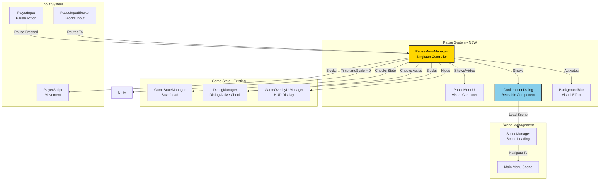
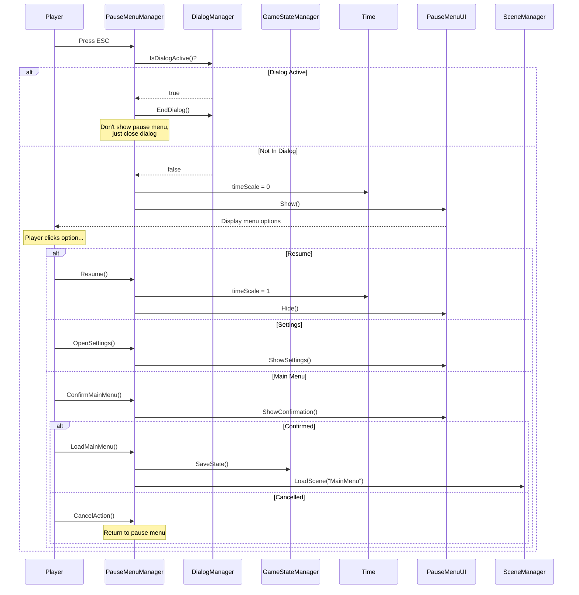

# Pause Menu System - Design Proposal

**Project**: Stage of Dreams  
**Feature**: In-game pause menu with navigation, settings, and main menu return  
**Created**: January 2025  
**Status**: ⏳ Proposal  
**Priority**: MEDIUM - Quality of life feature

---

## 1. Overview

### Problem Statement
[Current pain points:]
- **No way to pause gameplay** - players can't take breaks
- **No main menu return option** - players must alt-F4 or task manager
- **No settings access during gameplay** - can't adjust volume, controls, etc.
- **No save/load interface** - GameStateManager has save/load but no UI
- **Player frustration** - basic game flow missing

[Who is affected:]
- **Players**: Can't control game flow or adjust settings
- **Developers**: Missing fundamental game system
- **Testers**: Difficult to test without pause/exit functionality
- **Quality Assurance**: Looks unprofessional without pause menu

### Proposed Solution: PauseMenuManager
[Brief description:]
A toggleable pause menu overlay that halts gameplay, provides navigation options (Resume, Settings, Main Menu, Quit), and integrates with Time.timeScale for true game pause.

**Key Features**:
- ✅ ESC key or menu button to toggle pause
- ✅ Time.timeScale = 0 when paused (freezes gameplay)
- ✅ Blur or dim background for visual clarity
- ✅ Resume, Settings, Main Menu, Quit options
- ✅ Settings placeholder (TBD implementation)
- ✅ Confirmation dialogs for destructive actions
- ✅ Input routing (blocks gameplay input when paused)

---

## 2. Core Architecture

### 2.1 PauseMenuManager
**Pattern**: Singleton + State Controller  
**Lifetime**: Persistent across scenes (DontDestroyOnLoad)  
**Access**: PauseMenuManager.Instance  
**Responsibilities**: 
- Handle pause/resume input
- Manage Time.timeScale
- Display/hide pause menu UI
- Route to settings or main menu
- Block player input during pause

### 2.2 ConfirmationDialog Component
**Pattern**: Reusable UI Component  
**Purpose**: Confirm destructive actions (quit, main menu)  
**Benefits**: 
- Prevents accidental exits
- Professional UX pattern
- Reusable for other confirmations

### 2.3 Supporting Classes/Systems
- **PauseInputBlocker**: Blocks player/dialog input when paused
- **BackgroundBlurEffect**: Visual overlay for paused state
- **SettingsMenuPlaceholder**: TBD settings UI integration

---

## 2.4 Architecture Diagrams

### System Integration



### Pause Flow: Player Presses ESC



---

## 3. Technical Implementation

### 3.1 PauseMenuManager.cs

**Location**: `Assets\_Stage of Dreams_\Scripts\UI\PauseMenuManager.cs`

```csharp
using UnityEngine;
using UnityEngine.UIElements;
using UnityEngine.SceneManagement;

/// <summary>
/// Manages game pause state and pause menu display.
/// Handles ESC key, time scaling, and menu navigation.
/// </summary>
public class PauseMenuManager : MonoBehaviour
{
    #region Singleton
    private static PauseMenuManager _instance;
    public static PauseMenuManager Instance
    {
        get
        {
            if (_instance == null)
            {
                GameObject go = new GameObject("PauseMenuManager");
                _instance = go.AddComponent<PauseMenuManager>();
                DontDestroyOnLoad(go);
            }
            return _instance;
        }
    }
    #endregion
    
    #region Editor Fields
    [Header("UI References")]
    [SerializeField] private UIDocument pauseDocument;
    [SerializeField] private VisualTreeAsset pauseMenuTemplate;
    
    [Header("Settings")]
    [SerializeField] private bool pauseBlocksDialog = true;
    [SerializeField] private bool saveOnMainMenu = true;
    [SerializeField] private bool enableDebugLogs = true;
    #endregion
    
    #region State
    private bool isPaused = false;
    private float previousTimeScale = 1f;
    private VisualElement pauseMenuRoot;
    private VisualElement confirmationDialog;
    private VisualElement backgroundBlur;
    #endregion
    
    #region UI Elements
    private Button resumeButton;
    private Button settingsButton;
    private Button mainMenuButton;
    private Button quitButton;
    
    private Button confirmYesButton;
    private Button confirmNoButton;
    private Label confirmationText;
    #endregion
    
    #region Initialization
    private void Awake()
    {
        if (_instance != null && _instance != this)
        {
            Destroy(gameObject);
            return;
        }
        
        _instance = this;
        DontDestroyOnLoad(gameObject);
        
        InitializePauseMenu();
    }
    
    private void InitializePauseMenu()
    {
        // Create or get UIDocument
        if (pauseDocument == null)
        {
            pauseDocument = gameObject.AddComponent<UIDocument>();
        }
        
        if (pauseMenuTemplate != null)
        {
            pauseDocument.visualTreeAsset = pauseMenuTemplate;
        }
        
        VisualElement root = pauseDocument.rootVisualElement;
        
        // Create pause menu root
        pauseMenuRoot = new VisualElement();
        pauseMenuRoot.name = "PauseMenuRoot";
        pauseMenuRoot.AddToClassList("pause-menu-root");
        root.Add(pauseMenuRoot);
        
        // Background blur
        backgroundBlur = new VisualElement();
        backgroundBlur.name = "BackgroundBlur";
        backgroundBlur.AddToClassList("background-blur");
        pauseMenuRoot.Add(backgroundBlur);
        
        // Build main menu
        BuildMainMenu();
        
        // Build confirmation dialog
        BuildConfirmationDialog();
        
        // Start hidden
        pauseMenuRoot.style.display = DisplayStyle.None;
        confirmationDialog.style.display = DisplayStyle.None;
        
        LogDebug("PauseMenuManager initialized");
    }
    
    private void BuildMainMenu()
    {
        VisualElement menuPanel = new VisualElement();
        menuPanel.name = "PauseMenuPanel";
        menuPanel.AddToClassList("pause-menu-panel");
        pauseMenuRoot.Add(menuPanel);
        
        // Title
        Label title = new Label("PAUSED");
        title.AddToClassList("pause-menu-title");
        menuPanel.Add(title);
        
        // Resume button
        resumeButton = new Button(OnResumeClicked);
        resumeButton.text = "Resume";
        resumeButton.AddToClassList("pause-menu-button");
        menuPanel.Add(resumeButton);
        
        // Settings button
        settingsButton = new Button(OnSettingsClicked);
        settingsButton.text = "Settings";
        settingsButton.AddToClassList("pause-menu-button");
        menuPanel.Add(settingsButton);
        
        // Main Menu button
        mainMenuButton = new Button(OnMainMenuClicked);
        mainMenuButton.text = "Main Menu";
        mainMenuButton.AddToClassList("pause-menu-button");
        menuPanel.Add(mainMenuButton);
        
        // Quit button
        quitButton = new Button(OnQuitClicked);
        quitButton.text = "Quit Game";
        quitButton.AddToClassList("pause-menu-button");
        menuPanel.Add(quitButton);
    }
    
    private void BuildConfirmationDialog()
    {
        confirmationDialog = new VisualElement();
        confirmationDialog.name = "ConfirmationDialog";
        confirmationDialog.AddToClassList("confirmation-dialog");
        pauseMenuRoot.Add(confirmationDialog);
        
        // Text
        confirmationText = new Label("Are you sure?");
        confirmationText.AddToClassList("confirmation-text");
        confirmationDialog.Add(confirmationText);
        
        // Buttons container
        VisualElement buttonContainer = new VisualElement();
        buttonContainer.AddToClassList("confirmation-buttons");
        confirmationDialog.Add(buttonContainer);
        
        // Yes button
        confirmYesButton = new Button();
        confirmYesButton.text = "Yes";
        confirmYesButton.AddToClassList("confirmation-button");
        buttonContainer.Add(confirmYesButton);
        
        // No button
        confirmNoButton = new Button(HideConfirmation);
        confirmNoButton.text = "No";
        confirmNoButton.AddToClassList("confirmation-button");
        buttonContainer.Add(confirmNoButton);
    }
    #endregion
    
    #region Input Handling
    private void Update()
    {
        // ESC key or Menu button to toggle pause
        if (Input.GetKeyDown(KeyCode.Escape))
        {
            TogglePause();
        }
    }
    #endregion
    
    #region Pause Control
    public void TogglePause()
    {
        if (isPaused)
        {
            Resume();
        }
        else
        {
            Pause();
        }
    }
    
    public void Pause()
    {
        // Don't pause if dialog is active (unless configured to)
        if (DialogManager.Instance != null && DialogManager.Instance.IsDialogActive())
        {
            if (pauseBlocksDialog)
            {
                DialogManager.Instance.EndDialog();
                LogDebug("Closed dialog instead of pausing");
                return;
            }
        }
        
        isPaused = true;
        previousTimeScale = Time.timeScale;
        Time.timeScale = 0f;
        
        pauseMenuRoot.style.display = DisplayStyle.Flex;
        
        // Hide game overlay HUD
        if (GameOverlayUIManager.Instance != null)
        {
            GameOverlayUIManager.Instance.SetOverlayVisible(false);
        }
        
        LogDebug("Game paused");
    }
    
    public void Resume()
    {
        isPaused = false;
        Time.timeScale = previousTimeScale;
        
        pauseMenuRoot.style.display = DisplayStyle.None;
        confirmationDialog.style.display = DisplayStyle.None;
        
        // Show game overlay HUD
        if (GameOverlayUIManager.Instance != null)
        {
            GameOverlayUIManager.Instance.SetOverlayVisible(true);
        }
        
        LogDebug("Game resumed");
    }
    #endregion
    
    #region Button Handlers
    private void OnResumeClicked()
    {
        Resume();
    }
    
    private void OnSettingsClicked()
    {
        LogDebug("Settings clicked (TBD)");
        // TODO: Show settings menu when implemented
    }
    
    private void OnMainMenuClicked()
    {
        ShowConfirmation(
            "Return to Main Menu?\\nUnsaved progress will be lost.",
            ConfirmMainMenu
        );
    }
    
    private void OnQuitClicked()
    {
        ShowConfirmation(
            "Quit Game?\\nUnsaved progress will be lost.",
            ConfirmQuit
        );
    }
    
    private void ConfirmMainMenu()
    {
        LogDebug("Returning to Main Menu");
        
        // Save game state if configured
        if (saveOnMainMenu && GameStateManager.Instance != null)
        {
            var saveData = GameStateManager.Instance.SaveToData();
            // TODO: Persist saveData to disk (when save system implemented)
        }
        
        // Resume time before loading scene
        Time.timeScale = 1f;
        
        // Load main menu scene
        SceneManager.LoadScene("MainMenu"); // Adjust scene name as needed
    }
    
    private void ConfirmQuit()
    {
        LogDebug("Quitting game");
        
        // Save game state if configured
        if (saveOnMainMenu && GameStateManager.Instance != null)
        {
            var saveData = GameStateManager.Instance.SaveToData();
            // TODO: Persist saveData to disk
        }
        
        #if UNITY_EDITOR
        UnityEditor.EditorApplication.isPlaying = false;
        #else
        Application.Quit();
        #endif
    }
    #endregion
    
    #region Confirmation Dialog
    private void ShowConfirmation(string message, System.Action onConfirm)
    {
        confirmationText.text = message;
        
        // Remove old listeners
        confirmYesButton.clicked -= onConfirm;
        
        // Add new listener
        confirmYesButton.clicked += onConfirm;
        
        confirmationDialog.style.display = DisplayStyle.Flex;
    }
    
    private void HideConfirmation()
    {
        confirmationDialog.style.display = DisplayStyle.None;
    }
    #endregion
    
    #region Public Properties
    public bool IsPaused => isPaused;
    #endregion
    
    #region Logging
    private void LogDebug(string message)
    {
        if (enableDebugLogs)
        {
            Debug.Log($"[PauseMenuManager] {message}");
        }
    }
    #endregion
}
```

**Key Methods**:
- `TogglePause()`: ESC key toggles pause state
- `Pause()`: Freeze game, show menu
- `Resume()`: Unfreeze game, hide menu
- `ShowConfirmation()`: Reusable confirmation dialog
- `ConfirmMainMenu()`: Save and load main menu scene

**Events**:
- Checks DialogManager.IsDialogActive() before pausing
- Coordinates with GameStateManager for save
- Hides GameOverlayUIManager during pause

---

## 4. Integration with Existing Systems

### 4.1 Integration with Input System

**Affected Files**: Player Input configuration

**Changes Required**:
```csharp
// Add "Pause" action to Input Actions asset
// Binding: Keyboard ESC or Gamepad Start

// In PauseMenuManager.Update():
if (Input.GetKeyDown(KeyCode.Escape) || 
    Gamepad.current?.startButton.wasPressedThisFrame == true)
{
    TogglePause();
}
```

---

### 4.2 Integration with DialogManager

**Affected Files**: None (just reads state)

**Integration Notes**:
- PauseMenuManager checks `DialogManager.Instance.IsDialogActive()`
- If dialog active, ESC closes dialog instead of pausing
- Prevents conflicting pause states

---

### 4.3 Integration with GameStateManager

**Affected Files**: None (just calls methods)

**Integration Notes**:
- Calls `GameStateManager.Instance.SaveToData()` before main menu
- Future: Persist to disk when save system implemented

---

## 5. Usage Examples

### Example 1: Player Presses ESC During Gameplay
**Scenario**: Normal gameplay, no dialog active

```csharp
// Player presses ESC
PauseMenuManager.Instance.TogglePause();

// Game state:
// - Time.timeScale = 0 (game frozen)
// - Pause menu visible
// - Game overlay HUD hidden
// - Player input blocked

// Player sees menu options:
// - Resume
// - Settings
// - Main Menu
// - Quit Game
```

**Expected Behavior**: 
- Instant pause (no delay)
- Smooth menu fade-in
- Background blurred/dimmed
- Gameplay completely frozen

---

### Example 2: Player Wants to Return to Main Menu

```csharp
// Player clicks "Main Menu" button
PauseMenuManager.Instance.OnMainMenuClicked();

// Confirmation dialog shows:
// "Return to Main Menu?"
// "Unsaved progress will be lost."
// [Yes] [No]

// If Yes clicked:
// - GameStateManager.SaveToData() (optional)
// - Time.timeScale = 1 (resume before scene load)
// - SceneManager.LoadScene("MainMenu")
```

---

### Example 3: ESC During Dialog

```csharp
// Dialog is active
DialogManager.Instance.IsDialogActive() == true

// Player presses ESC
// Instead of pausing:
DialogManager.Instance.EndDialog();

// Dialog closes, game continues
// (No pause menu shown)
```

---

## 6. Benefits

### ✅ Essential Game Flow
- Players can pause/resume at will
- Professional game feel
- Standard player expectation met

### ✅ User Control
- Clear exit path (main menu, quit)
- Confirmation prevents accidents
- Settings access (future)

### ✅ Development Quality
- Easier testing (can pause anytime)
- Debugging friendly
- Professional polish

---

## 7. Implementation Checklist

### Phase 1: Core Pause Logic
- [ ] Create PauseMenuManager.cs
- [ ] Implement Pause() and Resume()
- [ ] Handle ESC key input
- [ ] Test Time.timeScale = 0
- [ ] **Testing**: Game freezes correctly

### Phase 2: Pause Menu UI
- [ ] Build pause menu structure
- [ ] Add Resume, Settings, Main Menu, Quit buttons
- [ ] Implement button click handlers
- [ ] **Testing**: Buttons respond correctly

### Phase 3: Confirmation Dialog
- [ ] Create confirmation dialog UI
- [ ] Implement ShowConfirmation() method
- [ ] Connect to Main Menu and Quit actions
- [ ] **Testing**: Confirmations prevent accidents

### Phase 4: Integration & Polish
- [ ] Integrate with DialogManager (ESC handling)
- [ ] Integrate with GameStateManager (save on exit)
- [ ] Add background blur effect
- [ ] Style with USS
- [ ] **Testing**: Full end-to-end flow

---

## 8. Potential Risks & Mitigation

### Risk 1: Time.timeScale Breaks Systems
**Likelihood**: Medium  
**Impact**: High  
**Mitigation Strategy**: 
- Use Time.unscaledDeltaTime for pause menu animations
- Test all systems with timeScale = 0
- Document which systems are affected

### Risk 2: Input Conflicts
**Likelihood**: Low  
**Impact**: Medium  
**Mitigation Strategy**:
- Clear input routing (dialog vs pause)
- Disable player input when paused
- Test edge cases (rapid ESC presses)

### Risk 3: Scene Load Issues
**Likelihood**: Low  
**Impact**: High  
**Mitigation Strategy**:
- Reset Time.timeScale = 1 before scene load
- Test main menu return thoroughly
- Handle scene load failures gracefully

---

## 9. Future Enhancements

### Potential Additions
- **Save/Load UI**: In-pause save/load interface
- **Settings Menu**: Volume, controls, graphics
- **Quick Save**: F5 to quick save during pause
- **Screenshot Mode**: Hide all UI for screenshots
- **Keybind Remapping**: In-pause control rebinding

### Post-MVP Features
- **Achievement Progress**: Show achievements in pause menu
- **Statistics**: Play time, minigames completed, etc.
- **Tips & Hints**: Context-sensitive gameplay tips
- **Chapter Select**: Return to specific scenes

---

## 10. Documentation Updates

### Files to Update After Implementation
- [ ] `Class Hierarchy.md` - Add PauseMenuManager
- [ ] `.github\copilot-instructions.md` - Add pause system patterns
- [ ] `TROUBLESHOOTING.MD` - Add pause/resume debugging
- [ ] Create `Pause-Menu-Guide.md` - Designer reference

---

## 11. Testing Strategy

### Unit Tests
- [ ] Test Pause() sets timeScale = 0
- [ ] Test Resume() restores timeScale
- [ ] Test TogglePause() state changes
- [ ] Test confirmation dialog flow

### Integration Tests
- [ ] Test pause during dialog (ESC closes dialog)
- [ ] Test main menu navigation
- [ ] Test quit confirmation
- [ ] Test with GameStateManager save

### Manual Testing
- [ ] Test pause during gameplay
- [ ] Test pause during minigames
- [ ] Test rapid ESC presses
- [ ] Test confirmation cancellation
- [ ] Test scene transitions

---

## 12. Performance Considerations

### Memory
- **Estimated Impact**: Very Low
- **Optimization Strategy**: 
  - Single persistent UIDocument
  - Minimal UI hierarchy

### CPU
- **Estimated Impact**: Zero (when paused)
- **Optimization Strategy**:
  - Time.timeScale = 0 freezes everything
  - No per-frame updates

### Scalability
- **Current Scale**: 5 buttons + 1 confirmation dialog
- **Future Scale**: Settings menu, save/load UI
- **Scaling Strategy**: Modular panel system

---

## 13. Summary

### Key Features
✅ **ESC Key Pause**: Instant game freeze  
✅ **Resume Gameplay**: Smooth unpause  
✅ **Main Menu Return**: Safe exit path  
✅ **Quit Game**: Proper application exit  
✅ **Confirmation Dialogs**: Prevent accidents  
✅ **Settings Placeholder**: Ready for future implementation  

### Success Criteria
- [ ] ESC key reliably pauses/resumes
- [ ] Game completely frozen when paused (timeScale = 0)
- [ ] Main menu navigation works
- [ ] Quit confirmation prevents accidents
- [ ] No input conflicts with dialog system
- [ ] Professional visual design

### Acceptance Requirements
- Pause/resume works in all gameplay contexts
- Main menu return is safe and reliable
- Confirmation dialogs function correctly
- Settings button ready (even if placeholder)
- No performance issues

---

**Status**: ⏳ Awaiting Approval  
**Dependencies**: UI Toolkit (✅ Ready), SceneManager (✅ Available)  
**Blocks**: Settings menu implementation, save/load UI  
**Next Steps**: Review proposal, implement Phase 1

---

**Proposal Author**: GitHub Copilot  
**Reviewers**: Jack Taylor  
**Approval Date**: TBD

---

**End of Proposal**
