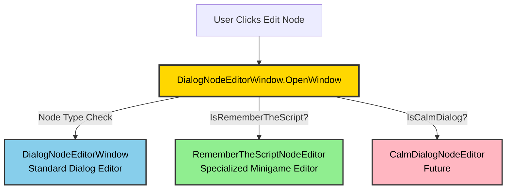
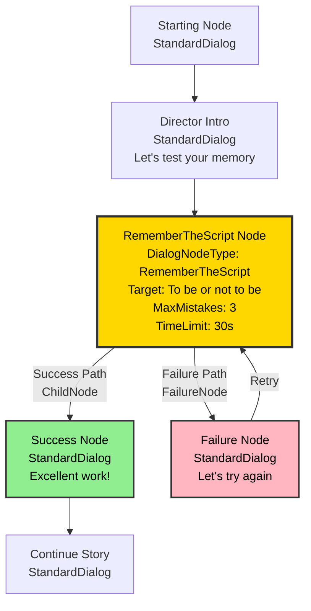
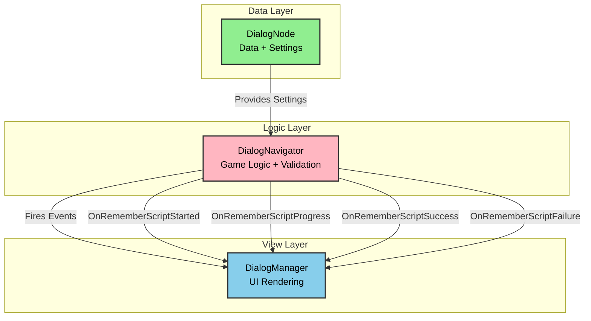

# Stage of Dreams - Dialog System Architecture Presentation

**Presentation Date**: January 2025  
**Audience**: Technical Review / Demo  
**Duration**: 15-20 minutes  
**Presenter**: Jack Taylor

---

## Table of Contents

1. [System Overview](#system-overview)
2. [Editor System Architecture](#editor-system-architecture)
3. [DialogTree Data Structure](#dialogtree-data-structure)
4. [Minigame Node System](#minigame-node-system)
5. [Integration & Workflow](#integration--workflow)
6. [Live Demo](#live-demo)

---

## System Overview

### What We Built

A **complete, production-ready dialog system** for Unity that supports:

- ✅ **Node-based conversations** with branching paths
- ✅ **Convergent dialog** - Multiple choices leading to same outcome
- ✅ **Minigame integration** - Seamless transition from dialog to gameplay
- ✅ **Event-driven architecture** - Clean separation of concerns
- ✅ **Custom editor tools** - Specialized editing windows for each node type
- ✅ **Type-safe design** - Extensible node type system

### Key Innovation: **Minigame = Node**

Instead of treating minigames as separate entities, we made **minigames a type of dialog node**:

```
DialogNode Types:
- StandardDialog (regular conversation)
- RememberTheScript (typing minigame)
- CalmDialog (choice-based minigame) [Future]
- DancingCombat (rhythm minigame) [Future]
```

**Benefits**:
- Minigames integrated directly into dialog flow
- No separate minigame management needed
- Automatic outcome node creation (success/failure)
- Clean, unified editing experience

---

## Editor System Architecture

### The Router Pattern



### How It Works

**1. Centralized Routing**
```csharp
public static void OpenWindow(SerializedProperty nodeProperty, DialogTree tree)
{
    // Check node type and route to appropriate editor
    if (IsRememberTheScriptNode(nodeProperty))
    {
        RememberTheScriptNodeEditor.OpenWindow(nodeProperty, tree);
        return;
    }
    
    // Future: IsCalmDialogNode? → CalmDialogNodeEditor
    
    // Default: Standard dialog editor
    DialogNodeEditorWindow window = CreateInstance<DialogNodeEditorWindow>();
    window.Initialize(nodeProperty, tree);
    window.Show();
}
```

**2. Type Detection**
```csharp
private static bool IsRememberTheScriptNode(SerializedProperty nodeProperty)
{
    SerializedProperty nodeTypeProp = nodeProperty.FindPropertyRelative("_nodeType");
    if (nodeTypeProp != null)
    {
        return (DialogNodeType)nodeTypeProp.enumValueIndex == DialogNodeType.RememberTheScript;
    }
    return false;
}
```

### Specialized Editors

#### RememberTheScriptNodeEditor

**Purpose**: Edit typing minigame nodes with focused UI

**Key Features**:
- ✅ Target phrase configuration with character count
- ✅ Difficulty settings (max mistakes, time limit, case sensitivity)
- ✅ Score settings (success reward, mistake penalty)
- ✅ **Automatic outcome node management** (success/failure)
- ✅ Estimated difficulty calculator
- ✅ Score preview for perfect/worst runs
- ✅ Test minigame button

**UI Layout**:
```
┌─────────────────────────────────────┐
│ RememberTheScript Node Editor       │
├─────────────────────────────────────┤
│ 🎭 Node: act1_director_script_01    │
│                                     │
│ Target Phrase Settings              │
│ ┌─────────────────────────────────┐ │
│ │ "To be or not to be"            │ │
│ │ Character Count: 18             │ │
│ └─────────────────────────────────┘ │
│                                     │
│ Difficulty Settings                 │
│ Max Mistakes: [3]                   │
│ Time Limit: [30.0] seconds          │
│ Case Sensitive: [ ]                 │
│                                     │
│ Score Settings                      │
│ Success Reward: [+20.0]             │
| Mistake Penalty: [-5.0]             │
│                                     │
│ Estimated Difficulty: ⭐⭐⭐       │
│ Perfect Score: +20.0                │
│ Worst Score: +5.0                   │
│                                     │
│ Outcome Nodes                       │
│ ✓ Success: act1_director_praise_01  │
│   [Edit Success Node]               │
│ ✗ Failure: act1_director_retry_01   │
│   [Edit Failure Node]               │
│                                     │
│ [Test Minigame] [Close]             │
└─────────────────────────────────────┘
```

**Benefits**:
- ✅ Only shows relevant minigame fields
- ✅ No clutter from standard dialog settings
- ✅ Intuitive minigame-specific controls
- ✅ Visual feedback on difficulty/scoring
- ✅ Direct access to outcome nodes

---

## DialogTree Data Structure

### NEW: Minigame Node Architecture



### Key Architectural Changes

#### 1. Node Type System

**Before** (Old approach):
```
- Minigames were separate systems
- Dialog nodes just triggered external minigame managers
- Complex integration required
```

**After** (New approach):
```csharp
public enum DialogNodeType
{
    StandardDialog,      // Regular dialog
    RememberTheScript,   // Typing minigame
    CalmDialog,          // Choice minigame (future)
    DancingCombat        // Rhythm minigame (future)
}

public class DialogNode
{
    [SerializeField] private DialogNodeType _nodeType;
    
    // Minigame-specific settings
    [SerializeField] private string _targetPhrase;
    [SerializeField] private int _maxMistakes;
    [SerializeField] private float _timeLimit;
    [SerializeField] private DialogNode _failureNode;  // NEW!
    
    // Standard dialog flow uses ChildNode (success path)
    // Failure path uses FailureNode (minigame-specific)
}
```

#### 2. Dual-Path System

**Success Path** (ChildNode):
```
Minigame Node → ChildNode → Success Node → Continue Story
```

**Failure Path** (FailureNode):
```
Minigame Node → FailureNode → Retry/Failure Node → (Retry Minigame OR Continue)
```

**Code**:
```csharp
// In DialogTree traversal:
private void TraverseAndCollectNodes(DialogNode node, HashSet<DialogNode> visited)
{
    if (node == null || visited.Contains(node)) return;
    
    visited.Add(node);
    allNodes.Add(node);
    
    // Check child node for auto-advance (SUCCESS PATH)
    if (node.ChildNode != null)
    {
        TraverseAndCollectNodes(node.ChildNode, visited);
    }
    
    // Check failure node for minigames (FAILURE PATH)  // NEW!
    if (node.FailureNode != null)
    {
        TraverseAndCollectNodes(node.FailureNode, visited);
    }
    
    // Check all choice targets
    if (node.HasChoices)
    {
        foreach (var choice in node.Choices)
        {
            if (choice?.TargetNode != null)
            {
                TraverseAndCollectNodes(choice.TargetNode, visited);
            }
        }
    }
}
```

#### 3. Automatic Outcome Node Creation

**When creating a minigame node, the system automatically**:

1. Creates Success Node (ChildNode)
   - Default praise dialog
   - Continues story flow
   - Awards applause score

2. Creates Failure Node reference
   - Default retry dialog
   - Allows retry attempt
   - Penalizes mistake score

**Example**:
```csharp
// In DialogTreeEditor Quick Builder
if (newNodeType == DialogNodeType.RememberTheScript)
{
    newNode.ConfigureRememberScript("Enter phrase here", 3, 30f, 20f, -5f);
    
    // Auto-create SUCCESS node
    var successNode = new DialogNode(
        "Director",
        "Excellent work! Your performance was flawless!",
        false,
        $"{newNode.NodeName}_success"
    );
    newNode.SetChildNode(successNode);
    
    // Auto-create FAILURE node
    var failureNode = new DialogNode(
        "Director",
        "Let's try that again. Remember your lines!",
        false,
        $"{newNode.NodeName}_failure"
    );
    newNode.FailureNode = failureNode;
    
    dialogTree.RefreshNodeList();  // Picks up both outcome nodes
}
```

---

## Minigame Node System

### Architecture: Clean Separation of Concerns



### DialogNavigator: Pure Game Logic

**Responsibilities**:
- ✅ Validate player input character-by-character
- ✅ Track mistakes and reset on failure
- ✅ Manage timer countdown
- ✅ Calculate scores based on performance
- ✅ Fire events for UI updates
- ❌ **NO UI CODE** - DialogNavigator doesn't know about rendering

**Key Events**:
```csharp
// Minigame Events (fired by DialogNavigator)
public event Action<DialogNode> OnRememberScriptStarted;
public event Action<int, int, float> OnRememberScriptProgress; // (currentIndex, mistakes, timeLeft)
public event Action<DialogNode, float> OnRememberScriptSuccess; // (successNode, score)
public event Action<DialogNode, int> OnRememberScriptFailure; // (failureNode, mistakes)
```

### RememberTheScript Implementation

**Validation Logic**:
```csharp
public void ValidateInput(char inputChar)
{
    if (!IsMinigameActive) return;
    
    // Get expected character
    char expectedChar = currentNode.CaseSensitive 
        ? currentNode.TargetPhrase[currentCharIndex] 
        : char.ToLower(currentNode.TargetPhrase[currentCharIndex]);
    
    char actualChar = currentNode.CaseSensitive 
        ? inputChar 
        : char.ToLower(inputChar);
    
    if (expectedChar == actualChar)
    {
        // Correct input
        currentCharIndex++;
        OnRememberScriptProgress?.Invoke(currentCharIndex, mistakeCount, timeRemaining);
        
        // Check completion
        if (currentCharIndex >= currentNode.TargetPhrase.Length)
        {
            CompleteMinigame(true);
        }
    }
    else
    {
        // Mistake
        mistakeCount++;
        OnRememberScriptProgress?.Invoke(currentCharIndex, mistakeCount, timeRemaining);
        
        // Check failure condition
        if (mistakeCount >= currentNode.MaxMistakes)
        {
            CompleteMinigame(false);
        }
    }
}
```

**Score Calculation**:
```csharp
private void CompleteMinigame(bool success)
{
    float totalScore = 0f;
    
    if (success)
    {
        // Success reward
        totalScore = currentNode.ScoreOnSuccess;
        
        // Bonus for fewer mistakes
        int mistakesAvoided = currentNode.MaxMistakes - mistakeCount;
        totalScore += mistakesAvoided * (-currentNode.ScorePerMistake);
        
        // Time bonus (if completed with time remaining)
        if (timeRemaining > 0)
        {
            totalScore += timeRemaining * 0.1f; // Bonus for speed
        }
        
        // Navigate to success node
        OnRememberScriptSuccess?.Invoke(currentNode.ChildNode, totalScore);
        NavigateToNode(currentNode.ChildNode);
    }
    else
    {
        // Failure penalty
        totalScore = mistakeCount * currentNode.ScorePerMistake;
        
        // Navigate to failure node
        OnRememberScriptFailure?.Invoke(currentNode.FailureNode, mistakeCount);
        
        if (currentNode.FailureNode != null)
        {
            NavigateToNode(currentNode.FailureNode);
        }
        else
        {
            // No failure node = retry
            ResetMinigame();
        }
    }
    
    // Update GameStateManager
    GameStateManager.Instance?.AdjustApplause(totalScore);
}
```

---

## Integration & Workflow

### Content Creator Workflow

**1. Create Dialog Tree Asset**
```
Assets → Create → Dialog System → Dialog Tree
```

**2. Open DialogTreeEditor**
```
Select DialogTree asset → Inspector shows custom editor
```

**3. Build Tree with Quick Builder**
```
DialogTreeEditor → Quick Tree Builder
- Set Node Type: RememberTheScript
- Enter Speaker Name: "Director"
- Enter Dialog Text: "Now, recite the famous line from Hamlet..."
- Click: "Create Starting Node"

→ System automatically creates:
  - Minigame node: act1_director_script_01
  - Success node: act1_director_script_01_success
  - Failure node: act1_director_script_01_failure
```

**4. Configure Minigame**
```
All Nodes list → Find minigame node → Click "Edit"
→ RememberTheScriptNodeEditor opens (automatic routing!)

Configure:
- Target Phrase: "To be or not to be"
- Max Mistakes: 3
- Time Limit: 30 seconds
- Success Reward: +20
- Mistake Penalty: -5

→ See estimated difficulty: ⭐⭐⭐
→ See score range: +5 to +20
```

**5. Edit Outcome Nodes**
```
Outcome Nodes section:
[Edit Success Node] → Opens standard editor for success dialog
[Edit Failure Node] → Opens standard editor for failure dialog

Customize the Director's response for success/failure!
```

**6. Test Minigame**
```
[Test Minigame] button → Opens test window
- Type the target phrase
- See real-time validation
- View score calculation
- Test success/failure paths
```

### Developer Integration Workflow

**1. Subscribe to Events in DialogManager**:
```csharp
private void InitializeNavigator()
{
    // Standard dialog events
    navigator.OnNodeChanged += HandleNodeChanged;
    navigator.OnDialogEnded += HandleDialogEnded;
    
    // Minigame events
    navigator.OnRememberScriptStarted += HandleRememberScriptStarted;
    navigator.OnRememberScriptProgress += HandleRememberScriptProgress;
    navigator.OnRememberScriptSuccess += HandleRememberScriptSuccess;
    navigator.OnRememberScriptFailure += HandleRememberScriptFailure;
}
```

**2. Implement UI Handlers** (future work):
```csharp
private void HandleRememberScriptStarted(DialogNode node)
{
    // Show typing minigame UI
    // Display target phrase with blanks: "__ __ __ __ __"
    // Show timer countdown
    // Show mistake counter
}

private void HandleRememberScriptProgress(int currentIndex, int mistakes, float timeLeft)
{
    // Update UI:
    // - Fill in correctly typed characters
    // - Update mistake counter
    // - Update timer
}

private void HandleRememberScriptSuccess(DialogNode successNode, float score)
{
    // Show success animation
    // Display score: "+20 Applause!"
    // Transition to success node dialog
}

private void HandleRememberScriptFailure(DialogNode failureNode, int mistakes)
{
    // Show failure animation
    // Display mistakes: "3/3 Mistakes - Try Again!"
    // Transition to failure node dialog
}
```

---

## Live Demo

### Demo Script

**1. Show DialogTree Asset**
```
- Open "Example Minigame Tree" in Unity
- Show DialogTreeEditor inspector
- Point out: "Quick Tree Builder" section
```

**2. Create New Minigame Node**
```
- Node Type: RememberTheScript
- Speaker: "Director"
- Text: "Let's test your memory with a famous line..."
- Click: "Create Starting Node"
- Point out: Automatic outcome node creation
```

**3. Open Specialized Editor**
```
- All Nodes list → Find new minigame node
- Click: "Edit"
- Show: Automatic routing to RememberTheScriptNodeEditor
- Point out: Clean, focused UI for minigame settings
```

**4. Configure Minigame**
```
- Target Phrase: "The play's the thing"
- Max Mistakes: 2
- Time Limit: 20 seconds
- Show: Difficulty calculator updates (⭐⭐)
- Show: Score preview (Perfect: +20, Worst: +10)
```

**5. Test Minigame**
```
- Click: "Test Minigame"
- Type the target phrase
- Show: Real-time validation
- Show: Mistake tracking
- Show: Success/failure outcomes
```

**6. Edit Outcome Nodes**
```
- Click: "Edit Success Node"
- Show: Standard dialog editor opens
- Customize success message
- Repeat for failure node
```

**7. Validate Tree**
```
- Click: "Validate Tree"
- Show: Console output with node count, structure
- Point out: Both outcome nodes appear in tree
```

**8. Show Architecture Diagram**
```
- Open: Docs/Presentation-Dialog-System-Architecture.md
- Show: Editor Router Pattern diagram
- Show: Minigame Node Architecture diagram
- Explain: Clean separation of concerns
```

---

## Key Takeaways

### What Makes This System Special

**1. Minigame = Node Paradigm**
- ✅ Unified data model
- ✅ No separate minigame managers needed
- ✅ Automatic outcome node creation
- ✅ Seamless dialog ↔ minigame transitions

**2. Specialized Editor Pattern**
- ✅ Router detects node type
- ✅ Opens appropriate editor automatically
- ✅ Each editor shows only relevant fields
- ✅ Extensible for future minigame types

**3. Clean Architecture**
- ✅ **Data** (DialogNode) - Pure settings
- ✅ **Logic** (DialogNavigator) - Game rules
- ✅ **View** (DialogManager) - UI rendering
- ✅ Event-driven communication

**4. Content Creator Friendly**
- ✅ Quick Tree Builder for rapid prototyping
- ✅ Visual node type indicators (🎭)
- ✅ Automatic outcome node creation
- ✅ Test minigame button
- ✅ Difficulty calculator

**5. Developer Friendly**
- ✅ Type-safe node type system
- ✅ Events for UI integration
- ✅ Extensible editor router
- ✅ Comprehensive validation

### Future Extensibility

**Adding New Minigame Types**:

```csharp
// 1. Add to enum
public enum DialogNodeType
{
    StandardDialog,
    RememberTheScript,
    CalmDialog,        // NEW!
}

// 2. Add detection method
private static bool IsCalmDialogNode(SerializedProperty nodeProperty)
{
    // Check if node type is CalmDialog
}

// 3. Add routing logic
public static void OpenWindow(SerializedProperty nodeProperty, DialogTree tree)
{
    if (IsRememberTheScriptNode(nodeProperty))
    {
        RememberTheScriptNodeEditor.OpenWindow(nodeProperty, tree);
        return;
    }
    
    if (IsCalmDialogNode(nodeProperty))  // NEW!
    {
        CalmDialogNodeEditor.OpenWindow(nodeProperty, tree);
        return;
    }
    
    // Default editor
}

// 4. Create specialized editor
public class CalmDialogNodeEditor : EditorWindow
{
    // Implement CalmDialog-specific UI
}
```

**That's it!** No modifications to existing code needed.

---

## Technical Achievements

### What We Learned

**Unity Editor Scripting**:
- ✅ Custom inspector windows
- ✅ SerializedProperty manipulation
- ✅ Editor window lifecycle
- ✅ Custom property drawers

**Software Design Patterns**:
- ✅ Router pattern for window management
- ✅ MVC architecture
- ✅ Event-driven communication
- ✅ Strategy pattern for node types

**Game Architecture**:
- ✅ ScriptableObject-based data
- ✅ Node-based conversation system
- ✅ Minigame integration
- ✅ State management

**C# Advanced Features**:
- ✅ SerializeReference for polymorphism
- ✅ Generic types
- ✅ Events and delegates
- ✅ Enums for type safety

---

## Questions?

**Common Questions**:

**Q: Why not use a visual graph editor like Dialogue System for Unity or Yarn Spinner?**
A: Those are great tools, but we wanted:
- Complete control over the data structure
- Tight integration with our minigame system
- Learning experience in Unity editor scripting
- Custom features like automatic outcome node creation

**Q: How does this handle save/load?**
A: DialogTree assets are ScriptableObjects - they persist automatically. Runtime state (current node, scores) is managed by GameStateManager with ScriptableObject-based save system.

**Q: Can you have multiple minigames in one conversation?**
A: Absolutely! Each minigame node is just another node in the tree. You can chain them:
```
Dialog → Minigame 1 → Dialog → Minigame 2 → Dialog → End
```

**Q: What about localization?**
A: Future feature! All text is stored in string fields, making it straightforward to add a localization key system.

**Q: Performance implications?**
A: Minimal - we're using:
- ScriptableObjects (lightweight asset references)
- Event-driven updates (no polling)
- Lazy tree traversal (only when needed)
- Editor-only complexity (runtime is simple)

---

## Thank You!

**Project**: Stage of Dreams  
**System**: Dialog System with Integrated Minigames  
**Developer**: Jack Taylor  
**Status**: Production-Ready for Presentation

**Next Steps**:
- ⏳ UI integration for RememberTheScript
- ⏳ CalmDialog minigame implementation
- ⏳ Demo scene creation
- ⏳ Deployment preparation

---

**"Break a leg on your presentation!"** 🎭✨
